[TOC]


简介：

1、开发工具

2、ES6：新特性【是浏览器脚本语言的规范，而JavaScript是具体实现】【ECMAScript6.0】

3、Node.js 包管理工具【类似maven】

4、vue类似springmvc

5、Babel：ES6新特性有些浏览器不支持，转换成各浏览器兼容的代码

6、Webpack：打包前端项目的工具【gulp也是同类产品】

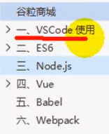

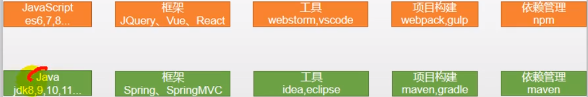


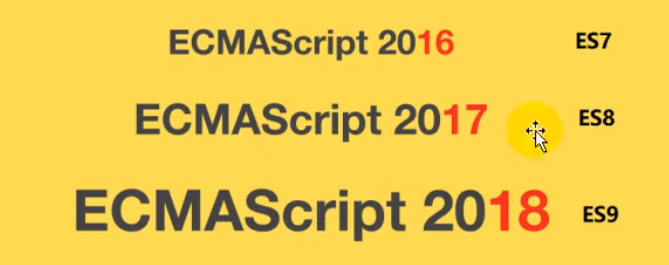


# 一、ES6

新建项目：E:/study/前端/ES6

```properties
1、打开vscode，打开文件夹->新建文件夹
2、新建文件let.html，shift+!回车快速生成HTML文档
3、右键 open with live server【浏览器查看】
```

## 1、增加了let、const

以前只有var

```
let：
1、局部作用域
2、只能声明1次
3、let不存在变量提升【var变量使用时，声明可以在使用之后】

const：
 1.声明之后不允许改变
 2.一但声明必须初始化，否则会报错
```

demo：

```html
1、let 声明的变量有严格局部作用域
<script>
    // var声明的变量往往会越域
    // let 声明的变量有严格局部作用域
    {
        var a = 1;
        let b = 2;
    }
    console.log(a); // 1
    console.log(b); // ReferenceError: b is not defined

</script>        

2、let只能声明1次
<script>
        // var可以声明多次
        // let只能声明1次
        var m = 1
        var m = 2
        let n = 3
        let n = 4
        console.log(m) // 2
        console.log(n) // Identifier 'n' has already been dec lared
</script>    

3、let不存在变量提升【var只要后面定义过了就可以】
<script>
    // var会变量提升
    // let不存在变量提升
    console.log(x); // undefined T 【undefined是没有值】
    varx=10;
    console.log(y); //ReferenceError: y is not defined
    lety=20;
</script>   

4、const声明变量
<script>   
    // 1.声明之后不允许改变
    // 2.一但声明必须初始化，否则会报错
    const a = 1;
    a = 3; //Uncaught TypeError: Assignment to constant variable .
</script>   
```


## 2、解构表达式

解构：**简化赋值操作**

alt+shift+f代码整理

```javascript
1、数组解构：简化将数组各项值赋给变量
    // 数组解构
    let arr = [1,2,3];
    let a = arr[0];
    let b = arr[1];
    let c = arr[2];

    let [x,y,z] = arr;
    //var [x,y,z] = arr;
    //const [x,y,z] = arr;
    console.log(a,b,c)
    console.log(x,y,z)

2、对象解构：简化对象与变量的赋值
    // 对象解构
    const person = {
    name: "jack",
    age: 21,
    language: ['java', 'js', 'css']
    }
    // 原始的方法
    // const name = person.name; 
    // const age = person.age;
    // const language = person.language;
    // ES6方法：
    let {name, age, language} = person;
    //const {name, age, language} = person;
    //var {name, age, language} = person;
    console.log(name, age, language);

3、对象解构延伸：变量名可以修改
	// name修改为abc
	let {name:abc, age, language} = person;


```


## 3、字符串扩展

```javascript
1、几个新的API
<script>
    let str = "hello.vue";
    console.log(str.startsWith("hello"));//true
    console.log(str.endsWith(".vue"));//true
    console.log(str.includes("e")); //true
    console.log(str.includes("hello"));//true
</script>

2、字符串模板
	1）多行不用拼串
        let ss = `<div>
                    < span>hello world< span>
                 </div>`;

	2）解析层级表达式
        const person = {
            name: "jack",
            age: 21,
            language: ['java', 'js', 'css']
        }
        let {name:abc, age:Age, language} = person;
        let info = `我是${abc}，今年${Age+10}岁，会用${person.language}`;
        console.log(info);

	3）调用方法
	    function fun() {
            return "这是fun函数"
        }
        let infoFun = `调用函数：${fun()}`;
        console.log(infoFun);// 调用函数：这是fun函数
```


## 4、函数优化

```
1、函数参数默认值
2、不定参数：就是java中 ...args数组
3、箭头函数（声明一个变量=匿名函数，参数即函数参数，且可以配合解构使用）【调用该变量就是调用匿名函数】
4、箭头函数+解构
```


```javascript
1、函数参数默认值
原始写法：
        //在ES6以前，我们无法给一个函数参数设置默认值，只能采用变通写法:
        function add(a, b) {
            //判断b是否为空，为空就给默认值1
            b = b || 1;
            return a + b;
        }
        //传一个参数
        console.log(add(10));
新写法：
        //现在可以这么写:直接给参数写上默认值，没传就会自动使用默认值
        function add2(a, b = 1) {
            return a + b;
        }
        console.log(add2(10));

2、不定参数：就是java中 ...args数组
        // 不定参数
        function fun(...args) {
            console.log(args.length);
        }
        fun(1,2,3,4);
        
3、箭头函数
        // 箭头函数 单行：
        var print = obj => console.log(obj);
        print("hello");

        var sum = (a,b) => a + b;
        console.log(sum(11,12));
        
       // 多行，用小括号括起来
        var sum2 = (a,b) => {
            c = a + b;
            return c + a;
        }
        console.log(sum2(11,12));

4、箭头函数+解构
    // 字符串模板
    const person = {
        name: "jack",
        age: 21,
        language: ['java', 'js', 'css']
    }
    // 箭头函数+解构
    var hello = ({name}) => console.log("hello, " + name);
    hello(person);

```


## 5、对象优化

调用Object相关方法 

```javascript
1、对象优化：将对象转换成所需格式的对象
    const person = {
        name: "jack",
        age: 21,
        language: ['java', 'js', 'css']
    }

    console.log(Object.keys(person));// 键的数组
    console.log(Object.values(person));// 值的数组
    console.log(Object.entries(person));// 键值 数组

2、合并对象
    const target = { a: 1 };
    const source1 = { b: 2 };
    const source2 = { C: 3 };
    //{a:1,b:2,c:3}
    Object.assign(target, source1, source2);
    console.log(target);//Object { a: 1, b: 2, C: 3 }

3、声明对象简写：如果变量名与属性名相同的话
    const age = 23
    const name = "张三"
    const person1 = { age: age, name: name }
    const person2 = { age, name }
    console.log(person2);

4、对象函数属性简写
	三种函数写法：
    let person3 = {
        name: "jack",
        //以前:
        eat: function (food) {
            console.log(this.name + "在吃" + food);
        },
        //箭头函数this不能使用，对象.属性
        eat2: food => console.log(person3.name + "在吃" + food),

        eat3(food) {
            console.log(this.name + "在吃" + food)
        }
    }
    person3.eat("香蕉");
    person3.eat2("苹果")
    person3.eat3("橘子")

5、对象拓展运算符
	1）拷贝对象(深拷贝) 
    let person4 = { name: "Amy", age: 15 }
    let someone = { ...person4 }
	console.log(someone) //{name:" Amy", age: 15 }

	2）合并对象
    后面的值会覆盖原有的值
    let age1 = { age: 15 }
    let name1 = { name: " Amy" }
    let p2 = { name:"zhangsan" }
    p2 = { ...age1, ...name1 }
	console.log(p2)

```

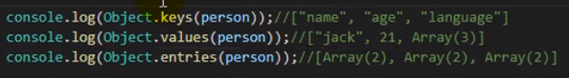

## 6、map和reduce

很像java8，**数组中新增了map和reduce方法**

```javascript
1、map():接收一个函数，将原数组中的所有元素用这个函数处理后放入新数组返回。
    let arr = ['1', '20', '-5', '3'];
    // arr = arr . map( (item)=>{ return item * 2 });
    arr = arr.map(item => item * 2);
    console.log(arr);

2、reduce(fun(previousValue, currentValue), initiaValue)
    //reduce()为数组中的每个元素 依次执行回调函数 ，不包括数组中被 删除或从未被赋值的元素，
    //[2, 40，-10, 6]
    /** arr.reduce(fun(previousValue, currentValue), initiaValue)
                1、previousValue(上一次调用回调返回的值，或者是提供的初始值(initialValue))
                2、currentValue(数组中当前被处理 的元素)
                3、index(当前元素在数组中的索引)
                4、array(调用reduce 的数组) */
    let result = arr.reduce((previousValue, currentValue) => {
        console.log("上一次处理后: " + previousValue);
        console.log("当前正在处理: " + currentValue);
        return previousValue + currentValue;
    }, 100);
    console.log(result)


```

reduce：

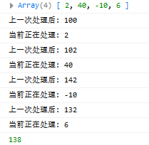


## 7、Promise

Promise对象，then((data)=>{})方法内部可以获得上一次请求返回的data值，所以可以根据data继续发送ajax请求


在JavaScript的世界中，**所有代码都是单线程执行的**。由于这个“缺陷”，导致JavaScript的所有**网络操作**，浏览器事件，都必须是**异步执行**。异步执行可以用回调函数实现。**一旦有一连串的ajax请求a,b,..后面的请求依赖前面的请求结果，就需要层层嵌套**。这种**缩进和层层嵌套**的方式，非常**容易造成上下文代码混乱**，我们不得不非常小心翼翼处理内层函数与外层函数的数据，一旦内层函数使用了上层函数的变量，这种混乱程度就会加剧..总之，这种"层叠.上下文的层层嵌套方式，着实增加了神经的紧张程度。

---

总结：就是代码缩进容易造成代码混乱，内层调用上层的变量

---

案例：用户登录，并展示该用户的各科成绩。在页面发送两次请求:

1.查询用户，查询成功说明可以登录

2.查询用户成功，查询科目

3.根据科目的查询结果，获取去成绩

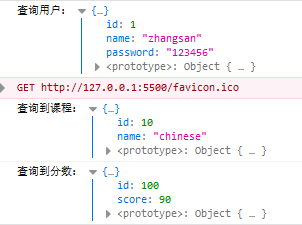

```javascript
1、原始
//1、查出当前用户信息
        //2、按照当前用户的id查出他的课程
        //3、按照当前课程id查出分数
        $.ajax({
            url: "mock/user.json",
            success(data) {
                console.log("查询用户：", data);
                $.ajax({
                    url: `mock/user_corse_${data.id}.json`,
                    success(data) {
                        console.log("查询到课程：", data);
                        $.ajax({
                            url: `mock/corse_score_${data.id}.json`,
                            success(data) {
                                console.log("查询到分数：", data);
                            },
                            error(error) {
                                console.log("出现异常了：" + error);
                            }
                        });
                    },
                    error(error) {
                        console.log("出现异常了：" + error);
                    }
                });
            },
            error(error) {
                console.log("出现异常了：" + error);
            }
        });

2、Promise可以封装异步操作，只有成功了then方法才会被执行【resolve和reject应该是两个回调函数，resolve里面调用了then方法】
let p = new Promise((resolve, reject) => {
    //1、异步操作
    $.ajax({
        url: "mock/user.json",
        success: function (data) {
            console.log("查询用户成功:", data)
            resolve(data);
        },
        error: function (err) {
            reject(err);
        }
    });
});

p.then((obj) => {
    return new Promise((resolve, reject) => {
        $.ajax({
            url: `mock/user_corse_${obj.id}.json`,
            success: function (data) {
                console.log("查询用户课程成功:", data)
                resolve(data);
            },
            error: function (err) {
                reject(err)
            }
        });
    })
}).then((data) => {
    console.log("上一步的结果", data)
    $.ajax({
        url: `mock/corse_score_${data.id}.json`,
        success: function (data) {
            console.log("查询课程得分成功:", data)
        },
        error: function (err) {
        }
    });
})


3、封装返回Promise对象的创建，简化代码
    function get(url, data) {
        return new Promise((resolve, reject) => {
            $.ajax({
                url: url,
                data: data,
                success: function (data) {
                    resolve(data);
                },
                error: function (err) {
                    reject(err)
                }
            })
        });
    }

    get("mock/user.json")
        .then((data) => {
        console.log("用户查询成功~~~:", data)
        return get(`mock/user_corse_${data.id}.json`);
    })
        .then((data) => {
        console.log("课程查询成功~~~:", data)
        return get(`mock/corse_score_${data.id}.json`);
    })
        .then((data)=>{
        console.log("课程成绩查询成功~~~:", data)
    })
        .catch((err)=>{
        console.log("出现异常",err)
    });
```


遇到的问题：file协议无法跨域： https://juejin.im/post/6844903965411246093 

```properties
同源策略（Same origin policy），是出于安全而诞生的一种约定，规定了只能在本域内进行资源访问。所谓同源是指"协议+域名+端口"三者相同。
```

```
1、使用live server
2、http请求的话，请求头需要带origin，并在服务端验证合法
request header 的 origin 必须合法
```


## 8、模块化

就是把script代码从html中抽离出来放到.js文件中，然后js文件的对象、数组、基本类型变量、函数可以被导出被其他js文件复用，这就称为模块化

```js
1、
hello.js
// export const util = {
//     sum(a, b) {
//         return a + b;
//     }
// }

// export {util} 默认时，import与这里要写的一样
export default {
    sum(a, b) {
        return a + b;
    }
}
//`export`不仅可以导出对象，一切JS变量都可以导出。比如：基本类型变量、函数、数组、对象。

user.js
var name = "jack"
var age = 21
function add(a,b){
    return a + b;
}

export {name,age,add}


main.js
import abc from "./hello.js"
import {name,add} from "./user.js"

abc.sum(1,2);
console.log(name);
add(1,3);
```


# 二、Vue

地址：https://cn.vuejs.org/v2/guide/installation.html#%E7%9B%B4%E6%8E%A5%E7%94%A8-lt-script-gt-%E5%BC%95%E5%85%A5

总结：Vue就是对js的封装，能够达到数据<==>页面双向绑定的作用，不用去写jquery中哪些选择器，数据改变了页面跟着改变

---


demo1：数据改变页面改变，vm是Vue对象

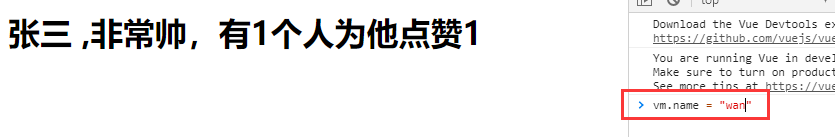

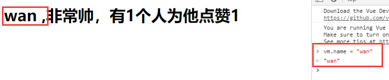

demo2：页面改变数据，导致页面修改

就是在标签绑定数据模型，在文本框中输入数据，数据会被Dom监听器监听修改model并加载到view中

```html
<input type="text" v-model="num">
<h1> {{name}} ,非常帅，有{{num}}个人为他点赞{{hello()}}</h1>

```


---


## 1、MVVM

以前的程序员需要协议对  $(‘#id’).append这种操作，现在增加viewmodel ，监听View和指令

Model  --  View  --  ViewModel

```properties
1、数据变，页面变

2、页面变，数据变【页面修改数据，进而导致页面变】
```

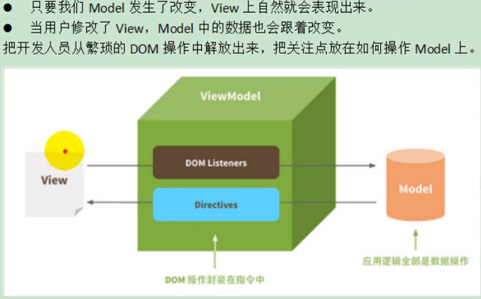

## 2、标签 与 数据模型绑定【安装vue】

```js
准备工作：

1、安装文档。我们选用npman安装：https://cn.vuejs.org/v2/guide/installation.html#NPM

创建一个vue2文件夹

npm init -y【表示该项目是npm管理】

# 安装最新稳定版
npm install vue

2、创建index.html，引入vue.js
<script src="./node_modules/vue/dist/vue.js"></script>

3、在VS CODE中安装Vue 2 Snippets语法提示 插件

4、在浏览器中安装一个 vue工具包
Vue-Devtools.zip  解压，google浏览器 更多工具-》扩展程序-》开发者模式-》加载已解压的扩展程序
```

```html
1、创建Vue实例
let vm = new Vue({
            el: "#app",//关联页面模板
            data: {  //封装数据
                name: "张三",
                num: 1
            });

2、Vue实例关联页面模板
	就是关联一个标签：	el: "#app",//绑定元素

3、将Vue实例的数据(data)，渲染到关联的模板中【自动的】

4、还可以定义方法，在页面模板中用{{}}来绑定数据或方法
		<button v-on:click="cancle">取消</button>
        <h1> {{name}} ,非常帅，有{{num}}个人为他点赞{{hello()}}</h1>

5、主要代码：
        let vm = new Vue({
            el: "#app",//绑定div元素，id选择
            data: {  //封装数据
                name: "张三",
                num: 1
            },
            methods:{  //封装方法
                cancle(){
                    this.num -- ;
                },
                hello(){
                    return "1"
                }
            }
        });

<!DOCTYPE html>
<html lang="en">

<head>
    <meta charset="UTF-8">
    <meta name="viewport" content="width=device-width, initial-scale=1.0">
    <meta http-equiv="X-UA-Compatible" content="ie=edge">
    <title>Document</title>
</head>

<body>

    <div id="app">
        <input type="text" v-model="num">
        <button v-on:click="num++">点赞</button>
        <button v-on:click="cancle">取消</button>
        <h1> {{name}} ,非常帅，有{{num}}个人为他点赞{{hello()}}</h1>
    </div>

    <script src="./node_modules/vue/dist/vue.js"></script>

    <script>
        //1、vue声明式渲染
        let vm = new Vue({
            el: "#app",//绑定元素
            data: {  //封装数据
                name: "张三",
                num: 1
            },
            methods:{  //封装方法
                cancle(){
                    this.num -- ;
                },
                hello(){
                    return "1"
                }
            }
        });

        //2、双向绑定,模型变化，视图变化。反之亦然。

        //3、事件处理

        //v-xx：指令

        //1、创建vue实例，关联页面的模板，将自己的数据（data）渲染到关联的模板，响应式的
        //2、指令来简化对dom的一些操作。
        //3、声明方法来做更复杂的操作。methods里面可以封装方法。

    </script>
</body>

</html>
```

## 2.3、插值表达式--必须有返回值

### 1）花括号

{{表达式}}，只能写在html标签体内部，例如下图不合法

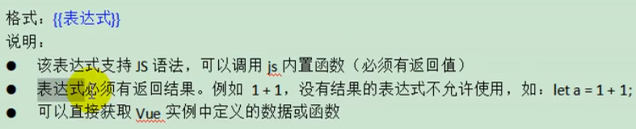

不合法：可以使用 v-bind来绑定属性值

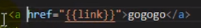


### 2）插值闪烁


## 4、指令

```html
1、事件：就是给标签绑定一个事件，例如点击事件、按键：
<button v-on:click="num++">点赞</button>

2、指令：各种事件的代码形式

3、指令可以绑定 方法、或者data如上
```

### 1）v-html、v-text

```html
解析html指令
    <div id="app">
        {{msg}}  {{1+1}}  {{hello()}}<br/>
        <span v-html="msg"></span>
        <br/>
        <span v-text="msg"></span>
    </div>

    new Vue({
        el:"#app",
        data:{
            msg:"<h1>Hello</h1>",
            link:"http://www.baidu.com"
            },
        methods:{
            hello(){
                return "World"
            }
        }
    })
```


### 1）v-bind-单向绑定

数据修改页面修改，页面修改不会导致数据修改（就是vue实例中的data没有修改）

```html
1、v-bind动态绑定属性值，不能使用插值表达式{{link}}
	1）、绑定href
		<a v-bind:href="link">gogogo</a>    绑定link
 		data:{
			link: "http://www.baidu.com"
 		}

	内部是对象形式
	2）、绑定class，根据true或false动态绑定class属性值
		<span v-bind:class="{active:isActive,'text-danger':hasError}"/> // 特殊字符加单引号
		data:{
			isActive:true,
    		hasError:true
		}

	3）、绑定style，这里的v-bind 可以省略
      	<span :style="{color: color1,fontSize: size}">你好</span> // 存在特殊字符也可以使用驼峰命名
		data:{
        	color1:'red',
        	size:'36px'
        }
```

### 2）v-model-双向绑定

页面修改数据修改，数据修改页面修改

```html
1、v-model=""
<div id="app">
    精通的语言：
    <input type="checkbox" v-model="language" value="Java"> java<br/>
    <input type="checkbox" v-model="language" value="PHP"> PHP<br/>
    <input type="checkbox" v-model="language" value="Python"> Python<br/>
    选中了 {{language.join(",")}} // 这是一个js表达式，拼接以，隔开
</div>

<script>
    let vm = new Vue({
        el:"#app",
        data:{
            language: []
        }
    })
</script>

```

### 3）v-on-绑定事件（点击事件、按键事件）

本小节内容包括 **事件修饰符** 和 **按键修饰符**

```html
1、v-on:
<button v-on:click="num++">点赞</button>

2、v-on可以简写
<button @click="num++">点赞</button>

<!-- 事件修饰符 -->
3、事件修饰符：阻止事件冒泡【例如一个大div包含一个小div，点击小div触发两次事件】
@click.stop:阻止事件冒泡到父元素:
@click.prevent: 阻止默认事件发生，a跳转事件被阻止
@click.capture: 使用事件捕获模式
@click.self: 只有元素自身触发事件才执行。(冒泡或捕获的都不执行)
@click.once : 只执行一次

解析a标签：<a>标签会alert一次，不加stop会alert2次
		 1、prevent阻止了跳转baidu.com的默认事件，
		 2、stop阻止了事件冒泡
		 3、="hello"是自己的事件
<div style="border: 1px solid red;padding: 20px;" v-on:click.once="hello">
    大div
    <div style="border: 1px solid blue;padding: 20px;" @click.stop="hello">
        小div <br />
        <a href="http://www.baidu.com" @click.prevent.stop="hello">去百度</a>
    </div>
</div>

methods:{
    hello(){
    	alert("点击了")
    }
}
    
<!-- 按键修饰符 -->
4、可以是组合键，@click.ctrl单击+ctrl键
按键别名，也可以使用建值
.enter
.tab
.delete (捕获“删除”和“退格”键)
.esc
.space
.up
.down
.Ieft
.right
<!-- 按键修饰符： -->
<input type="text" v-model="num" v-on:keyup.up="num+=2" @keyup.down="num-=2" @click.ctrl="num=10"><br />
```

### 4）v-for 遍历

**遍历的时候都加上:key来区分不同数据，提高vue渲染效率**，key选择唯一项

```html
<body>
	<div id="app">
        <ul>
            <li v-for="(user,index) in users" :key="user.name" v-if="user.gender == '女'">
                <!-- 1、显示user信息：v-for="item in items" -->
               当前索引：{{index}} ==> {{user.name}}  ==>   {{user.gender}} ==>{{user.age}} <br>
                <!-- 2、获取数组下标：v-for="(item,index) in items" -->
                <!-- 3、遍历对象：
                        v-for="value in object"
                        v-for="(value,key) in object"
                        v-for="(value,key,index) in object" 
                -->
                对象信息：
                <span v-for="(v,k,i) in user">{{k}}=={{v}}=={{i}}；</span>
                <!-- 4、遍历的时候都加上:key来区分不同数据，提高vue渲染效率 -->
            </li>
        </ul>

        <ul>
            <li v-for="(num,index) in nums" :key="index"></li>
        </ul>
    </div>
    <script src="../node_modules/vue/dist/vue.js"></script>
    <script>         
        let app = new Vue({
            el: "#app",
            data: {
                users: [{ name: '柳岩', gender: '女', age: 21 },
                { name: '张三', gender: '男', age: 18 },
                { name: '范冰冰', gender: '女', age: 24 },
                { name: '刘亦菲', gender: '女', age: 18 },
                { name: '古力娜扎', gender: '女', age: 25 }],
                nums: [1,2,3,4,4]
            },
        })
    </script>
</body>
```

### 5）v-if 和v-show

区别：看项目

v-if：是这个标签是否渲染

v-show：是display是否显示

### 6）v-else和v-else-if


## 5、计算属性、侦听器、过滤器

所有需要动态计算的属性写在computed中

```html
1、计算属性：computed计算总价
        <!-- 某些结果是基于之前数据实时计算出来的，我们可以利用计算属性。来完成 -->
<ul>
    <li>西游记； 价格：{{xyjPrice}}，数量：<input type="number" v-model="xyjNum"> </li>
    <li>水浒传； 价格：{{shzPrice}}，数量：<input type="number" v-model="shzNum"> </li>
    <li>总价：{{totalPrice}}</li>
    {{msg}}
</ul>
<script>
    new Vue({
        el: "#app",
        data: {
            xyjPrice: 99.98,
            shzPrice: 98.00,
            xyjNum: 1,
            shzNum: 1,
            msg: ""
        },
        computed: {
            // totalPrice : function() ES6后可以简化成下样式
            totalPrice(){
                return this.xyjPrice*this.xyjNum + this.shzPrice*this.shzNum
            }
        }
    })
</script>

2、侦听器，watch监听xyjNum，如果>=3修改msg和xyjNum的值【在computed之前执行】
<script>
    new Vue({
        el: "#app",
        data: {
            xyjPrice: 99.98,
            shzPrice: 98.00,
            xyjNum: 1,
            shzNum: 1,
            msg: ""
        },
        computed: {
            // totalPrice : function() ES6后可以简化成下样式
            totalPrice(){
                return this.xyjPrice*this.xyjNum + this.shzPrice*this.shzNum
            }
        },
        watch: {
            xyjNum(newVal,oldVal){
                if(newVal>=3){
                    this.msg = "库存超出限制";
                    this.xyjNum = 3
                }else{
                    this.msg = "";
                }
            }
        },
    })
</script>

3、根据结果值，做一系列操作
全局过滤器+局部过滤器
<div id="app">
    <ul>
        <li v-for="user in userList">
            {{user.id}} ==> {{user.name}} ==> {{user.gender == 1?"男":"女"}} ==>
            {{user.gender | genderFilter}} ==> {{user.gender | gFilter}}
        </li>
    </ul>
</div>
    <script>
        // 全局过滤器
        Vue.filter("gFilter", function (val) {
            if (val == 1) {
                return "男~~~";
            } else {
                return "女~~~";
            }
        })

        let vm = new Vue({
            el: "#app",
            data: {
                userList: [
                    { id: 1, name: 'jacky', gender: 1 },
                    { id: 2, name: 'peter', gender: 0 }
                ]
            },
            filters: {
                // filters 定义局部过滤器，只可以在当前vue实例中使用
                genderFilter(val) {
                    if (val == 1) {
                        return "男";
                    } else {
                        return "女";
                    }
                }
            }
        })
    </script>
```


## 6、组件化

组件：1、就是view 和model 整体包装成一个组件可以被复用

​			2、组件本身就是一个对象（Vue实例），其他的Vue实例内部可以包含组件实例【因为组件实例也是一个Vue实例，所以可以实现套娃，多重重复使用】

​			3、在一个Vue实例中，template（模板）和components（导入组件）可以同时出现，可以添加模板将自己声明成一个组件，也可以使用components导入其他组件【多重重复使用的实现】

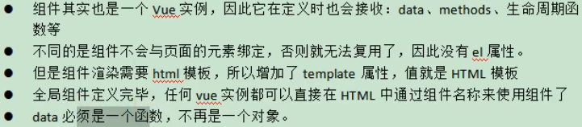


```html
1、分为全局组件 和 局部组件
全局组件：Vue.component("counter"，  // counter是组件名。我猜测就是静态的所以全局
局部组件：定义一个普通对象就可以，然后在Vue实例内部添加components属性并设置组件名（k:v形式）
	<div id="app">
        <button v-on:click="count++">我被点击了 {{count}} 次</button>

        <counter></counter>
        <counter></counter>
        <counter></counter>
        <counter></counter>
        <counter></counter>

        <button-counter></button-counter>
    </div>
    <script src="../node_modules/vue/dist/vue.js"></script>


    <script>
        //1、全局声明注册一个组件
        Vue.component("counter", {
            template: `<button v-on:click="count++">我被点击了 {{count}} 次</button>`,
            data() {
                return {
                    count: 1
                }
            }
        });

        //2、局部声明一个组件
        const buttonCounter = {
            template: `<button v-on:click="count++">我被点击了 {{count}} 次~~~</button>`,
            data() {
                return {
                    count: 1
                }
            }
        };

        new Vue({
            el: "#app",
            data: {
                count: 1
            },
            components: {
                'button-counter': buttonCounter
            }
        })
    </script>
```


## 7、生命周期、钩子函数

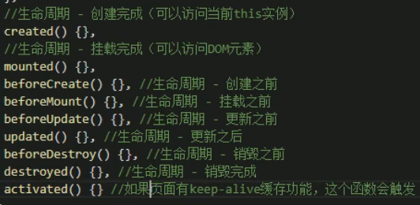

Vue实例创建过程

注入：将值注入到data属性的时候 （beforeCreate：注入之前）（created：注入之后 ）


**就是一个Vue实例创建后，注入、挂载、渲染时，钩子函数调用的时机**

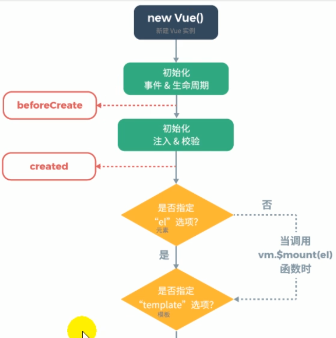

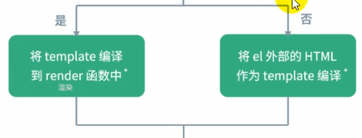

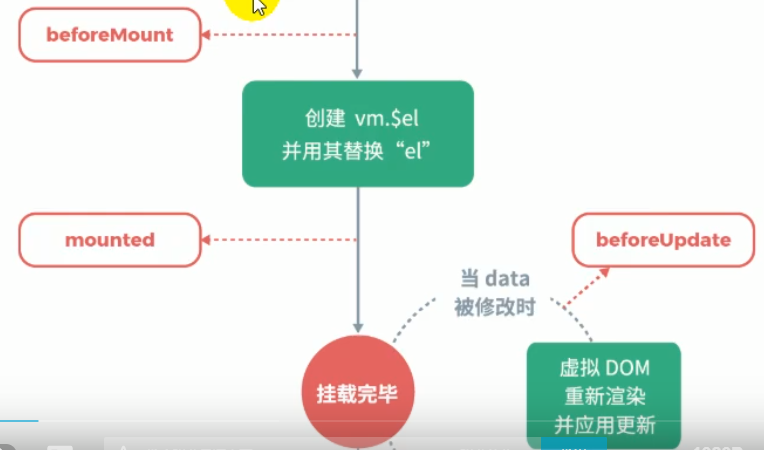

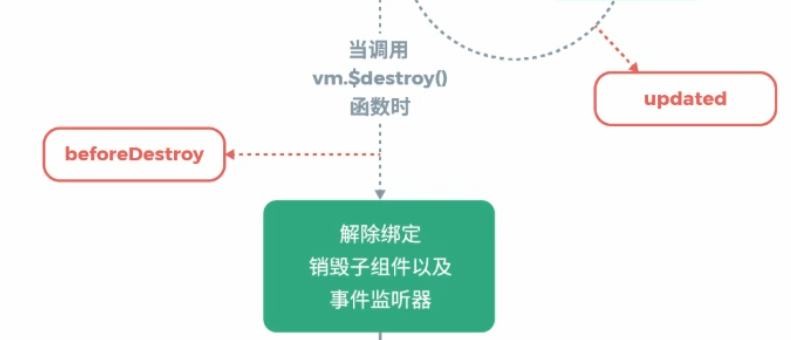


## 8、模块化【解析main.js 重要】【安装webpack模板】

```properties
1、全局安装webpack【能把项目打包】
	npm install webpack -g
	细节：cmd右键取消快速编辑模式
	
2、安装vue脚手架【模块化项目】
	npm install -g @vue/cli-init【后面init 失败，选择下面一条语句成功】
	解决方法一：cnpm install -g vue-cli
	解决方法二：https://blog.csdn.net/zhumizhumi/article/details/89875666
		查找vue.cmd，将文件夹添加到环境变量Path中
		
3、vue脚手架初始化一个叫vue-demo以webpack为模板的应用
	vue init webpack vue-demo
```

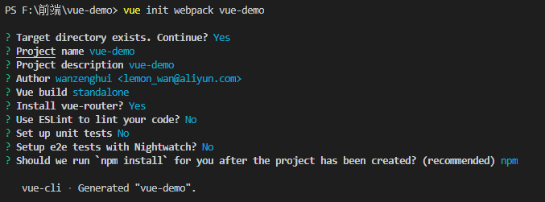

```properties
4、cd vue-demo

5、npm run dev启动，ctrl+c停止项目
	http://localhost:8080就可以访问了

6、main.js

import Vue from 'vue'
import App from './App'
import router from './router'	// 指定了路由规则

Vue.config.productionTip = false

/* eslint-disable no-new */
new Vue({
  el: '#app',
  router,
  components: { App },	/* 导入的组件 */
  template: '<App/>' 	/* 单文件组件作为模板 */
})
解析：这里component其实已经导入了组件App，在index.html的div中直接使用<App></App>就可以了
如果这里指定了template: '<App/>'，则div不用再写<App></App>了，表示以template作为模板渲染，否则以el指定的div作为模板

----------------------------------------------------------------------------------

7、index.html

<!DOCTYPE html>
<html>
  <head>
    <meta charset="utf-8">
    <meta name="viewport" content="width=device-width,initial-scale=1.0">
    <title>vue-demo</title>
  </head>
  <body>
    <div id="app">
    	这里也可以直接使用<App></App>
    </div>
    <!-- built files will be auto injected -->
  </body>
</html>

```

vue-demo结构：

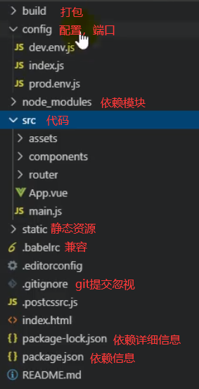

## 9、单文件组件 App.vue

【.vue文件就是一个全局的vue实例，不需要export语句】这一个文件就是一个组件。例如main.js中的Vue实例就使用了App.vue单文件组件作为模板


去官网看doc，三个组成部分

template ：html代码

script：js代码

style：css

```vue
1、App.vue 单文件组件，被引入到index.html的div模块
template由img和<router-view/>组成，imag图片始终不变
路由按照请求路径来显示不同的页面【路由规则查看main.js导入的路由组件具体路由】


<template>
  <div id="app">
    
    <router-view/>
  </div>
</template>

<script>
export default {
  name: 'App'
}
</script>

<style>
#app {
  font-family: 'Avenir', Helvetica, Arial, sans-serif;
  -webkit-font-smoothing: antialiased;
  -moz-osx-font-smoothing: grayscale;
  text-align: center;
  color: #2c3e50;
  margin-top: 60px;
}
</style>
```

自定义路由组件：

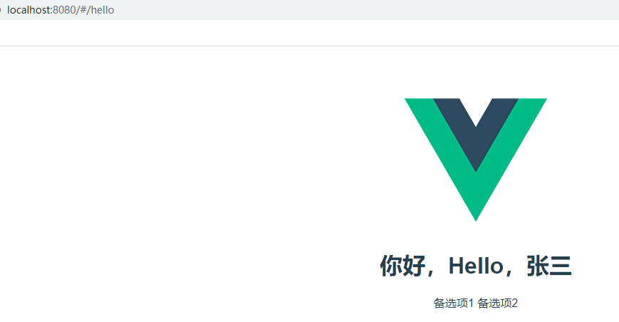

## 10、路由视图

路由视图会根据请求路径改变

```vue
1、App.vue

<template>
  <div id="app">
    <!-- img图片不变 -->
    
    <!-- 路由视图会根据请求路径改变 -->
    <router-view/>
  </div>
</template>

<script>
export default {
  name: 'App'
}
</script>

<style>
#app {
  font-family: 'Avenir', Helvetica, Arial, sans-serif;
  -webkit-font-smoothing: antialiased;
  -moz-osx-font-smoothing: grayscale;
  text-align: center;
  color: #2c3e50;
  margin-top: 60px;
}
</style>

2、index.js【里面new了一个Router并且是default没有名字】
规则是/请求会使用组件HelloWorld

import Vue from 'vue'
import Router from 'vue-router'
import HelloWorld from '@/components/HelloWorld'

Vue.use(Router)

export default new Router({
  routes: [
    {
      path: '/',
      name: 'HelloWorld',
      component: HelloWorld
    }
  ]
})

3、所有在路由规则里面添加路由+组件的映射关系，就可以把自己写的组件也添加进去了【/hello】
然后在写单页面组件hello.vue就可以了【.vue文件就是一个全局的vue实例，不需要export语句】

import Vue from 'vue'
import Router from 'vue-router'
import HelloWorld from '@/components/HelloWorld'
import Hello from '@/components/Hello'

Vue.use(Router)

export default new Router({
  routes: [
    {
      path: '/',
      name: 'HelloWorld',
      component: HelloWorld
    },{
      path: '/hello',
      name: 'Hello',
      component: Hello
    }
  ]
})


```

## 11、总结+梳理【重要，看这里】

总结：.js（纯js代码，定义实例、变量）、.vue（单文件组件）、.html（渲染模板）【其中.js文件与.vue文件互相依赖进行渲染（template被作为模板渲染），html文件可以被作为模板进行渲染也可以在内部写js语句】

```properties
vue实例：以下demo主要讲在<script>中new的Vue实例
		组成：任何vue实例都包含template、script、style三部分
	1、el：关联的html标签（一般是div标签的id）【表示该vue实例的template是el外部的html】
	2、router：路由，可以被当前vue实例依赖的组件相关联完成不同路由地址的渲染（在.vue文件< router-view>/使用路由）
	3、components：依赖的组件（组件也是一个vue实例），这里依赖了组件后，在div中就可以使用< 组件名/>来使用组件进行渲染了
	4、template：直接在这里渲染后添加到div标签中【表示该vue实例的template是指定的组件】
	5、data：数据，div标签内部可以使用插值表达式使用，但是标签属性上要使用指令 来使用data中的属性值
	6、methods：方法，跟data使用方式一样（插值表达式使用时不需要加括号）
	7、computed：计算属性，实际上一个方法，并且有返回值
	8、watch：监控data中的数据（先于computer被执行）
	9、过滤器：局部（只能在当前vue实例中使用）与全局过滤器，【用来对数据的过滤{{user.gender | gFilter}}】
// 全局过滤器（可以被其他vue使用）
Vue.filter("gFilter", function (val) {
    if (val == 1) {
    	return "男~~~";
    } else {
    	return "女~~~";
    }
})
	
new Vue({
  el: '#app',
  router,
  components: { App },// 名字与组件名相同可以简写
  data: {name: "zhangsan", age: 13},
  methods: {
  	hello(){return "World";}
  },
  computed: {
    totalPrice(){// totalPrice : function() ES6后可以简化成下样式
  		return this.xyjPrice*this.xyjNum + this.shzPrice*this.shzNum
    }
  },
  watch: {
  	xyjNum(newVal,oldVal){
        if(newVal>=3){
        	this.msg = "库存超出限制";
        	this.xyjNum = 3
        }else{
        	this.msg = "";
        }
  	}
  },
  filters: {
      // filters 定义局部过滤器，只可以在当前vue实例中使用
      genderFilter(val) {// 过滤器的名字
      	if (val == 1) {
      		return "男";
      	} else {
      		return "女";
      	}
      }
  },
  template: '<App/>'
})
```

```html
component组件：
	实际上就是一个Vue实例，组件三要素：template、script、style
    组件的两种形式：1、声明式组件（下面demo中的全局组件、局部组件）；
    			 2、单文件组件（三要素，其实就是一个全局的vue实例，组件也是vue实例。例如App.vue）
    组件使用：在js代码中创建vue实例使用的组件的时候，要导入组
                1、导入单文件组件：import App from './App' （export default {name: 'App'}）
														 整个App.vue导出为一个组件实例对象
				2、导入声明式组件：import {buttonCounter} from './user.js' 
						  导出一个叫buttonCounter的组件实例（export {buttonCounter}）

1、声明式组件：全局组件 && 局部组件
	使用：在vue实例中定义components属性指定局部属性，全局属性不需要指定
	demo：组件化.html
    <div id="app">
        <button v-on:click="count++">我被点击了 {{count}} 次</button>
        <counter></counter>
        <button-counter></button-counter>
    </div>
    <script src="../node_modules/vue/dist/vue.js"></script>
    <script>
        //1、全局声明注册一个组件
        Vue.component("counter", {
            template: `<button v-on:click="count++">我被点击了 {{count}} 次</button>`,
            data() {
                return {
                    count: 1
                }
            }
        });

        //2、局部声明一个组件
        const buttonCounter = {
            template: `<button v-on:click="count++">我被点击了 {{count}} 次~~~</button>`,
            data() {
                return {
                    count: 1
                }
            }
        };

        new Vue({
            el: "#app",
            data: {
                count: 1
            },
            components: {
                'button-counter': buttonCounter
            }
        })
    </script>

2、单文件组件，使用的时候要import导入【因为组件本身就是一个vue实例，一个js要使用另一个js的实例、变量就要导入】
demo：main.js
import Vue from 'vue'
import App from './App'    这里要导入App.vue单文件组件
import router from './router'

Vue.config.productionTip = false

/* eslint-disable no-new */
new Vue({
  el: '#app',
  router,
  components: { App },
  template: '<App/>'
})


demo：App.vue
<template>
  <div id="app">
    <!-- img图片不变 -->
    
    <!-- 路由视图会根据请求路径改变 -->
    <router-view/>
  </div>
</template>

<script>
export default {
  name: 'App'
}
</script>

<style>
#app {
  font-family: 'Avenir', Helvetica, Arial, sans-serif;
  -webkit-font-smoothing: antialiased;
  -moz-osx-font-smoothing: grayscale;
  text-align: center;
  color: #2c3e50;
  margin-top: 60px;
}
</style>

3、组件内部属性template
单文件组件：App.vue在<template>标签内部可以使用<router-view/>标签指定该标签的渲染由路由指定
声明式组件：在组件的template属性中 `<router-view/>` 同样可以指定路由渲染标签

而路由标签的实际路由由依赖该组件的vue实例决定，所以<router-view/>就像一个钩子函数，由实际vue实例决定
```

```js
router.js：路由实例，与vue实例搭配使用，在组件的template中可以使用<router-view/>来指定不同路由显示不同的组件
解析router.js内部：
1、导入 vue 和 vue-router
2、导入依赖的组件
3、new Router实例并export导出
4、在routes属性内部指定一个数组
5、数组元素三个属性
	1）path：路由地址【当访问/hello时，App.vue组件的template中的<router-view/>就会渲染Hello组件】
    2）name：组件名
    3）component：组件
import Vue from 'vue'
import Router from 'vue-router'
import HelloWorld from '@/components/HelloWorld'
import Hello from '@/components/Hello'

Vue.use(Router)

export default new Router({
  routes: [
    {
      path: '/',
      name: 'HelloWorld',
      component: HelloWorld
    },{
      path: '/hello',
      name: 'Hello',
      component: Hello
    }
  ]
})
```

```vue
<router-view>和<router-link>
1、<router-view>：会根据访问路径决定渲染组件
2、<router-link>：相当于a标签，点击后渲染路由指定的组件
<template>
  <div id="app">
    <!-- img图片不变 -->
    
    <router-link to="/hello">去hello</router-link>
    <router-link to="/">去首页</router-link>
    <!-- 路由视图会根据请求路径改变 -->
    <router-view/>
  </div>
</template>

<script>
export default {
  name: 'App'
}
</script>

<style>
#app {
  font-family: 'Avenir', Helvetica, Arial, sans-serif;
  -webkit-font-smoothing: antialiased;
  -moz-osx-font-smoothing: grayscale;
  text-align: center;
  color: #2c3e50;
  margin-top: 60px;
}
</style>

```


```properties
区分.js文件、.html文件、.vue文件
.js文件：
1、js多用于绑定vue实例与div的绑定关系（用el:'#app'）
2、js文件可以import和export变量、函数、实例（vue、component、router）
3、js文件其实就是<script>标签内部代码单独抽离出来了
4、vue实例可以选择html作为模板渲染，也可以使用template属性指定的作为模板渲染

.html文件
1、多用作模板，模板与vue实例结合才能完成渲染。
2、内部可以指定<script>标签，内部代码跟.js文件的一样

.vue文件
1、一个单文件组件，一个vue实例，并在<script>以export default{name:App}的形式向外提供组件实例
1、包含template、script、style，是一个完整组件
```


