网站汇总：

```
前端标签网站：https://element.eleme.cn/#/zh-CN/component/tree
mybatisplus文档：mp.baomidou.com/guide/logic-delete.html
 
树：https://element.eleme.cn/#/zh-CN/component/tree 【在这里面找属性，可以默认展开某个节点】【内部可以加按钮，删除、编辑、追加】【可拖拽节点】

可拖拽节点： https://element.eleme.cn/#/zh-CN/component/tree#ke-tuo-zhuai-jie-dian 
switch开关： https://element.eleme.cn/#/zh-CN/component/switch#switch-kai-guan 【是否允许拖动】


对话框【可以嵌套表单】：https://element.eleme.cn/#/zh-CN/component/dialog#ji-ben-yong-fa 
表单组件： https://element.eleme.cn/#/zh-CN/component/form 【嵌入到对话框】
弹框： https://element.eleme.cn/#/zh-CN/component/message-box 【删除确认、取消】
消息提示： https://element.eleme.cn/#/zh-CN/component/message 【删除成功】


table自定义列模板-滑动按钮：https://element.eleme.cn/#/zh-CN/component/message【显示状态】
switch开关： https://element.eleme.cn/#/zh-CN/component/switch#switch-kai-guan 【放在自定义模板里面】
upload，文件上传： https://element.eleme.cn/#/zh-CN/component/upload 
springcloud文档： https://github.com/alibaba/spring-cloud-alibaba/blob/master/README-zh.md 
表单数据自定义校验： https://element.eleme.cn/#/zh-CN/component/form#zi-ding-yi-xiao-yan-gui-ze 

接口文档：https://easydoc.xyz/s/78237135/ZUqEdvA4/hKJTcbfd
```


[TOC]

# 项目遇到的问题

## 1、跨域

renren-fast-vue访问出现跨域问题

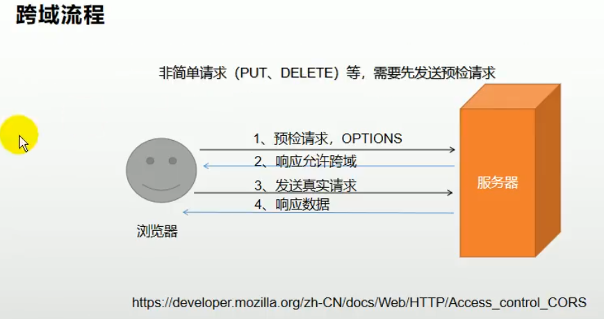

跨域：浏览器的安全检查功能，协议、域名、端口只要任一改变都发生跨域请求

.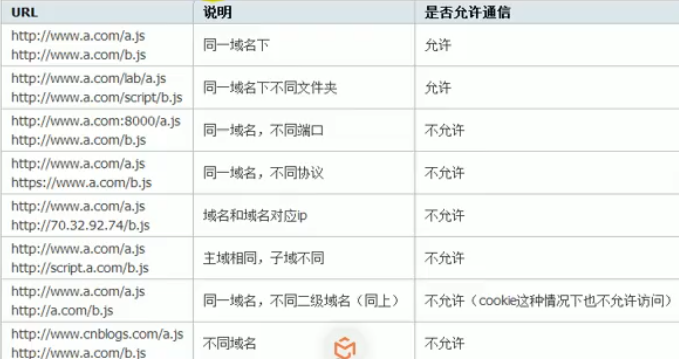


解决方案一：所有请求都由nginx转发，前端请求后端HTTP请求都有nginx处理，浏览器检查时不会发生跨域

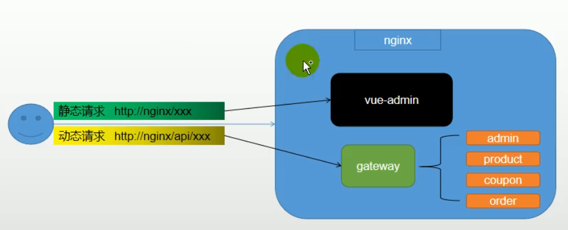

解决方案二：

发送请求前会发送一次OPTION请求，请求服务端此次跨域请求是否被允许，在服务端配置响应头，允许跨域

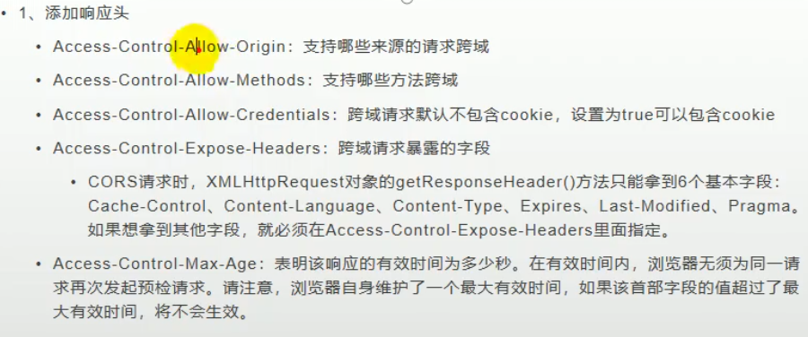


```java
1、在gateway创建配置类
CorsWebFilter是拦截器？还是过滤器？

@Configuration
public class GulimallCorsConfiguration {

    @Bean
    public CorsWebFilter corsWebFilter() {
        UrlBasedCorsConfigurationSource source = new UrlBasedCorsConfigurationSource();
        CorsConfiguration corsConfiguration = new CorsConfiguration();
        // 1、配置跨域
        corsConfiguration.addAllowedHeader("*");
        corsConfiguration.addAllowedMethod("*");
        corsConfiguration.addAllowedOrigin("*");
        corsConfiguration.setAllowCredentials(true);// 否则跨域请求会丢失cookie信息

        source.registerCorsConfiguration("/**", corsConfiguration);
        return new CorsWebFilter(source);
    }
}

```


## 2、httpRequest.js+生成代码片段

post请求，参数是data，返回参数在then的data里

get请求，参数是params，返回参数在then的data里

```js
utils -> httpRequest.js
封装了ajax请求，例如get请求可能会被缓存，默认拼一个时间戳参数，每次发新情求
所以封装一个代码片段，直接请求是调用httpRequest封装的get请求，输入httpget就行
文件->首选项->用户片段
vue.code-snippets
{
	"生成vue模板": {
		"prefix": "vue",
		"body": [
			"<template>",
			"<div></div>",
			"</template>",
			"",
			"<script>",
			"//这里可以导入其他文件（比如：组件，工具js，第三方插件js，json文件，图片文件等等）",
			"//例如：import 《组件名称》 from '《组件路径》'",
			"",
			"export default {",
			"//import引入的组件需要注入到对象中才能使用",
			"components: {},",
			"props: {},",
			"data() {",
			"//这里存放数据",
			"return {};",
			"},",
			"//计算属性 类似于data概念",
			"computed: {},",
			"//监控data中的数据变化",
			"watch: {},",
			"//方法集合",
			"methods: {},",
			"//声明周期 - 创建完成（可以访问当前this实例）",
			"created() {},",
			"//声明周期 - 挂载完成（可以访问DOM元素）",
			"mounted() {},",
			"beforeCreate() {}, //生命周期 - 创建之前",
			"beforeMount() {}, //生命周期 - 挂载之前",
			"beforeUpdate() {}, //生命周期 - 更新之前",
			"updated() {}, //生命周期 - 更新之后",
			"beforeDestroy() {}, //生命周期 - 销毁之前",
			"destroyed() {}, //生命周期 - 销毁完成",
			"activated() {} //如果页面有keep-alive缓存功能，这个函数会触发",
			"};",
			"</script>",
			"<style scoped>",
			"</style>",
		]
	},
	"http-get请求": {
		"prefix": "httpget",
		"body": [
			"this.\\$http({",
			"url: this.\\$http.adornUrl(''),",
			"method: 'get',",
			"params: this.\\$http.adornParams({})",
			"}).then(({data}) => {",
			"})"
		],
		"description": "httpGET请求"
	},
	"http-post请求": {
		"prefix": "httppost",
		"body": [
			"this.\\$http({",
			"url: this.\\$http.adornUrl(''),",
			"method: 'post',",
			"data: this.\\$http.adornData(data, false)",
			"}).then(({ data }) => { });"
		],
		"description": "httpPOST请求"
	}
}
```


## 3、java应用服务器上传oss代码

可以看阿里云文档oss，很好找自己找

```java
1、导入依赖，可以用启动器，然后注入OSSClient，这里直接自己创建OSSClient对象
    <dependency>
    	<groupId>com.aliyun.oss</groupId>
    	<artifactId>aliyun-sdk-oss</artifactId>
   	 	<version>3.10.2</version>
    </dependency>

2、直接上传
    @Test
    void testUpload() throws FileNotFoundException {
        // Endpoint以杭州为例，其它Region请按实际情况填写。
        String endpoint = "oss-cn-shanghai.aliyuncs.com";
        // 云账号AccessKey有所有API访问权限，建议遵循阿里云安全最佳实践，创建并使用RAM子账号进行API访问或日常运维，请登录 https://ram.console.aliyun.com 创建。
        String accessKeyId = "XX";
        String accessKeySecret = "XX";

        // 创建OSSClient实例。
        OSS ossClient = new OSSClientBuilder().build(endpoint, accessKeyId, accessKeySecret);

        // 上传文件流。
        InputStream inputStream = new FileInputStream("C:\\Users\\Administrator\\Desktop\\spring cloud alibaba全解2.pdf");
        ossClient.putObject("gulimall-wan", "spring cloud alibaba全解2.pdf", inputStream);

        // 关闭OSSClient。
        ossClient.shutdown();

        System.out.println("上传成功");
    }

```

## 4、校验异常绑定

校验异常绑定是在每个controller请求上处理异常，每个请求都需要处理，应该使用统一处理的方式

```java
    @RequestMapping("/save")
    // @RequiresPermissions("product:brand:save")
    public R save(@Validated({AddGroup.class}) @RequestBody BrandEntity brand, BindingResult result){
        // 使用统一的异常处理，将异常抛出
        if (result.hasErrors()) {
            Map<String, String> map = new HashMap<>();
            // 获取校验的错误结果
            result.getFieldErrors().forEach((item) -> {
                // 获取到错误提示FieldError
                String message = item.getDefaultMessage();
                // 获取错误的属性名字
                String field = item.getField();
                map.put(field, message);
            });
            return R.ok().error(400, "提交的数据不合法").put("data", map);
        }else {

        }
        brandService.save(brand);
        return R.ok();
    }
```

## 5、接口文档

```
https://easydoc.xyz/s/78237135/ZUqEdvA4/hKJTcbfd
```


## 6、PO、VO、TO、DTO、

```
1.PO(persistant object）持久对象
mapper查询出来的记录都用PO封装，一个对象代表一条记录，多个记录可以用PO的集合。PO中应该不包
含任何对数据库的操作。【例如Entity类】

2.DO（Domain Object）领域对象
就是从现实世界中抽象出来的有形或无形的业务实体。

3.TO(Transfer Object)，数据传输对象
不同的应用程序之间传输的对象

4.DTO(Data Transfer Object)数据传输对象
泛指于 展示层与服务层之间的数据传输对象

5.VO（value object）值对象
view object：视图对象，接收页面请求数据封装的对象， 封装返回给页面的对象
例如 @JsonInclude(JsonInclude.Include.NON_EMPTY)：如果是空就不返回

6.BO（business object）业务对象
由多个不同类型的PO组成，例如一个简历对象，由教育经历PO，工作经历PO组成

7.POJO（plain ordinary java object）简单无规则java对象
POJO是 DO/DTO/BO/BO的统称，只有基本的setter、getter方法

8.DAO（data access object）数据访问对象
是一个sun的一个标准j2ee 设计模式，这个模式中有个接口就是DAO，它负持久
层的操作。为业务层提供接口。此对象用于访问数据库。通常和PO结合使用，DAO中包
含了各种数据库的操作方法。通过它的方法，结合PO对数据库进行相关的操作。夹在业
务逻辑与数据库资源中间。配合vo，提供数据库的 CRUD 操作.

```

## 7、controller和service功能分配

```
* 1、controller：处理请求，接收和校验数据【JSR303】
* 2、service接收controller传来的数据，进行业务处理
* 3、controller接收service处理完的数据，封装页面指定的vo
```

## 8、renren-fast-vue启动解决

```
https://www.cnblogs.com/misscai/p/12809404.html

（一）切换淘宝镜像

　　npm install -g cnpm --registry=https://registry.npm.taobao.org

（二）设置权限(管理员打开cmd)

　　输入set-ExecutionPolicy RemoteSigned 选择A

      

（三）安装依赖

　　注意： npm 有些可能下载不下来

　　用 　　cnpm install 

（四）启动

　　npm run dev
```

## 9、content-type与requestBody、requestParm

```
https://blog.csdn.net/qq_26761587/article/details/73691189
```


## 10、远程调用

```
两种实现：
1、发送到网关
@FeignClient("gulimall-gateway")
public interface CouponFeignService {

    @RequestMapping("/api/coupon/coupon/member/list")
    public R membercoupons();
}

2、直接发送到服务
@FeignClient("gulimall-coupon")
public interface CouponFeignService {

    @RequestMapping("/coupon/coupon/member/list")
    public R membercoupons();
}
```

```
实现步骤：
0、引入open-feign依赖
1、要把服务注册到注册中心中
2、开启远程调用功能
	@EnableFeignClients(basePackages="com.atguigu.gulimall.member.feign")

3、指定@FeignClient
@FeignClient("gulimall-coupon")
public interface CouponFeignService {

    @RequestMapping("/coupon/coupon/member/list")
    public R membercoupons();
}

     * 1、CouponFeignService.saveSpuBounds( spuBoundTo);
     * 1) 、@RequestBody将这个对象转为json。
     * 2)、找到gulimaLl-coupon服务，给/coupon/spubounds/save发送请求。
     * 将上一步转的jsor放在请求体位置，发送请求，
     * 3) 、对方服务收到请求。请求体里有json数据。
     * (@RequestBody SpuBoundsEntity spuBounds)﹔将请求体的json转为SpuBoundsEntity;
     * 只要jsor数据模型是兼容的。双方服务无需使用同—个to
```

## 11、统一异常处理

```
找商品服务，后台管理，都有
```


## 12、校验

```
找商品服务，后台管理，都有
```

## 13、修改每个服务的内存JVM

1、editConfigurations


2、创建一个Compound


3、将每个服务加入到同一个Compound中

 

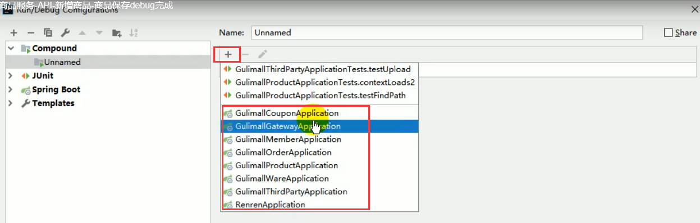

4、点击修改，占用内存-Xmx100m

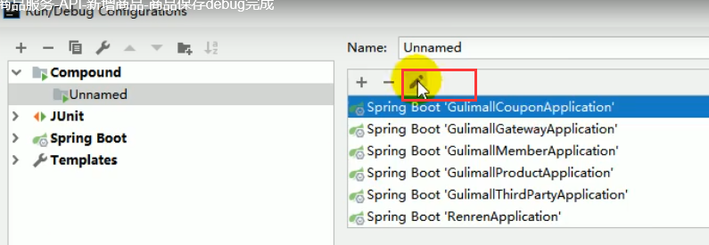


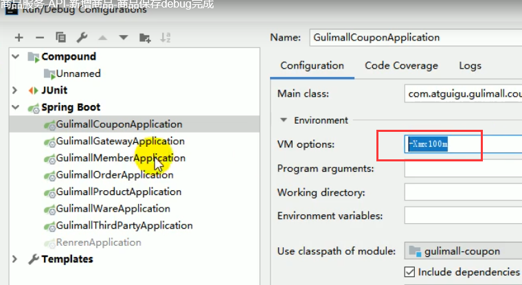

5、起名gulimall

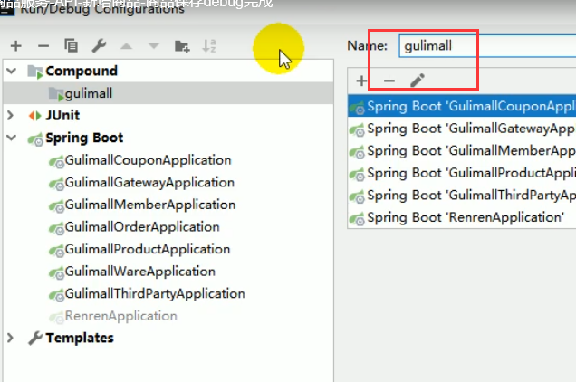

6、启动gulimall


## 14、开启事务

```
1、@EnableTransactionManagement

2、@Transactional
```


## 15、P100点击规格400错误

```
INSERT INTO sys_menu (menu_id, parent_id, name, url, perms, type, icon, order_num) VALUES (76, 37, '规格维护', 'product/attrupdate', '', 2, 'log', 0);
```


# 一、商品服务

## 1、后台管理

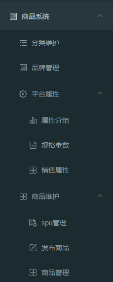

### 1.1、商品分类【三级分类】

renren-fast-vue

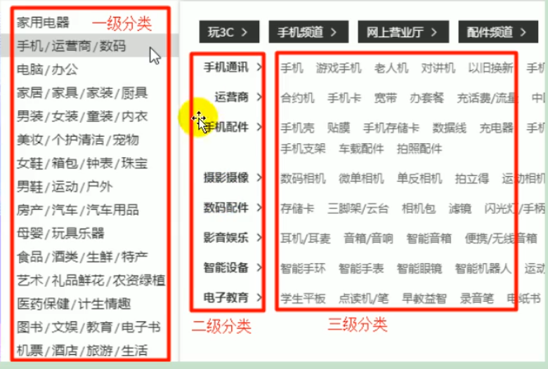

表：gulimall-pms -> pms_category

每个分类会保存自己的父分类id

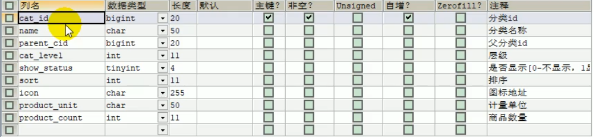

---

#### * 配置

请求服务器地址：static/config/index.js——>>window.SITE_CONFIG['baseUrl'] = 'http://localhost:88/api';

```java
1、启动renren-fast后端，启动前端项目npm run dev
2、登录localhost:8001,admin admin
新增后台管理的一级目录：商品系统
	系统管理->菜单管理->新增-> 目录

3、新增菜单：分类维护，选中商品系统【可看下图】

4、菜单的url：localhost:8008/product/category 会转换成product-category作为请求路由【会根据不同的路由加载不同的组件（这是vue的功能）】
新建category.vue文件放在目录：src->views->modules->product

输入vue根据模板生成代码

5、这个是展示属性数据用的
doc:https://element.eleme.cn/#/zh-CN/component/tree
使用<el-tree>展示三级分类

6、真实数据应该是调用商品服务的接口来的，所以可以查看项目内部sys->user.vue是怎么调接口的
问题：要将请求发送到网关，而不是8080【全局查询localhost:8080，修改为网关的地址:80】
1）修改static/config/index.js
      window.SITE_CONFIG['baseUrl'] = 'http://localhost:88/api';

7、让gulimall-fast后端项目注册到网关中
1）引入依赖
		<dependency>
			<groupId>com.atguigu.gulimall</groupId>
			<artifactId>gulimall-common</artifactId>
			<version>0.0.1-SNAPSHOT</version>
		</dependency>
		
2）添加Nacos配置
spring:
  application:
    name: renren-fast
  cloud:
    nacos:
      discovery:
        server-addr: 127.0.0.1:8848
        
3）在Application上加上注解，将该服务注册到注册中心中
@EnableDiscoveryClient

4）设置网关转发规则：带负载均衡的，路径匹配转发规则
例子：http://localhost:88/api/captcha.jpg  http://localhost:8080/api/captcha.jpg
    http://localhost:8080/renren-fast/captcha.jpg
      - id: admin_route
        uri: lb://renren-fast
        predicates:
        - Path=/api/**    
但是！正确的是还要带上项目名 server-servlet-context-path的路径，且去掉api **/
  最后版本：
      - id: admin_route
        uri: lb://renren-fast
        predicates:
        - Path=/api/**
        filters:
          - RewritePath=/api/(?<segment>.*),/renren-fast/$\{segment}
          
5）重启renren-fast 、 gateway


6）出现问题header contains multiple values 'http://localhost:8001, http://localhost:8001', but only one is allowed.
配置了多个跨域，找到renren-fast的跨域，给注释掉
重启访问，成功进入后台管理页面
    
8、商品管理请求404
原因：所有api请求转发到了renren-fast

Request URL: http://localhost:88/api/product/category/list/tree
Request Method: GET
Status Code: 404 Not Found
Remote Address: [::1]:88
Referrer Policy: no-referrer-when-downgrade

    解决：api/product转到商品服务
在gateway 配置路由规则
      - id: product_route
        uri: lb://gulimall-product
        predicates:
        - Path=/api/product/**
        filters:
        - RewritePath=/api/(?<segment>.*),/$\{segment}


9、配置商品服务配置
1）新建bootstrap.properties
spring.application.name=gulimall-product
spring.cloud.nacos.config.server-addr=127.0.0.1:8848
spring.cloud.nacos.config.namespace=a152f0a8-3f55-4496-bc9a-c26df96bb2f9
spring.cloud.nacos.config.group=dev
#如果这个dev不放开的话，默认的gulimall-coupon不生效【会加载dev分组下的所有配置】

spring.cloud.nacos.config.extension-configs[0].data-id=datasource.yml
spring.cloud.nacos.config.extension-configs[0].group=dev
spring.cloud.nacos.config.extension-configs[0].refresh=true

spring.cloud.nacos.config.extension-configs[1].data-id=mybatis.yml
spring.cloud.nacos.config.extension-configs[1].group=dev
spring.cloud.nacos.config.extension-configs[1].refresh=true

spring.cloud.nacos.config.extension-configs[2].data-id=spring.yml
spring.cloud.nacos.config.extension-configs[2].group=dev
spring.cloud.nacos.config.extension-configs[2].refresh=true
2）在Nacos配置中心新建相关配置，服务发现、mybatis-plus、oss
    http://127.0.0.1:8848/nacos
3）开启服务注册发现功能，在Application添加注解
    @EnableDiscoveryClient
4）重启，访问：http://localhost:88/api/product/category/list/tree
错误：{"msg":"invalid token","code":401}，没有令牌。说明请求被renren-fast拦截了
原因：路由 api/product被api/** 拦截了
解决：把gateway精确的路由放在前面，防止api/**优先拦截      **/

10、这个时候已经可以显示数据了，看图
```

新增商品系统：

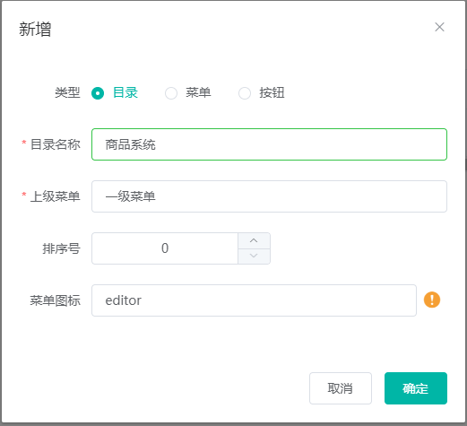

新增菜单：分类维护

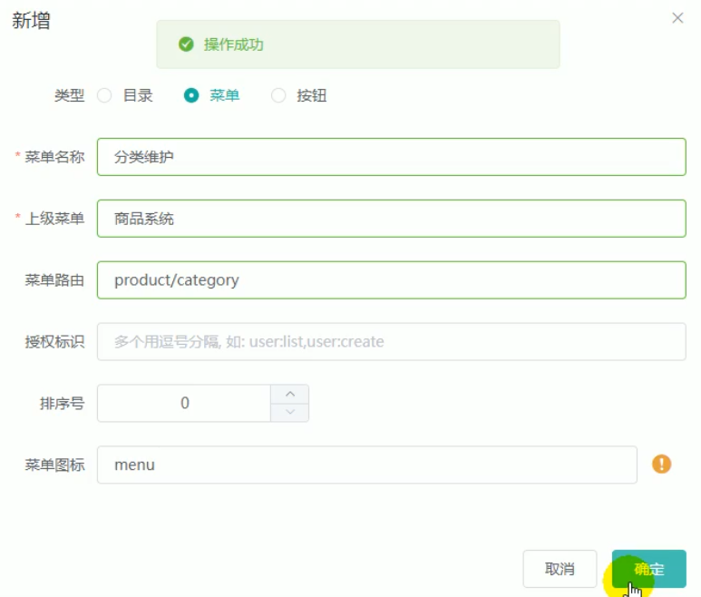

gulimall-admin数据库：renren-fast的数据库中，有新建菜单的数据

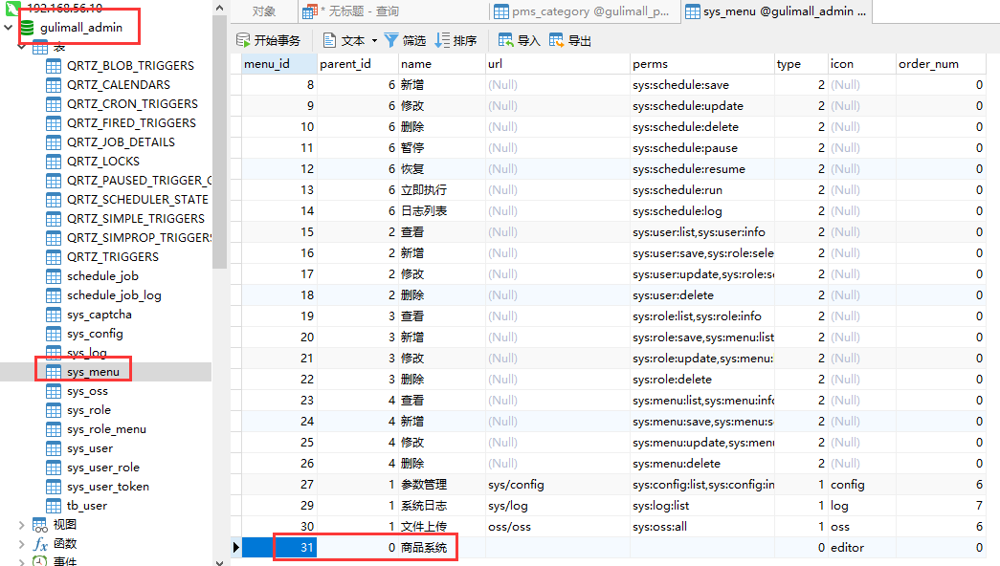

三级分类图：

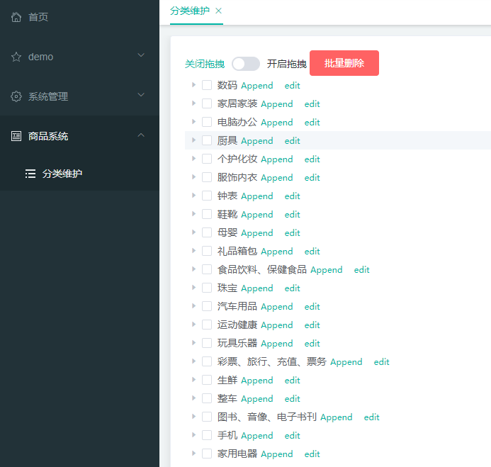

#### * getMenu()：获取所有分类

1、解构{data}：获得R对象，data.data获得R中key为data的 分类数组 数据

最外层data：

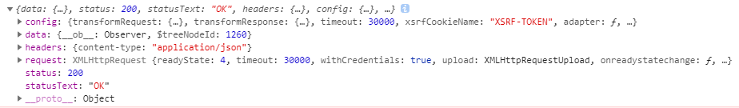

内层data：R对象

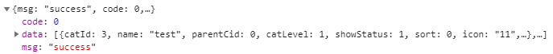


```js
  methods: {
    getMenus() {
      this.$http({
        url: this.$http.adornUrl("/product/category/list/tree"),
        method: "get",
      }).then(({ data }) => {// 解构data，有三层  解构data.data对象的data属性
        console.log("成功获取到菜单数据...", data.data);
        this.menus = data.data;// 给menus数组设置值
      });
    },  
	created() {// 生命周期也是method中的方法
   		this.getMenus();
  	}
  }
```

#### * < el-tree>

绑定数据menus，三级分类

```vue
<el-tree
      :data="menus"
      show-checkbox
      node-key="id"
      default-expand-all
      :expand-on-click-node="false">
    </el-tree>

<script>
  export default {
   data() {
    return {
      menus: []
    };
  },
  methods: {
    getMenus() {
      this.$http({
        url: this.$http.adornUrl("/product/category/list/tree"), // 调用http.adornUrl拼接
        method: "get",
      }).then(({ data }) => {// 解构返回值对象中的data属性
        console.log("成功获取到菜单数据...", data.data);
        this.menus = data.data;// data.data获得R对象中的data属性，获得结果集数组
      });
    }
</script>
```


#### * 自定义节点 slot-scope

自定义节点< span>绑定属性slot-scope可以获得每行的数据。并且为每一行的标签设置相应的span - button（append、edit、delete）【参照网站doc 自定义节点部分 scoped slot 】

https://element.eleme.cn/#/zh-CN/component/tree 

```vue
<el-tree
      :data="data"
      show-checkbox
      node-key="id"
      default-expand-all
      :expand-on-click-node="false">
      <span class="custom-tree-node" slot-scope="{ node, data }">
        <span>{{ node.label }}</span>
        <span>
          <el-button
            type="text"
            size="mini"
            @click="() => append(data)">
            Append
          </el-button>
          <el-button
            type="text"
            size="mini"
            @click="() => remove(node, data)">
            Delete
          </el-button>
        </span>
      </span>
    </el-tree>

<script>
  export default {
    methods: {
      append(data) {
      },

      remove(node, data) {
      }
    }
  };
</script>
```


#### * getMenu接口

```java
1、导入数据
	执行pms_catelog.sql【分布式基础/docs/代码/sql】
	
2、CategoryEntity添加子分类List，每个分类会保存 孩子分类集合
	@TableField(exist = false)  // 库中不存在该字段
	List<CategoryEntity> children;

3、三级分类接口
	/**
     * 查出所有分类以及子分类，以树形结构组装起来
     */
    @RequestMapping("/list/tree")
    // @RequiresPermissions("product:category:list")
    public R list(){
        List<CategoryEntity> entities = categoryService.listWithTree();
        return R.ok().put("data", entities);
    }

4、查询分类，并给分类设置子分类list【lambdas表达式】
    @Override
    public List<CategoryEntity> listWithTree() {
        // 1、查出所有分类
        List<CategoryEntity> entities = baseMapper.selectList(null);
        // 2、组装成父子的属性结构
        // 2.1)找到所有的一级分类
        List<CategoryEntity> level1Menus = entities.stream().filter(categoryEntity ->
                categoryEntity.getParentCid() == 0
        ).map(menu -> {// 给每一个元素设置 属性
            menu.setChildren(getChildrens(menu, entities));
            return menu;
        }).sorted((menu1, menu2) ->// 排序
                (menu1.getSort() == null ? 0 : menu1.getSort()) - (menu2.getSort() == null ? 0 : menu2.getSort())
        ).collect(Collectors.toList());// 结果包装成list

        return level1Menus;
    }

    // 递归给每一个menu设置 children
    private List<CategoryEntity> getChildrens(CategoryEntity root, List<CategoryEntity> all) {
        List<CategoryEntity> children = all.stream().filter(menu ->
                menu.getParentCid().equals(root.getCatId())
        ).map(menu -> {
            menu.setChildren(getChildrens(menu, all));
            return menu;
        }).sorted((menu1, menu2) ->
                (menu1.getSort() == null ? 0 : menu1.getSort()) - (menu2.getSort() == null ? 0 : menu2.getSort())
        ).collect(Collectors.toList());
        return children;
    }
```

存放位置：

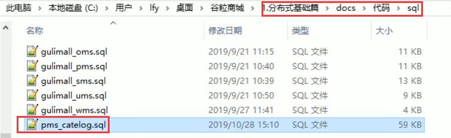


#### * remove(node,data):删除分类【this.$confirm+this.$message】

```
1、逻辑删除
2、消息提示【是否删除】https://element.eleme.cn/#/zh-CN/component/message
	this.$confirm
3、弹框【删除成功】https://element.eleme.cn/#/zh-CN/component/message-box
	this.$message
```

```js
    remove(node, data) {
      var ids = [data.catId];
      this.$confirm(`是否删除【${data.name}】菜单?`, "提示", {
        confirmButtonText: "确定",
        cancelButtonText: "取消",
        type: "warning",
      })
        .then(() => {
          this.$http({
            url: this.$http.adornUrl("/product/category/delete"),
            method: "post",
            data: this.$http.adornData(ids, false),
          }).then(({ data }) => {
            this.$message({
              message: "菜单删除成功",
              type: "success",
            });
            this.getMenus();// 删除后页面需要同步刷新，不显示已删除的分类
            this.expandedKey = [node.parent.data.catId];//设置需要默认展开的父节点id【跟删除前保持一致】
          });
        })
        .catch(() => {});

      console.log("remove", node, data);
    },
  },
```

#### * 后端逻辑删除

逻辑删除：

1、任何时候where都会带上showStatus = 0【如果全局配置了showStatus字段】【所以不要配置这个】

2、直接在逻辑删除字段上配置@TableLogic(value = "1", delval = "0")注解，并且可以修改全局的逻辑值

```java
1、@RequestBody，使用postman测试

2、使用逻辑删除：并且如果被引用了则不能删除该分类 doc：mp.baomidou.com/guide/logic-delete.html
在product配置里加入以下配置
mybatis-plus:
  mapper-locations: classpath:/mapper/**/*.xml
  global-config:
    db-config:
      id-type: auto
     -- logic-delete-field: showStatus  # 全局逻辑删除的实体字段名(since 3.3.0,配置后可以忽略不配置步骤2)【注：这个不要配置，否则整个服务都配置上了】
      logic-delete-value: 1 # 逻辑已删除值(默认为 1)
      logic-not-delete-value: 0 # 逻辑未删除值(默认为 0)
          
	/**
	 * 如果与全局的配置不一样，在字段上配置逻辑值
	 */
	@TableLogic(value = "1", delval = "0")// 可以修改1和0的含义
	private Integer showStatus;

3、添加dao的debug日志
logging:
  level:
    com.atguigu.gulimall: debug
        
4、CategoryController.java
    /**
     * 删除
     */
    @RequestMapping("/delete")
    // @RequiresPermissions("product:category:delete")
    public R delete(@RequestBody Long[] catIds){
		// categoryService.removeByIds(Arrays.asList(catIds));
        //1、检查当前册除的菜单，是否被别的地方引用
        categoryService.removeMenuByIds(Arrays.asList(catIds));

        return R.ok();
    }
5、CategoryServiceImpl.java  //TODO 逻辑删除
    @Override
    public void removeMenuByIds(List<Long> asList) {
        //TODO 1、检查当前副除的菜单，是否被别的地方引用

        //逻辑删除
        baseMapper.deleteBatchIds(asList);
    }

6、拖拽后保存分类数据 CategoryController.java
    /**
     * 拖拽后保存分类数据[parentId、sort、catLevel]
     * 条件[catId]
     * @param category parentId、sort、catLevel、catId
     * @return
     */
    @RequestMapping("/update/sort")
    // @RequiresPermissions("product:category:update")
    public R updateSort(@RequestBody CategoryEntity[] category){
        categoryService.updateBatchById(Arrays.asList(category));

        return R.ok();
    }
```

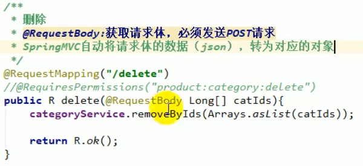

使用postman测试：post请求，body，raw+json

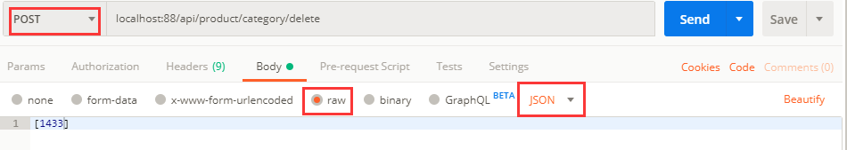


#### * append(data)：追加分类【< el-dialog>+< el-form>】

```
1、v-if="node.level <=2" // 只有1级和2级结点可以追加
2、点击append按钮，dialogVisible=true，显示对话框<el-dialog>
3、<el-dialog>
```


 对话框（增加一条分类数据，需要表单提交）：https://element.eleme.cn/#/zh-CN/component/dialog#ji-ben-yong-fa 【可以嵌套表单】

加一个对话框标签，自定义内容->**打开嵌套表单的Dialog**

表单组件： https://element.eleme.cn/#/zh-CN/component/form 

```vue
    <el-tree
      :data="menus" // v-bind:data 绑定menus
      :props="defaultProps" // 1、children子树是哪个字段；2、label页面默认显示的是哪个字段
      :expand-on-click-node="false"  // 只有点击三角形才打开
      node-key="catId" 	// 每个结点都有一个data属性值是唯一的，设置后默认展开的菜单就可以指定node.catId，因为每个结点都可以找到其node.parent.data.catId
    >
      <span class="custom-tree-node" slot-scope="{ node, data }">//append + delete删除分类
        <span>{{ node.label }}</span>
        <span>
          <el-button
            v-if="node.level <=2" // 只有1级和2级结点可以追加
            type="text"
            size="mini"
            @click="() => append(data)" // append按钮，点击后会显示对话框【dialogVisible=true】
          >Append</el-button>
        </span>
      </span>
    </el-tree>

    <el-dialog // append点击后弹出 对话框，内部可以包含表单
      :title="title"
      :visible.sync="dialogVisible" // false默认关闭
      width="30%"
      :close-on-click-modal="false" // 点击对话框外面不关闭对话框【这里需要boolean值，所以加:绑定】
    >
      <el-form :model="category"> // 绑定了一个category
        <el-form-item label="分类名称">
          <el-input v-model="category.name" autocomplete="off"></el-input>// 双向绑定
        </el-form-item>
        <el-form-item label="图标">
          <el-input v-model="category.icon" autocomplete="off"></el-input>
        </el-form-item>
        <el-form-item label="计量单位">
          <el-input v-model="category.productUnit" autocomplete="off"></el-input>
        </el-form-item>
      </el-form>
      <span slot="footer" class="dialog-footer">
        <el-button @click="dialogVisible = false">取 消</el-button>
        <el-button type="primary" @click="submitData">确 定</el-button>// 确定调用方法
      </span>
    </el-dialog>
```

#### * 拖拽：< el-tree>的属性

draggable+allowDrop+handleDrop

```
1、draggable：通过一个按钮控制是否可以拖拽，以免误操作
	这里后面加了一个开启拖拽按钮，绑定了draggable的值，点击后才为true
2、allowDrop：此次拖拽是否合法？
	拖拽后不能改变树的高度【以当前节点为根的这棵树的高度+父节点层数<=3，否则新树的高度会改变】
3、handleDrop：拖拽合法触发的事件【存库】
	1、新的parentId
	2、兄弟节点的sort
	3、level层级【以自己为根的那棵树层级是否需要修改】
	
4、发送请求后，要刷新maxlevel 、updateNodes的数据
```

#### * 批量保存、批量删除

```vue
<el-button v-if="draggable" @click="batchSave">批量保存</el-button>
<el-button type="danger" @click="batchDelete">批量删除</el-button>
```
#### *< el-switch>开启拖拽

```vue
<el-switch v-model="draggable" active-text="开启拖拽" inactive-text="关闭拖拽"></el-switch>
```


#### * category.vue所有代码

```vue
<template>
  <div>
    <el-switch v-model="draggable" active-text="开启拖拽" inactive-text="关闭拖拽"></el-switch>
    // 只有点击了批量保存，拖拽的数据才会存库，绑定时间batchSave
    <el-button v-if="draggable" @click="batchSave">批量保存</el-button>
    <el-button type="danger" @click="batchDelete">批量删除</el-button>
    <el-tree
      :data="menus" // v-bind:data 绑定menus
      :props="defaultProps" // 1、children子树是哪个字段；2、label页面默认显示的是哪个字段
      :expand-on-click-node="false"  // 只有点击三角形才打开
      show-checkbox // 结点可以被选择【批量选择，批量删除】
      node-key="catId" 	// 每个结点都有一个data属性值是唯一的，设置后默认展开的菜单就可以指定node.catId，因为每个结点都可以找到其node.parent.data.catId
      :default-expanded-keys="expandedKey" // 默认展开的菜单，删除的时候这个值会更新
      :draggable="draggable"	// 可拖拽节点
      :allow-drop="allowDrop"	// 是否可以拖到指定位置，方法有三个参数【拖动、目标、类型(内部，同级)】
      @node-drop="handleDrop"	// 节点拖拽成功处触发的事件
      ref="menuTree" // 当前树 this.$refs.menuTree.getCheckedNodes();可以获得选中节点
    >
        // 下面这个标签是参考的自定义dialog，给树的每一个Node都增添按钮slot
      <span class="custom-tree-node" slot-scope="{ node, data }">//append + delete删除分类
        <span>{{ node.label }}</span>
        <span>
          <el-button
            v-if="node.level <=2" // 只有1级和2级结点可以追加
            type="text"
            size="mini"
            @click="() => append(data)" // append按钮，点击后会显示对话框【dialogVisible=true】
          >Append</el-button>
          <el-button 
            type="text" 
            size="mini" 
            @click="edit(data)"
          >edit</el-button>
          <el-button
            v-if="node.childNodes.length==0" // 没有子节点才可以删除
            type="text"
            size="mini"
            @click="() => remove(node, data)"
          >Delete</el-button>
        </span>
      </span>
    </el-tree>

    <el-dialog // append点击后弹出 对话框，内部可以包含表单
      :title="title"
      :visible.sync="dialogVisible" // false默认关闭
      width="30%"
      :close-on-click-modal="false" // 点击对话框外面不关闭对话框【这里需要boolean值，所以加:绑定】
    >
      <el-form :model="category"> // 绑定了一个category
        <el-form-item label="分类名称">
          <el-input v-model="category.name" autocomplete="off"></el-input>// 双向绑定
        </el-form-item>
        <el-form-item label="图标">
          <el-input v-model="category.icon" autocomplete="off"></el-input>
        </el-form-item>
        <el-form-item label="计量单位">
          <el-input v-model="category.productUnit" autocomplete="off"></el-input>
        </el-form-item>
      </el-form>
      <span slot="footer" class="dialog-footer">
        <el-button @click="dialogVisible = false">取 消</el-button>
        <el-button type="primary" @click="submitData">确 定</el-button>// 确定调用方法
      </span>
    </el-dialog>
  </div>
</template>

<script>
//这里可以导入其他文件（比如：组件，工具js，第三方插件js，json文件，图片文件等等）
//例如：import 《组件名称》 from '《组件路径》';

export default {
  //import引入的组件需要注入到对象中才能使用
  components: {},
  props: {},
  data() {
    return {
      pCid: [],// 当拖拽存库代码移动到batchSave时，需要用到pCid默认展开parentId，所以在handleDrop要给pCid存入parentId值
      draggable: false,
      updateNodes: [],
      maxLevel: 0,
      title: "",
      dialogType: "", //edit,add
      category: {// 分类数据，给上默认值
        name: "",
        parentCid: 0,
        catLevel: 0,
        showStatus: 1,
        sort: 0,
        productUnit: "",
        icon: "",
        catId: null,
      },
      dialogVisible: false,
      menus: [],
      expandedKey: [],// 默认需要展开的catId
      defaultProps: {
        children: "children",
        label: "name",
      },
    };
  },

  //计算属性 类似于data概念
  computed: {},
  //监控data中的数据变化
  watch: {},
  //方法集合
  methods: {
    getMenus() {
      this.$http({
        url: this.$http.adornUrl("/product/category/list/tree"), // 调用http.adornUrl拼接
        method: "get",
      }).then(({ data }) => {// 解构返回值对象中的data属性
        console.log("成功获取到菜单数据...", data.data);
        this.menus = data.data;// data.data获得R对象中的data属性，获得结果集数组
      });
    },
    batchDelete() {
      let catIds = [];
      // this当前vue实例，this.$refs获得当前vue所有组件，this.$refs.menuTree：获得menuTree组件
      // 获取menuTree组件所有选中的data【注意这里是data而不是treeNode】
      // 该方法有两个参数：1、只包含叶子节点  	默认false【永远不包含父节点，我觉得这个应该是true】
      //			    2、默认包含半选节点   默认false【当全选后才包含父节点】
      let checkedNodes = this.$refs.menuTree.getCheckedNodes();
      console.log("被选中的元素", checkedNodes);
      for (let i = 0; i < checkedNodes.length; i++) {
        catIds.push(checkedNodes[i].catId);
      }
      this.$confirm(`是否批量删除【${catIds}】菜单?`, "提示", {
        confirmButtonText: "确定",
        cancelButtonText: "取消",
        type: "warning",
      })
        .then(() => {// 点击确定执行
          this.$http({
            url: this.$http.adornUrl("/product/category/delete"),
            method: "post",
            data: this.$http.adornData(catIds, false),
          }).then(({ data }) => {
            this.$message({
              message: "菜单批量删除成功",
              type: "success",
            });
            this.getMenus();
          });
        })
        .catch(() => {});// 点击取消执行
    },
    // 批量保存拖拽功能的更新值
    batchSave() {
      this.$http({
        url: this.$http.adornUrl("/product/category/update/sort"),
        method: "post",
        data: this.$http.adornData(this.updateNodes, false),
      }).then(({ data }) => {
        this.$message({
          message: "菜单顺序等修改成功",
          type: "success",
        });
        //刷新出新的菜单
        this.getMenus();
        //设置需要默认展开的菜单
        this.expandedKey = this.pCid;
        this.updateNodes = [];// 重置
        // this.pCid = 0;
      });
    },
    handleDrop(draggingNode, dropNode, dropType, ev) {// 拖拽允许触发的事件
      // draggingNode, dropNode, dropType【三个参数，跟拖拽条件的三个参数一样】
      // draggingNode：该参数值不会改变，dropNode会动态修改level层级与el-tree保持一致
      // 要修改三个数据：1、draggingNode的父id
      //			  2、最新顺序sort，获取节点拖动后的所有兄弟节点的集合【通过dropNode获得】
      // 如果是inner，则是dropNode.childNodes,else：dropNode.parent.childNodes
      //			  3、还要递归修改层级【自己的层级+所有子节点的层级】
      //				修改条件：draggingNode.level与修改后的level不相等
      console.log("handleDrop: ", draggingNode, dropNode, dropType);
      let pCid = 0;//1、当前节点最新的父节点id【更新draggingNode的parentCid】
      let siblings = null;
      if (dropType == "before" || dropType == "after") {
        // 如果是同级，父节点修改为dropNode.parent.data.catId
        pCid = dropNode.parent.data.catId == undefined ? 0 : dropNode.parent.data.catId;
       //获得兄弟节点，包含了level更新后的draggingNode，但是data.catLevle是数据库字段没更新【需更新】
        siblings = dropNode.parent.childNodes;
      } else {
        // 内部，父节点修改为dropNode.data.catId
        pCid = dropNode.data.catId;
       //获得兄弟节点，包含了level更新后的draggingNode，但是data.catLevle是数据库字段没更新【需更新】
        siblings = dropNode.childNodes;
      }
      // 需要自动展开的tree
      this.pCid.push(pCid);

      //2、当前拖拽节点的最新顺序【更新sort】
      for (let i = 0; i < siblings.length; i++) {
        //如果遍历的是当前正在拖拽的节点【需要修改parentId、catLevel】
        if (siblings[i].data.catId == draggingNode.data.catId) {
          // 记录当前level
          let catLevel = draggingNode.level;
          // 如果当前level与修改后的level不同，则要修改catLevle字段的值【存库】【并且children的catLevel字段也需要更新，否则就都不用更新】
          if (siblings[i].level != draggingNode.level) {
            // 将catLevel字段修改为正确的level
            catLevel = siblings[i].level;
            // 如果层级需要修改，则所有children的层级都需要修改
            // 参数是：从dropNode获得的当前节点【dropNode中的level是更新过后的正确层级值】
            this.updateChildNodeLevel(siblings[i]);
          }
          // 将当前节点的sort、parentCid、catLevel更新【catLevel字段已经修改为正确的level】
          this.updateNodes.push({
            catId: siblings[i].data.catId,
            sort: i,
            parentCid: pCid,
            catLevel: catLevel,
          });
        } else {// 更新其他兄弟节点的sort，条件是catId【parentId、catLevel不用改】
          this.updateNodes.push({ catId: siblings[i].data.catId, sort: i });
        }
      }

      //3、当前拖拽节点的最新层级
      console.log("updateNodes", this.updateNodes);
      // 存库逻辑放到批量保存了
      this.maxLevel = 0;// 每次一拖拽完都应该重置
    },
    updateChildNodeLevel(node) {
      if (node.childNodes.length > 0) {
        for (let i = 0; i < node.childNodes.length; i++) {
          var cNode = node.childNodes[i].data;
          // 修改catLevel为正确的level
          this.updateNodes.push({catId: cNode.catId, catLevel: node.childNodes[i].level,
          });
          // 递归遍历每一个Node的childNodes集合
          this.updateChildNodeLevel(node.childNodes[i]);
        }
      }
    },
    // 允许拖拽条件
    allowDrop(draggingNode, dropNode, type) {
      // 先记住两点：1、层数与高度是相反的【层数为3，高度为1】【这里层数看做深度，顶层层数是1】
      //		   2、被拖动的当前节点的高度+目标父节点的层数<=3【高度+层数=整颗树高度（高度不能改变）】
      // 		   3、高度计算：查找所有的子节点找到最深节点的层数【就是深度】深度-当前节点层数+1=高度
      //		   4、目标父节点【如果是inner，dropNode就是父节点；否则dropNode.parent是父节点】

      console.log("allowDrop:", draggingNode, dropNode, type);
      // 找到当前节点的最深子节点的深度maxLevel
      this.maxLevel = draggingNode.level;
      // 注意：这里不是传的不是draggingNode.data，而是draggingNode，然后递归使用draggingNode.childNodes，而不使用draggingNode.data.children
      // 原因：children是数据库字段，没有及时更新，多次拖拽后数据会混乱
      this.countNodeLevel(draggingNode);
      // maxLevel-当前节点的深度+1=以当前节点作为根节点的树的高度
      let high = Math.abs(this.maxLevel - draggingNode.level) + 1;
      console.log("高度：", high);

      // 整棵树的高度不能改变，所以 父节点层数+拖拽树高度=新树高度【不能大于3】
      if (type == "inner") {
        // console.log(
        //   `this.maxLevel：${this.maxLevel}；draggingNode.data.catLevel：${draggingNode.data.catLevel}；dropNode.level：${dropNode.level}`
        // );
        return high + dropNode.level <= 3;
      } else {
        return high + dropNode.parent.level <= 3;
      }
    },
    countNodeLevel(node) {
      // 找到所有子节点，求出最大深度
      // 这里使用node.childNodes和level，不使用数据库的children和catLevel
      // childNodes和level是随tree改变而实时更新
      if (node.childNodes != null && node.childNodes.length > 0) {
        for (let i = 0; i < node.childNodes.length; i++) {
          if (node.childNodes[i].level > this.maxLevel) {
            this.maxLevel = node.childNodes[i].level;
          }
          this.countNodeLevel(node.childNodes[i]);
        }
      }
    },
    edit(data) {
      console.log("要修改的数据", data);
      this.dialogType = "edit";
      this.title = "修改分类";
      this.dialogVisible = true;
      //发送请求获取当前节点最新的数据，查询需要修改的这条数据的最新数据
      this.$http({
        url: this.$http.adornUrl(`/product/category/info/${data.catId}`),
        method: "get",
      }).then(({ data }) => {// 解构将值赋给data
        //请求成功
        console.log("要回显的数据", data);
        this.category.name = data.data.name;
        this.category.catId = data.data.catId;
        this.category.icon = data.data.icon;
        this.category.productUnit = data.data.productUnit;
        this.category.parentCid = data.data.parentCid;// 父菜单也要设置，edit提交后默认展开
        this.category.catLevel = data.data.catLevel;
        this.category.sort = data.data.sort;
        this.category.showStatus = data.data.showStatus;
        /**
         *         parentCid: 0,
        catLevel: 0,
        showStatus: 1,
        sort: 0,
         */
      });
    },
    append(data) {// 给category对象设置默认值，并且data是当前选中的node，所以append的node就是其子层
      console.log("append", data);
      this.dialogType = "add";// 设置为添加
      this.title = "添加分类";
      this.dialogVisible = true;// 展示对话框
      this.category.parentCid = data.catId;// 父id=父层id
      this.category.catLevel = data.catLevel * 1 + 1; // 子层=父层+1
      this.category.catId = null;// 数据库默认生成
      this.category.name = "";// 清空回显值
      this.category.icon = "";// 清空回显值
      this.category.productUnit = "";// 清空回显值
      this.category.sort = 0;// 清空回显值
      this.category.showStatus = 1;// 清空回显值
    },

    submitData() {// 修改和添加 统一调用这个方法
      if (this.dialogType == "add") {
        this.addCategory();
      }
      if (this.dialogType == "edit") {
        this.editCategory();
      }
    },
    //修改三级分类数据
    editCategory() {
      var { catId, name, icon, productUnit } = this.category;// 1、因为对话框dialog使用的是双向绑定，页面修改会修改对象值； 2、使用解构，不修改的字段是null；
      this.$http({
        url: this.$http.adornUrl("/product/category/update"),
        method: "post",
        data: this.$http.adornData({ catId, name, icon, productUnit }, false),// 解构成data对象然后调用this.$http.adornData包装参数【包装成json格式】
      }).then(({ data }) => {// 处理
        this.$message({
          message: "菜单修改成功",
          type: "success",
        });
        //关闭对话框
        this.dialogVisible = false;
        //刷新出新的菜单
        this.getMenus();
        //设置需要默认展开的菜单
        this.expandedKey = [this.category.parentCid];
      });
    },
    //append post提交 添加分类 操作
    addCategory() {// 双向绑定的，所以方法不需要参数
      console.log("提交的三级分类数据", this.category);// 需要this.
      this.$http({
        url: this.$http.adornUrl("/product/category/save"),
        method: "post",
        data: this.$http.adornData(this.category, false),// 封装
      }).then(({ data }) => {
        this.$message({
          message: "菜单保存成功",
          type: "success",
        });
        //关闭对话框
        this.dialogVisible = false;
        //刷新出新的菜单
        this.getMenus();
        //设置需要默认展开的菜单
        this.expandedKey = [this.category.parentCid];
      });
    },

    remove(node, data) {
      var ids = [data.catId];
      this.$confirm(`是否删除【${data.name}】菜单?`, "提示", {
        confirmButtonText: "确定",
        cancelButtonText: "取消",
        type: "warning",
      })
        .then(() => {// 点击确定后会执行then
          this.$http({
            url: this.$http.adornUrl("/product/category/delete"),
            method: "post",
            data: this.$http.adornData(ids, false),
          }).then(({ data }) => {// 发起ajax请求成功后调用then
            this.$message({
              message: "菜单删除成功",
              type: "success",
            });
            this.getMenus();// 删除后页面需要同步刷新，不显示已删除的分类
            this.expandedKey = [node.parent.data.catId];//设置需要默认展开的菜单【跟删除前保持一致】
          });
        }) 
        .catch(() => {});// 点击取消后调用catch

      console.log("remove", node, data);
    },
  },
  //生命周期 - 创建完成（可以访问当前this实例）
  created() {
    this.getMenus();
  },
  //生命周期 - 挂载完成（可以访问DOM元素）
  mounted() {},
  beforeCreate() {}, //生命周期 - 创建之前
  beforeMount() {}, //生命周期 - 挂载之前
  beforeUpdate() {}, //生命周期 - 更新之前
  updated() {}, //生命周期 - 更新之后
  beforeDestroy() {}, //生命周期 - 销毁之前
  destroyed() {}, //生命周期 - 销毁完成
  activated() {}, //如果页面有keep-alive缓存功能，这个函数会触发
};
</script>
<style scoped>
</style>
```

### 1.2、品牌管理

品牌管理管理的新增删除的前端都在逆向生成的代码页面里

#### * 配置

```
1、新增品牌管理

2、复制逆向生成的前端代码到renren-fast-vue的product文件夹下
逆向生成代码目录：gulimall-product\main\resources\src\views\modules\product

3、品牌管理中是存在新建、删除的，但是因为前端有权限管理，所以未显示
全局搜索isAuth，在index.js中修改为return true;取消权限
然后新增、删除就可以用了

```

index.js取消权限检查：

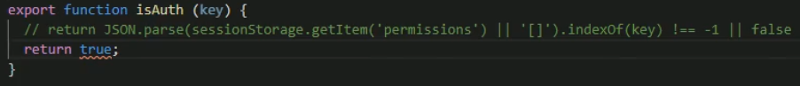

新增：

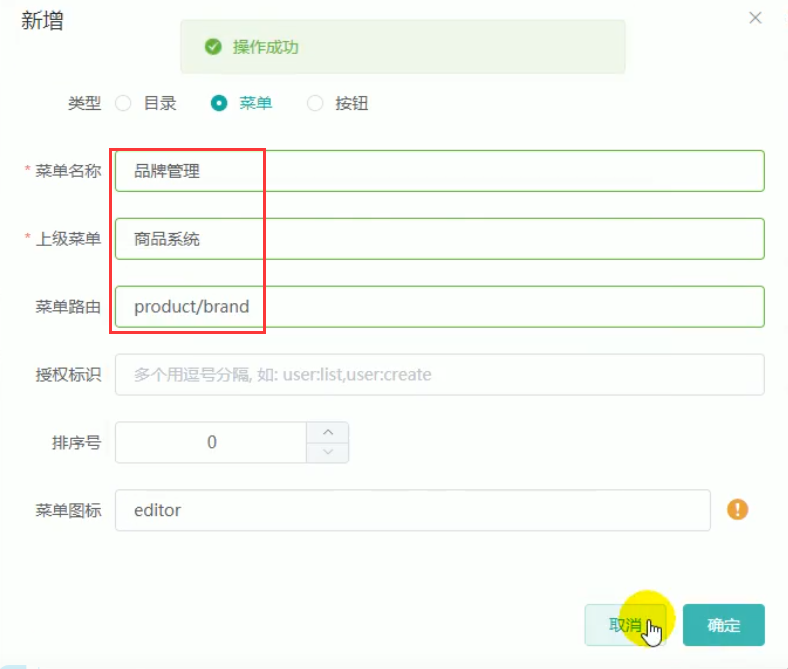


#### * slot-scope-自定义列模板+switch【显示状态】

显示状态是一个按钮，可以点击滑动代表显示与不显示

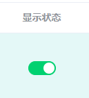

```vue
1、el-table自定义列<template slot-scope="scope">
	然后内部放一个switch开关
<el-form :inline="true" :model="dataForm" @keyup.enter.native="getDataList()">
 <el-table-column prop="showStatus" header-align="center" align="center" label="显示状态">
    <template slot-scope="scope">
      <el-switch
        v-model="scope.row.showStatus"
        active-color="#13ce66"
        inactive-color="#ff4949"
        :active-value="1"
        :inactive-value="0"
        @change="updateBrandStatus(scope.row)"
      ></el-switch>
    </template>
  </el-table-column>
</el-form>
```
doc：table->自定义列模板->switch开关

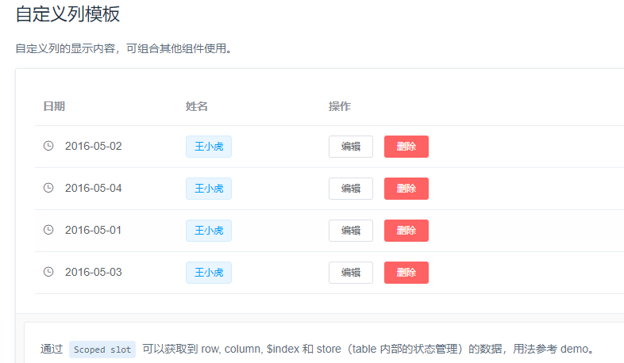


#### * switch开关-Event事件

switch有一个事件：监听switch的变化

change事件

@change：on-click:change的缩写


#### * 文件上传oss

OSS登录： https://oss.console.aliyun.com/overview 

```java
1、为什么需要文件服务器？
	1）不能放在本地，例如集群时将文件保存在本地，集群其他服务找不到文件
	2）不适合存储在数据库服务中

2、有哪些选择？
	1）FastDFS、vsftpd【搭建复杂、维护成本高、前期费用高】
	2）云存储：阿里云对象存储、七牛云存储【即开即用、无需维护、按量收费】

3、使用oss对象上传的两种方式
	1）统一上传到应用服务器，服务器上传oss
	2）客户端使用签名后直传
		账号密码存在应用服务器上
		客户端上传时向应用服务器发送policy请求，服务器利用OSS账号密码生成一个防伪令牌，有上传地址、授权令牌
		客户端上传文件到服务器，并且带上令牌
```

#### * 创建gulimall-third-party模块

在gulimall-third-party模块中封装oss的policy请求

java服务端签名直传并设置上传回调： https://help.aliyun.com/document_detail/91868.html?spm=a2c4g.11186623.2.16.1d2f7eaeOSyN4O#concept-ahk-rfz-2fb 

查看spring cloud文档
https://github.com/alibaba/spring-cloud-alibaba/blob/master/README-zh.md
找到oosdemo：https://github.com/alibaba/spring-cloud-alibaba/blob/master/spring-cloud-alibaba-examples/oss-example/readme-zh.md【要找历史版本，最新版本打不开了】

```properties
1、创建gulimall-third-party模块作为第三方服务模块
policy请求为什么不放在common模块中？如果放在common请求中，则每个服务都要配置相应的属性配置，否则启动报错【不过也可以通过在pom中exclusion该启动器就可以了】
选择spring web 、 OpenFeign

2、添加依赖 oos启动器+common、和版本管理
<!--cloud管理oos-->
<dependency>
    <groupId>com.alibaba.cloud</groupId>
    <artifactId>spring-cloud-starter-alicloud-oss</artifactId>
</dependency>
<dependency>
    <groupId>com.atguigu.gulimall</groupId>
    <artifactId>gulimall-common</artifactId>
    <version>0.0.1-SNAPSHOT</version>
    <exclusions>
        <exclusion>
            <groupId>com.baomidou</groupId>
            <artifactId>mybatis-plus-boot-starter</artifactId>
        </exclusion>
    </exclusions>
</dependency>
<!-- 版本管理 -->
<dependencyManagement>
    <dependencies>
        <dependency>
            <groupId>org.springframework.cloud</groupId>
            <artifactId>spring-cloud-dependencies</artifactId>
            <version>${spring-cloud.version}</version>
            <type>pom</type>
            <scope>import</scope>
        </dependency>
        <dependency>
            <groupId>com.alibaba.cloud</groupId>
            <artifactId>spring-cloud-alibaba-dependencies</artifactId>
            <version>2.2.0.RELEASE</version>
            <type>pom</type>
            <scope>import</scope>
        </dependency>
    </dependencies>
</dependencyManagement>

3、在Application添加注解
@@EnableDiscoveryClient

4、登录阿里云
跟着这个文档走就可以了：
https://help.aliyun.com/document_detail/91868.html?spm=a2c4g.11186623.2.16.1d2f7eaeOSyN4O#concept-ahk-rfz-2fb 
	1）开通OSS，开通oss服务，开启一个bucket
		记录外网 endpoint：oss-cn-shanghai.aliyuncs.com
				bucket: gulimall-wan
	2）开通AccessKey->开始使用子用户AccessKey
	登录名称：gulimall-wan	显示名称：gulimall
	访问方式：编程访问
	记录	access-key: XX
      	 secret-key: XX
	
	3）为AccessKey添加权限：oss-all所有权限
	
	4）修改CORS
		打开bucket -> 权限管理 -> 跨域设置 -> 设置 -> 创建规则
		来源：* 
		允许Headers：* 
		允许Methods：POST

3、bootstrap.properties 和 oss.yml
spring.application.name=gulimall-third-party
spring.cloud.nacos.config.server-addr=127.0.0.1:8848
spring.cloud.nacos.config.namespace=93331e33-77bb-4ea0-958f-216afa8b9fb0
spring.cloud.nacos.config.group=dev
#如果这个dev不放开的话，默认的gulimall-third-party不生效【会加载dev分组下的所有配置】

spring.cloud.nacos.config.extension-configs[0].data-id=oss.yml
spring.cloud.nacos.config.extension-configs[0].group=dev
spring.cloud.nacos.config.extension-configs[0].refresh=true

oss.yml【如果在common导入启动器依赖，没有alicloud下面的配置，就会启动报错】
spring:
  cloud:
    alicloud:
      access-key: xx
      secret-key: xx
      oss:
        endpoint: oss-cn-shanghai.aliyuncs.com
        bucket: gulimall-wan
        
4、创建OssController，返回policy凭证
@RestController
public class OssController {

    @Autowired
    OSS ossClient;

    @Value("${spring.cloud.alicloud.oss.endpoint}")
    private String endpoint;
    @Value("${spring.cloud.alicloud.oss.bucket}")
    private String bucket;
    @Value("${spring.cloud.alicloud.access-key}")
    private String accessId;

    @RequestMapping("/oss/policy")
    public R policy() {
        String host = "https://" + bucket + "." + endpoint; // host的格式为 bucketname.endpoint
        String format = new SimpleDateFormat("yyyy-MM-dd").format(new Date());
        String dir = format + "/"; // 用户上传文件时指定的前缀。在bucket创建一个以日期为文件夹的目录里
        Map<String, String> respMap = null;
        try {
            long expireTime = 30;
            long expireEndTime = System.currentTimeMillis() + expireTime * 1000;
            Date expiration = new Date(expireEndTime);
            // PostObject请求最大可支持的文件大小为5 GB，即CONTENT_LENGTH_RANGE为5*1024*1024*1024。
            PolicyConditions policyConds = new PolicyConditions();
            policyConds.addConditionItem(PolicyConditions.COND_CONTENT_LENGTH_RANGE, 0, 1048576000);
            policyConds.addConditionItem(MatchMode.StartWith, PolicyConditions.COND_KEY, dir);

            String postPolicy = ossClient.generatePostPolicy(expiration, policyConds);
            byte[] binaryData = postPolicy.getBytes("utf-8");
            String encodedPolicy = BinaryUtil.toBase64String(binaryData);
            String postSignature = ossClient.calculatePostSignature(postPolicy);

            respMap = new LinkedHashMap<String, String>();
            respMap.put("accessid", accessId);
            respMap.put("policy", encodedPolicy);
            respMap.put("signature", postSignature);
            respMap.put("dir", dir);
            respMap.put("host", host);
            respMap.put("expire", String.valueOf(expireEndTime / 1000));
            // respMap.put("expire", formatISO8601Date(expiration));

            // 下面是跨域设置，在网关统一解决跨域
        } catch (Exception e) {
            // Assert.fail(e.getMessage());
            System.out.println(e.getMessage());
        } finally {
            ossClient.shutdown();
        }
        return R.ok().put("data", respMap);
    }
}
```

开通AccessKey：

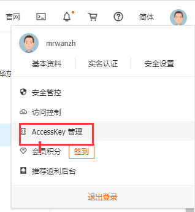

添加权限：

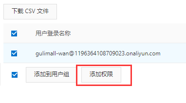

使用alicloud管理OSS

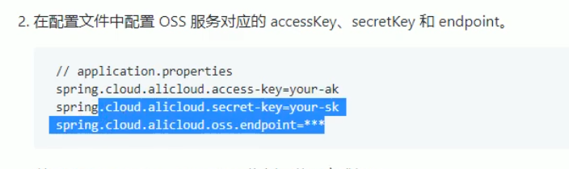


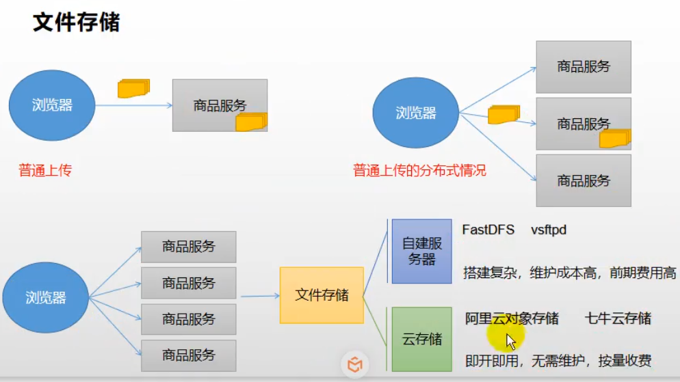

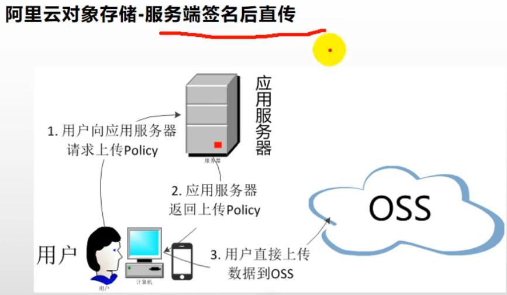


#### * < el-upload>文件上传 + 跨域问题

doc： https://element.eleme.cn/#/zh-CN/component/upload 

```vue
1、在el-form表单中添加<single-upload>组件
2、双向绑定dataForm.logo值
	<el-form
      :model="dataForm"// v-model 双向绑定dataForm对象，
      :rules="dataRule"	// 每一个dataForm字段绑定一个dataRule中指定的规则
      ref="dataForm"
      @keyup.enter.native="dataFormSubmit()"
      label-width="140px"	// 调整lable宽度
    >
      <el-form-item label="品牌logo地址" prop="logo">
        <!-- <el-input v-model="dataForm.logo" placeholder="品牌logo地址"></el-input> -->
        <single-upload v-model="dataForm.logo"></single-upload> // 文件上传
      </el-form-item>
    </el-form>
```

使用步骤：

```properties
1、三个文件复制到renren-fast-ves的src/components/upload文件夹里面

2、修改multiUpload.vue和singleUpload.vue文件
	修改成自己的外网Bucket域名
	action="http://gulimall-wan.oss-cn-shanghai.aliyuncs.com"
	
3、在brand-add-or-update.vue中导入
	1)import SingleUpload from "@/componets/upload/singleUpload"
	2)在data 的components:{SingleUpload}
	3)在</template>中就可以使用了 <single-upload>来代替之前的<el-input>标签【自定义节点】

4、设置跨域，允许bucket跨域请求
	在oss里面修改管理控制台修改：
	https://oss.console.aliyun.com/bucket/oss-cn-shanghai/gulimall-wan/permission/cors
```

拷贝三个组件到renren-fast-vue中

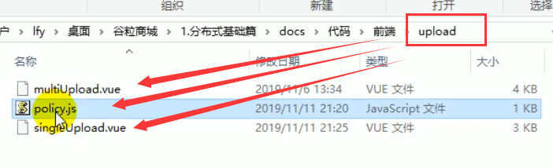

#### * < el-image>【自定义列模板显示图片】


```vue
问题：<el-image>组件默认没有导入，无法使用，自定义列模板显示组件：
        <template slot-scope="scope">// 添加一个自定义列模板，自定义显示图片
          <!-- <el-image
              style="width: 100px; height: 80px"
              :src="scope.row.logo"
          fit="fill"></el-image>--> // fit填充是填满
            // 这里根据src显示图片【从oss加载】，原始img
          	
        </template>
1、拷贝完整组件到element-ui/index.js中【element-ui是renren-fast-vue导入的，并没有导入所有组件】
https://element.eleme.cn/#/zh-CN/component/quickstart

2、不知道啥原因用不了<el-image>，最后改成了原生的
```

#### * < el-form>校验【rules属性】

```js
1、model绑定了dataForm
2、rules绑定了dataRule
3、dataRule声明了每一个dataForm属性的校验规则
4、默认规则+自定义校验规则
	1）默认规则：由3个属性组成的对象
		规则：必须不为空；错误提示消息：message；blur：鼠标移开触发
		name: [{ required: true, message: "品牌名不能为空", trigger: "blur" }],
	2）自定义规则：2个属性组成的对象
		validator：匿名方法，3个参数
		
		firstLetter: [
          {
            validator: (rule, value, callback) => {
              if (value == "") {
                callback(new Error("首字母必须填写"));
              } else if (!/^[a-zA-Z]$/.test(value)) {// 正则表达式，必须是a-zA-Z
                callback(new Error("首字母必须a-z或者A-Z之间"));
              } else {
                callback();
              }
            },
            trigger: "blur"
          }
		
```

代码：

```vue
    <el-form
      :model="dataForm"// v-model 绑定dataForm对象，
      :rules="dataRule"	// 每一个dataForm字段绑定一个dataRule中指定的规则
      ref="dataForm"
      @keyup.enter.native="dataFormSubmit()"
      label-width="140px"	// 调整lable宽度
    >
      <el-form-item label="品牌名" prop="name">
        <el-input v-model="dataForm.name" placeholder="品牌名"></el-input>
      </el-form-item>
      <el-form-item label="品牌logo地址" prop="logo">
        <!-- <el-input v-model="dataForm.logo" placeholder="品牌logo地址"></el-input> -->
        <single-upload v-model="dataForm.logo"></single-upload> // 文件上传
      </el-form-item>
      <el-form-item label="介绍" prop="descript">
        <el-input v-model="dataForm.descript" placeholder="介绍"></el-input>
      </el-form-item>
      <el-form-item label="显示状态" prop="showStatus">
        <el-switch // 新增里面也使用switch选择框
          v-model="dataForm.showStatus"
          active-color="#13ce66"
          inactive-color="#ff4949"
          :active-value="1"		// 激活状态修改为1：双向绑定showStatus
          :inactive-value="0"	// 不激活状态修改为0：双向绑定showStatus
        ></el-switch>
      </el-form-item>
      <el-form-item label="检索首字母" prop="firstLetter">
        <el-input v-model="dataForm.firstLetter" placeholder="检索首字母"></el-input>
      </el-form-item>
      <el-form-item label="排序" prop="sort">
          // 绑定一个number值
        <el-input v-model.number="dataForm.sort" placeholder="排序"></el-input>
      </el-form-item>
    </el-form>
    <span slot="footer" class="dialog-footer">
      <el-button @click="visible = false">取消</el-button>
      <el-button type="primary" @click="dataFormSubmit()">确定</el-button>
    </span>
  </el-dialog>
</template>

<script>
export default {
  data() {
    return {
      dataForm: {
        brandId: 0,
        name: "",
        logo: "",
        descript: "",
        showStatus: 1,
        firstLetter: "",
        sort: 0
      },
      dataRule: {// 指定的规则
          // blur：鼠标失去焦点
        name: [{ required: true, message: "品牌名不能为空", trigger: "blur" }],
        logo: [
          { required: true, message: "品牌logo地址不能为空", trigger: "blur" }
        ],
        descript: [
          { required: true, message: "介绍不能为空", trigger: "blur" }
        ],
        showStatus: [
          {
            required: true,
            message: "显示状态[0-不显示；1-显示]不能为空",
            trigger: "blur"
          }
        ],
          firstLetter: [
          {
            validator: (rule, value, callback) => {
              if (value == "") {
                callback(new Error("首字母必须填写"));
              } else if (!/^[a-zA-Z]$/.test(value)) {// 正则表达式，必须是a-zA-Z
                callback(new Error("首字母必须a-z或者A-Z之间"));
              } else {
                callback();
              }
            },
            trigger: "blur"
          }
        ]
      }
    }
  }
</script>
```

#### * 后端校验【分组校验+统一异常处理+自定义校验】

【参照product->BrandEntity.java】

```properties
后端也要对所有提交的数据进行校验，因为可能会使用postman提交

JSR303：java 数据校验的标准 
​	1、给Bean类属性上添加校验注解@NotBlank
​	2、开启校验注解：@Valid，告诉springmvc 请求参数需要校验【spring使用@Validated代替】
​	3、在controller接口中绑定参数bean后紧跟一个BindResult获得校验结果
​	4、分组校验
​		1）@NotBlank(message="品牌名必须提交", groups={AddGroups.class})给校验注解标注什么情况需要进行校验【在common新建valid.AddGroups接口】
​		2）将@Valid换成!@Validated({AddGroups.class})注解
​		3）没有分组的在标注分组情况时不会生效，如果@Validated没有指定分组，则分过组的属性反而不会生效
​	5、自定义校验
​		1）编写一个自定义校验注解
​		2）编写一个自定义的校验器
​		3）关联自定义的校验器和自定义的校验注解
扩展：
校验未通过默认显示的message来自：ValidationMessages_zh_CN.properties
message默认值"{com.atguigu.common.valid.ListValue.message}"

统一异常处理：
​	1、编写异常处理类@ControllerAdvice
​	2、@ExceptionHandler标注处理异常的方法【可多个，指定不同的异常类】
​	3、默认没有指定分组的校验注解，在分组校验情况下不生效
```

```java
统一异常处理：
1、在common中引入依赖
springboot2.3.2需要引入，放在common中
<dependency>
	<groupId>org.springframework.boot</groupId>
	<artifactId>spring-boot-starter-validation</artifactId>
	<version>2.3.2.RELEASE</version>
</dependency>

2、在Entity类上加上校验注解【参照product->BrandEntity类的注解使用】
@NotBlank(groups = {AddGroup.class})
@URL(message = "logo必须是一个合法的url地址",groups={AddGroup.class,UpdateGroup.class})
private String logo;

3、在common助攻创建分组接口
com.atguigu.common.valid;
public interface AddGroup {}

4、在controller类上开启校验		+	【分组校验】
@Valid或@Validated【属于spring注解，可以分组】
@RequestMapping("/update/status")
public R save(@Validated({AddGroup.class}) @RequestBody BrandEntity brand)

@RequestMapping("/update/status")
public R updateStatus(@Validated({UpdateStatusGroup.class}) @RequestBody BrandEntity brand)

5、在common微服务新建枚举类
com.atguigu.common.exception.BizCodeEnume
exception.BizCodeEnume
/**
 * 错误码和错误信息定义类
 * 1.错误码定义规则为5为数字
 * 2.前两位表示业务场景，最后三位表示错误码。例如:100001。10:通用001:系统未知
 * 异常
 * 3.维护错误码后需要维护错误描述，将他们定义为枚举形式
 * 错误码列表:
 * 10:通用
 *      001:参数格式校验
 * 11:商品
 * 12:订单
 * 13:购物车
 * 14:物流
 */
public enum BizCodeEnume {
    UNKNOW_EXCEPTION(10000, "系统未知异常"),
    VALID_EXCEPTION(10001, "参数格式验证失败");

    private int code;
    private String msg;

    BizCodeEnume(int code, String msg) {
        this.code = code;
        this.msg = msg;
    }

    public int getCode() {
        return code;
    }

    public String getMsg() {
        return msg;
    }
}

6、创建统一异常处理类
在product微服务下创建exception.GulimallExceptionControllerAdvice.java
方法返回值可以是ModelAndView
@Slf4j
@RestControllerAdvice(basePackages = app)
public class GulimallExceptionControllerAdvice {
    // 处理MethodArgumentNotValidException异常
    // 可以使用Exception.class先打印一下异常类型来确定具体异常
    @ExceptionHandler(value = MethodArgumentNotValidException.class)
    public R handleValidException(MethodArgumentNotValidException e) {
        log.error("数据校验出现问题{}, 异常类型:{}", e.getMessage(), e.getClass());
        // 获取异常绑定结果
        BindingResult result = e.getBindingResult();
        Map<String, String> errorMap = new HashMap<>();
        // 获取校验的错误结果
        result.getFieldErrors().forEach((item) -> {
            // 获取错误的属性名字 + 获取到错误提示FieldError
            errorMap.put(item.getField(), item.getDefaultMessage());
        });
        return R.ok().error(BizCodeEnume.VALID_EXCEPTION.getCode(),BizCodeEnume.VALID_EXCEPTION.getMsg()).put("data", errorMap);
    }
	// 处理所有异常
    @ExceptionHandler(value = Throwable.class)
    public R handleValidException(Throwable throwable) {

        return R.ok().error(BizCodeEnume.UNKNOW_EXCEPTION.getCode(), BizCodeEnume.UNKNOW_EXCEPTION.getMsg());
    }
}
    
7、可以postman测试了
返回400则是校验不通过
{
    "timestamp": "2020-08-08T08:45:40.081+00:00",
    "status": 400,
    "error": "Bad Request",
    "message": "",
    "path": "/product/brand/save"
}
```


```java
自定义校验：
1、在common中创建校验注解 @ListValue 
@Target({ METHOD, FIELD, ANNOTATION_TYPE, CONSTRUCTOR, PARAMETER, TYPE_USE })// 可以标注在哪些位置 方法、参数、构造器
@Retention(RUNTIME)// 可以在什么时候获取到
@Documented//
@Constraint(validatedBy = {ListValueConstraintValidator.class})// 使用哪个校验器进行校验的（这里不指定，在初始化的时候指定）
public @interface ListValue {
    // 默认会找ValidationMessages.properties
    String message() default "{com.atguigu.common.valid.ListValue.message}";
    Class<?>[] groups() default { };
    Class<? extends Payload>[] payload() default { };
    // 可以指定数据只能是vals数组指定的值
    int[] vals() default { };
}


2、编写自定义的校验器类，指定泛型<校验注解,数据类型>
在common中创建ListVaLueConstraintVaLidator实现ConstraintVaLidator接口【实现方法，实现校验规则】
public class ListValueConstraintValidator implements ConstraintValidator<ListValue, Integer> {
    private Set<Integer> set = new HashSet<>();
    /**
     * 初始化方法
     * @param constraintAnnotation
     */
    @Override
    public void initialize(ListValue constraintAnnotation) {
        int[] vals = constraintAnnotation.vals();
        if (vals != null && vals.length != 0) {
            for (int val : vals) {
                set.add(val);
            }
        }
    }
    /**
     * 校验逻辑：是否是指定的值{0, 1}
     * @param value 需要校验的值
     * @param context 上下文
     * @return
     */
    @Override
    public boolean isValid(Integer value, ConstraintValidatorContext context) {
        return set.contains(value);// 如果set length==0，会返回false
    }
}

3、关联 自定义校验器 和 自定义校验注解
【同一个注解可以指定多个不同的校验器，完成校验功能，】
    @Constraint(validatedy = { ListVaLueConstraintVaLidator.class})【可以指定多个不同的校验器】
	所以
        
4、创建ValidationMessages.properties配置错误信息
在common中创建属性文件
		com.atguigu.common.valid.ListValue.message=必须提交指定的值

5、postman测试
```

统一的错误码，放在common里面

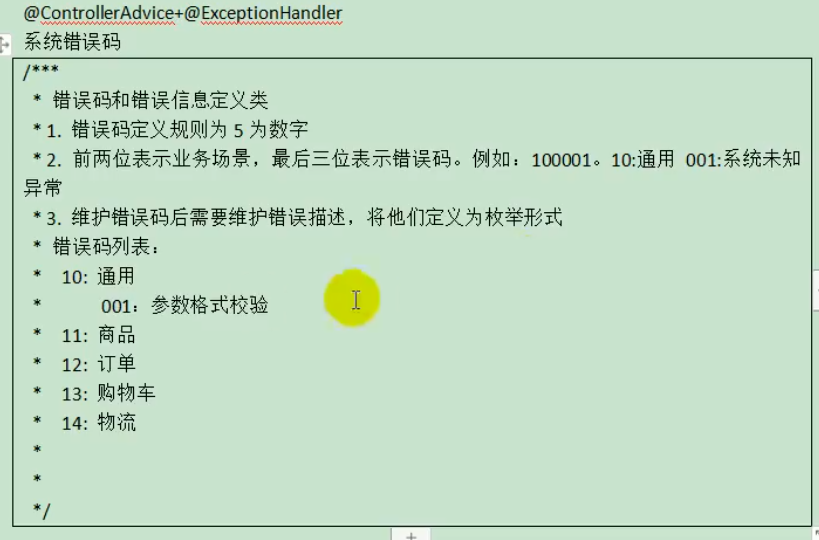

#### * 后端引入分页插件+开启事务

```java
1、mybatisplus要使用分页是引入分页插件

2、打开doc：https://mp.baomidou.com/guide/page.html
package com.atguigu.gulimall.product.config;
@Configuration
@EnableTransactionManagement// 开启事务
@MapperScan("com.atguigu.gulimall.product.dao")
public class MybatisConfig {

     // 引入分页插件
    @Bean
    public PaginationInterceptor paginationInterceptor() {
        PaginationInterceptor paginationInterceptor = new PaginationInterceptor();
        // 设置请求的页面大于最大页后操作， true调回到首页，false 继续请求  默认false
         paginationInterceptor.setOverflow(true);
        // 设置最大单页限制数量，默认 500 条，-1 不受限制
        paginationInterceptor.setLimit(1000);
        // 开启 count 的 join 优化,只针对部分 left join
        paginationInterceptor.setCountSqlParser(new JsqlParserCountOptimize(true));
        return paginationInterceptor;
    }
}
```

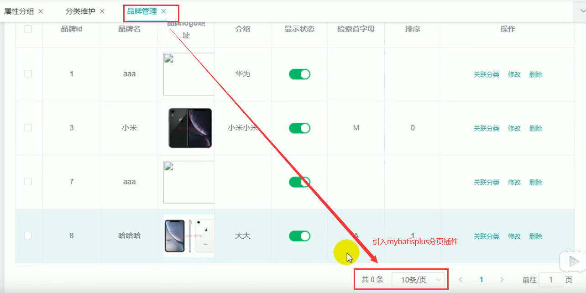

#### * 添加查询后端代码

带模糊查询的service方法

```java
    @RequestMapping("/list")
    // @RequiresPermissions("product:brand:list")
    public R list(@RequestParam Map<String, Object> params){
        PageUtils page = brandService.queryPage(params);

        return R.ok().put("page", page);
    }

	@Override
    public PageUtils queryPage(Map<String, Object> params) {
        // 获取key
        String key = (String) params.get("key");
        QueryWrapper<BrandEntity> queryWrapper = new QueryWrapper<>();
        // 模糊查询逻辑
        if (!StringUtils.isEmpty(key)) {
            // SELECT COUNT(1) FROM pms_brand WHERE (brand_id = ? OR name LIKE ?)
            queryWrapper.eq("brand_id", key).or().like("name", key);
        }
        IPage<BrandEntity> page = this.page(
                new Query<BrandEntity>().getPage(params),
                queryWrapper
        );
        return new PageUtils(page);

    }
```

#### * 完善关联分类【查询+保存 接口】

```
1、拷贝老师的前端代码modules过来

2、每个品牌  可能关联多个分类，既有手机、又有电脑

3、修改 save方法和list方法
CategoryBrandRelationController：
    /**
     * 查询品牌关联的所有分类
     */
    @GetMapping("/catelog/list")
    // @RequiresPermissions("product:categorybrandrelation:list")
    public R cateloglist(@RequestParam("brandId") Long brandId){
        List<CategoryBrandRelationEntity> data = categoryBrandRelationService.list(
                new QueryWrapper<CategoryBrandRelationEntity>().eq("brand_id", brandId)
        );

        return R.ok().put("data", data);
    }
    /**
     * 品牌分类关联 保存
     * 电商系统的冗余字段【brand_name,category_name】，不要使用数据库的关联查询
     * 发起多次请求查询
     */
    @RequestMapping("/save")
    // @RequiresPermissions("product:categorybrandrelation:save")
    public R save(@RequestBody CategoryBrandRelationEntity categoryBrandRelation){
		categoryBrandRelationService.saveDetail(categoryBrandRelation);

        return R.ok();
    }
service：
查询添加条件：
    @Override
    public PageUtils queryPage(Map<String, Object> params) {
        IPage<CategoryBrandRelationEntity> page = this.page(
                new Query<CategoryBrandRelationEntity>().getPage(params),
                new QueryWrapper<CategoryBrandRelationEntity>()
        );

        return new PageUtils(page);
    }
保存添加冗余数据：【不使用关联查询】
    @Override
    public void saveDetail(CategoryBrandRelationEntity categoryBrandRelation) {
        // 发起多次请求冗余数据，而不使用关联查询
        Long brandId = categoryBrandRelation.getBrandId();
        Long catelogId = categoryBrandRelation.getCatelogId();
        BrandEntity brandEntity = brandDao.selectById(brandId);
        CategoryEntity categoryEntity = categoryDao.selectById(catelogId);

        categoryBrandRelation.setBrandName(brandEntity.getName());
        categoryBrandRelation.setCatelogName(categoryEntity.getName());

        this.save(categoryBrandRelation);
    }
```

#### * 完善修改逻辑【添加事务】

```
1、冗余是为了分库分表

2、当修改分类名字、品牌名字的时候，要同时修改 关联表CategoryBrandRelation表中的冗余数据
    @Transactional
    @Override
    public void updateDetail(BrandEntity brand) {
        this.updateById(brand);
        // 需要保证冗余数据一致
        if (!StringUtils.isEmpty(brand.getName())) {
            // 同步更新其他关联表
            categoryBrandRelationService.updateBrand(brand.getBrandId(), brand.getName());

            // TODO 更新其他关联
        }
    }
    
    /**
     * 级联更新所有关联的数据
     * @param category
     */
    @Transactional
    @Override
    public void updateCascade(CategoryEntity category) {
        this.updateById(category);
        if (!StringUtils.isEmpty(category.getName())) {
            categoryBrandRelationService.updateCategory(category.getCatId(), category.getName());

            // TODO 更新其他关联
        }
    }

```


#### * policy.js所有代码

```js
import http from '@/utils/httpRequest.js'
export function policy() {	// 对外暴露一个policy方法获得上传签名的
   return  new Promise((resolve,reject)=>{
        http({
            url: http.adornUrl("/thirdparty/oss/policy"),
            method: "get",
            params: http.adornParams({})
        }).then(({ data }) => {
            resolve(data);
        })
    });
}
```


#### * singleUpload.vue所有代码

上传单个文件

```vue
<template> 
  <div>
    <el-upload
      action="http://gulimall-wan.oss-cn-shanghai.aliyuncs.com"
      :data="dataObj"
      list-type="picture"
      :multiple="false" :show-file-list="showFileList"
      :file-list="fileList"
      :before-upload="beforeUpload"	// 上传之前会调用
      :on-remove="handleRemove"
      :on-success="handleUploadSuccess"
      :on-preview="handlePreview">
      <el-button size="small" type="primary">点击上传</el-button>
      <div slot="tip" class="el-upload__tip">只能上传jpg/png文件，且不超过10MB</div>
    </el-upload>
    <el-dialog :visible.sync="dialogVisible">
      
    </el-dialog>
  </div>
</template>
<script>
   import {policy} from './policy'	// 导入了policy方法
   import { getUUID } from '@/utils'

  export default {
    name: 'singleUpload',
    props: {
      value: String
    },
    computed: {
      imageUrl() {
        return this.value;
      },
      imageName() {
        if (this.value != null && this.value !== '') {
          return this.value.substr(this.value.lastIndexOf("/") + 1);
        } else {
          return null;
        }
      },
      fileList() {
        return [{
          name: this.imageName,
          url: this.imageUrl
        }]
      },
      showFileList: {
        get: function () {
          return this.value !== null && this.value !== ''&& this.value!==undefined;
        },
        set: function (newValue) {
        }
      }
    },
    data() {
      return {
        dataObj: {				// 上传文件需要的信息
          policy: '',
          signature: '',
          key: '',
          ossaccessKeyId: '',
          dir: '',
          host: '',
          // callback:'',
        },
        dialogVisible: false
      };
    },
    methods: {
      emitInput(val) {
        this.$emit('input', val)
      },
      handleRemove(file, fileList) {
        this.emitInput('');
      },
      handlePreview(file) {
        this.dialogVisible = true;
      },
      beforeUpload(file) {// 上传之前调用
        let _self = this;
        return new Promise((resolve, reject) => {
          policy().then(response => {	// 请求后端获得令牌，并设置参数
            console.log("响应的数据",response);
            _self.dataObj.policy = response.data.policy;
            _self.dataObj.signature = response.data.signature;
            _self.dataObj.ossaccessKeyId = response.data.accessid;
            _self.dataObj.key = response.data.dir +getUUID()+'_${filename}';
            _self.dataObj.dir = response.data.dir;
            _self.dataObj.host = response.data.host;
            console.log("响应的数据222。。。",_self.dataObj);
            resolve(true)
          }).catch(err => {
            reject(false)
          })
        })
      },
      handleUploadSuccess(res, file) {
        console.log("上传成功...")
        this.showFileList = true;
        this.fileList.pop();
        this.fileList.push({name: file.name, url: this.dataObj.host + '/' + this.dataObj.key.replace("${filename}",file.name) });
        this.emitInput(this.fileList[0].url);
      }
    }
  }
</script>
<style>

</style>
```


#### * brand.vue所有代码

```vue
<template>
  <div class="mod-config">
    <el-form :inline="true" :model="dataForm" @keyup.enter.native="getDataList()">
      <el-form-item>
        <el-input v-model="dataForm.key" placeholder="参数名" clearable></el-input>
      </el-form-item>
      <el-form-item>
        <el-button @click="getDataList()">查询</el-button>
        <el-button
          v-if="isAuth('product:brand:save')"
          type="primary"
          @click="addOrUpdateHandle()"
        >新增</el-button>
        <el-button
          v-if="isAuth('product:brand:delete')"
          type="danger"
          @click="deleteHandle()"
          :disabled="dataListSelections.length <= 0"
        >批量删除</el-button>
      </el-form-item>
    </el-form>
    <el-table
      :data="dataList"
      border
      v-loading="dataListLoading"
      @selection-change="selectionChangeHandle"
      style="width: 100%;"
    >
      <el-table-column type="selection" header-align="center" align="center" width="50"></el-table-column>
      <el-table-column prop="brandId" header-align="center" align="center" label="品牌id"></el-table-column>
      <el-table-column prop="name" header-align="center" align="center" label="品牌名"></el-table-column>
      <el-table-column prop="logo" header-align="center" align="center" label="品牌logo地址">
        <template slot-scope="scope">// 添加一个自定义列模板，自定义显示图片
          <!-- <el-image
              style="width: 100px; height: 80px"
              :src="scope.row.logo"
          fit="fill"></el-image>--> // fit填充是填满
            // 这里根据src显示图片【从oss加载】，原始img
          	
        </template>
      </el-table-column>
      <el-table-column prop="descript" header-align="center" align="center" label="介绍"></el-table-column>
      <el-table-column prop="showStatus" header-align="center" align="center" label="显示状态">
        <template slot-scope="scope">// 自定义列模板
          <el-switch		// 显示按钮【滑动按钮，控制是否显示】
            v-model="scope.row.showStatus"// 这里通过scope.row.showStatus获取scope当前行的											//showStatus值
            active-color="#13ce66"
            inactive-color="#ff4949"
            :active-value="1"	// 前面加:,绑定数字1，代表激活是数字1，默认是true【这个1会绑定给
                     			//showStatus字段，否则showStatus这个字段值是true】
            :inactive-value="0" // 前面加:,绑定数字1，代表激活是数字0，默认是false
            @change="updateBrandStatus(scope.row)" // change事件，激活后调用
                     								//updateBrandStatus并传入参数
          ></el-switch>
        </template>
      </el-table-column>
      <el-table-column prop="firstLetter" header-align="center" align="center" label="检索首字母"></el-table-column>
      <el-table-column prop="sort" header-align="center" align="center" label="排序"></el-table-column>
      <el-table-column fixed="right" header-align="center" align="center" width="250" label="操作">
        <template slot-scope="scope">
          <el-button type="text" size="small" @click="updateCatelogHandle(scope.row.brandId)">关联分类</el-button>
          <el-button type="text" size="small" @click="addOrUpdateHandle(scope.row.brandId)">修改</el-button>
          <el-button type="text" size="small" @click="deleteHandle(scope.row.brandId)">删除</el-button>
        </template>
      </el-table-column>
    </el-table>
    <el-pagination
      @size-change="sizeChangeHandle"
      @current-change="currentChangeHandle"
      :current-page="pageIndex"
      :page-sizes="[10, 20, 50, 100]"
      :page-size="pageSize"
      :total="totalPage"
      layout="total, sizes, prev, pager, next, jumper"
    ></el-pagination>
    <!-- 弹窗, 新增 / 修改 -->// 这里点击新增，v-if变为true，addOrUpdateVisible=false
    <add-or-update v-if="addOrUpdateVisible" ref="addOrUpdate" @refreshDataList="getDataList"></add-or-update>

    <el-dialog title="关联分类" :visible.sync="cateRelationDialogVisible" width="30%">
      <el-popover placement="right-end" v-model="popCatelogSelectVisible">
        <category-cascader :catelogPath.sync="catelogPath"></category-cascader>
        <div style="text-align: right; margin: 0">
          <el-button size="mini" type="text" @click="popCatelogSelectVisible = false">取消</el-button>
          <el-button type="primary" size="mini" @click="addCatelogSelect">确定</el-button>
        </div>
        <el-button slot="reference">新增关联</el-button>
      </el-popover>
      <el-table :data="cateRelationTableData" style="width: 100%">
        <el-table-column prop="id" label="#"></el-table-column>
        <el-table-column prop="brandName" label="品牌名"></el-table-column>
        <el-table-column prop="catelogName" label="分类名"></el-table-column>
        <el-table-column fixed="right" header-align="center" align="center" label="操作">
          <template slot-scope="scope">
            <el-button
              type="text"
              size="small"
              @click="deleteCateRelationHandle(scope.row.id,scope.row.brandId)"
            >移除</el-button>
          </template>
        </el-table-column>
      </el-table>
      <span slot="footer" class="dialog-footer">
        <el-button @click="cateRelationDialogVisible = false">取 消</el-button>
        <el-button type="primary" @click="cateRelationDialogVisible = false">确 定</el-button>
      </span>
    </el-dialog>
  </div>
</template>

<script>
import AddOrUpdate from "./brand-add-or-update";
import CategoryCascader from "../common/category-cascader";
export default {
  data() {
    return {
      dataForm: {
        key: ""
      },
      brandId: 0,
      catelogPath: [],
      dataList: [],
      cateRelationTableData: [],
      pageIndex: 1,
      pageSize: 10,
      totalPage: 0,
      dataListLoading: false,
      dataListSelections: [],
      addOrUpdateVisible: false,// 显示新增dialog
      cateRelationDialogVisible: false,
      popCatelogSelectVisible: false
    };
  },
  components: {
    AddOrUpdate,
    CategoryCascader
  },
  activated() {
    this.getDataList();
  },
  methods: {
    addCatelogSelect() {
      //{"brandId":1,"catelogId":2}
      this.popCatelogSelectVisible =false;
      this.$http({
        url: this.$http.adornUrl("/product/categorybrandrelation/save"),
        method: "post",
        data: this.$http.adornData({brandId:this.brandId,catelogId:this.catelogPath[this.catelogPath.length-1]}, false)
      }).then(({ data }) => {
        this.getCateRelation();
      });
    },
    deleteCateRelationHandle(id, brandId) {
      this.$http({
        url: this.$http.adornUrl("/product/categorybrandrelation/delete"),
        method: "post",
        data: this.$http.adornData([id], false)
      }).then(({ data }) => {
        this.getCateRelation();
      });
    },
    updateCatelogHandle(brandId) {
      this.cateRelationDialogVisible = true;
      this.brandId = brandId;
      this.getCateRelation();
    },
    getCateRelation() {
      this.$http({
        url: this.$http.adornUrl("/product/categorybrandrelation/catelog/list"),
        method: "get",
        params: this.$http.adornParams({
          brandId: this.brandId
        })
      }).then(({ data }) => {
        this.cateRelationTableData = data.data;
      });
    },
    // 获取数据列表
    getDataList() {
      this.dataListLoading = true;
      this.$http({
        url: this.$http.adornUrl("/product/brand/list"),
        method: "get",
        params: this.$http.adornParams({
          page: this.pageIndex,
          limit: this.pageSize,
          key: this.dataForm.key
        })
      }).then(({ data }) => {
        if (data && data.code === 0) {
          this.dataList = data.page.list;
          this.totalPage = data.page.totalCount;
        } else {
          this.dataList = [];
          this.totalPage = 0;
        }
        this.dataListLoading = false;
      });
    },
    updateBrandStatus(data) {// switch 激活事件，发送修改请求
      console.log("最新信息", data);
      let { brandId, showStatus } = data;// 解构
      //发送请求修改状态
      this.$http({
        url: this.$http.adornUrl("/product/brand/update/status"),
        method: "post",
        data: this.$http.adornData({ brandId, showStatus }, false)
      }).then(({ data }) => {
        this.$message({
          type: "success",
          message: "状态更新成功"
        });
      });
    },
    // 每页数
    sizeChangeHandle(val) {
      this.pageSize = val;
      this.pageIndex = 1;
      this.getDataList();
    },
    // 当前页
    currentChangeHandle(val) {
      this.pageIndex = val;
      this.getDataList();
    },
    // 多选
    selectionChangeHandle(val) {
      this.dataListSelections = val;
    },
    // 新增 / 修改
    addOrUpdateHandle(id) {
      this.addOrUpdateVisible = true;// 渲染组件
      this.$nextTick(() => {// 渲染完了之后再执行
        this.$refs.addOrUpdate.init(id);
      });
    },
    // 删除
    deleteHandle(id) {
      var ids = id
        ? [id]
        : this.dataListSelections.map(item => {
            return item.brandId;
          });
      this.$confirm(
        `确定对[id=${ids.join(",")}]进行[${id ? "删除" : "批量删除"}]操作?`,
        "提示",
        {
          confirmButtonText: "确定",
          cancelButtonText: "取消",
          type: "warning"
        }
      ).then(() => {
        this.$http({
          url: this.$http.adornUrl("/product/brand/delete"),
          method: "post",
          data: this.$http.adornData(ids, false)
        }).then(({ data }) => {
          if (data && data.code === 0) {
            this.$message({
              message: "操作成功",
              type: "success",
              duration: 1500,
              onClose: () => {
                this.getDataList();
              }
            });
          } else {
            this.$message.error(data.msg);
          }
        });
      });
    }
  }
};
</script>

```


#### * brand-add-or-update.vue所有代码

```vue
<template>
  <el-dialog
    :title="!dataForm.id ? '新增' : '修改'"
    :close-on-click-modal="false"
    :visible.sync="visible"
  >
    <el-form
      :model="dataForm"// v-model 双向绑定dataForm对象，
      :rules="dataRule"	// 每一个dataForm字段绑定一个dataRule中指定的规则
      ref="dataForm"
      @keyup.enter.native="dataFormSubmit()"
      label-width="140px"	// 调整lable宽度
    >
      <el-form-item label="品牌名" prop="name">
        <el-input v-model="dataForm.name" placeholder="品牌名"></el-input>
      </el-form-item>
      <el-form-item label="品牌logo地址" prop="logo">
        <!-- <el-input v-model="dataForm.logo" placeholder="品牌logo地址"></el-input> -->
        <single-upload v-model="dataForm.logo"></single-upload> // 文件上传
      </el-form-item>
      <el-form-item label="介绍" prop="descript">
        <el-input v-model="dataForm.descript" placeholder="介绍"></el-input>
      </el-form-item>
      <el-form-item label="显示状态" prop="showStatus">
        <el-switch // 新增里面也使用switch选择框
          v-model="dataForm.showStatus"
          active-color="#13ce66"
          inactive-color="#ff4949"
          :active-value="1"		// 激活状态修改为1：双向绑定showStatus
          :inactive-value="0"	// 不激活状态修改为0：双向绑定showStatus
        ></el-switch>
      </el-form-item>
      <el-form-item label="检索首字母" prop="firstLetter">
        <el-input v-model="dataForm.firstLetter" placeholder="检索首字母"></el-input>
      </el-form-item>
      <el-form-item label="排序" prop="sort">
          // 绑定一个number值
        <el-input v-model.number="dataForm.sort" placeholder="排序"></el-input>
      </el-form-item>
    </el-form>
    <span slot="footer" class="dialog-footer">
      <el-button @click="visible = false">取消</el-button>
      <el-button type="primary" @click="dataFormSubmit()">确定</el-button>
    </span>
  </el-dialog>
</template>

<script>
import SingleUpload from "@/components/upload/singleUpload"; // 导入组件
export default {
  components: { SingleUpload },// 声明组件
  data() {
    return {
      visible: false,
      dataForm: {
        brandId: 0,
        name: "",
        logo: "",
        descript: "",
        showStatus: 1,
        firstLetter: "",
        sort: 0
      },
      dataRule: {// 指定的规则
          // blur：鼠标失去焦点
        name: [{ required: true, message: "品牌名不能为空", trigger: "blur" }],
        logo: [
          { required: true, message: "品牌logo地址不能为空", trigger: "blur" }
        ],
        descript: [
          { required: true, message: "介绍不能为空", trigger: "blur" }
        ],
        showStatus: [
          {
            required: true,
            message: "显示状态[0-不显示；1-显示]不能为空",
            trigger: "blur"
          }
        ],
        firstLetter: [
          {
            validator: (rule, value, callback) => {
              if (value == "") {
                callback(new Error("首字母必须填写"));
              } else if (!/^[a-zA-Z]$/.test(value)) {// 正则表达式，必须是a-zA-Z
                callback(new Error("首字母必须a-z或者A-Z之间"));
              } else {
                callback();
              }
            },
            trigger: "blur"
          }
        ],
        sort: [
          {
            validator: (rule, value, callback) => {
              if (value === "") {// 这里要写三个等号，因为0在js中也是空串
                callback(new Error("排序字段必须填写"));
              } else if (!Number.isInteger(value) || value<0) {
                callback(new Error("排序必须是一个大于等于0的整数"));
              } else {
                callback();
              }
            },
            trigger: "blur"
          }
        ]
      }
    };
  },
  methods: {
    init(id) {
      this.dataForm.brandId = id || 0;
      this.visible = true;
      this.$nextTick(() => {
        this.$refs["dataForm"].resetFields();
        if (this.dataForm.brandId) {
          this.$http({
            url: this.$http.adornUrl(
              `/product/brand/info/${this.dataForm.brandId}`
            ),
            method: "get",
            params: this.$http.adornParams()
          }).then(({ data }) => {
            if (data && data.code === 0) {
              this.dataForm.name = data.brand.name;
              this.dataForm.logo = data.brand.logo;
              this.dataForm.descript = data.brand.descript;
              this.dataForm.showStatus = data.brand.showStatus;
              this.dataForm.firstLetter = data.brand.firstLetter;
              this.dataForm.sort = data.brand.sort;
            }
          });
        }
      });
    },
    // 表单提交
    dataFormSubmit() {
      this.$refs["dataForm"].validate(valid => {
        if (valid) {
          this.$http({
            url: this.$http.adornUrl(
              `/product/brand/${!this.dataForm.brandId ? "save" : "update"}`
            ),
            method: "post",
            data: this.$http.adornData({
              brandId: this.dataForm.brandId || undefined,
              name: this.dataForm.name,
              logo: this.dataForm.logo,
              descript: this.dataForm.descript,
              showStatus: this.dataForm.showStatus,
              firstLetter: this.dataForm.firstLetter,
              sort: this.dataForm.sort
            })
          }).then(({ data }) => {
            if (data && data.code === 0) {
              this.$message({
                message: "操作成功",
                type: "success",
                duration: 1500,
                onClose: () => {
                  this.visible = false;
                  this.$emit("refreshDataList");
                }
              });
            } else {
              this.$message.error(data.msg);
            }
          });
        }
      });
    }
  }
};
</script>

```


### 1.3、平台属性

#### 1.3.1、属性分组

##### * 后台管理系统创建菜单

```
1、拷贝1-分布式基础_全栈开发篇\代码\sql\sys_menus.sql内部的内容
	打开gulimall-admin数据库【就是renren-fast的数据库】，执行该sql代码
	作用：直接创建出需要创建的所有菜单项，不需要再手动一个个创建了
```

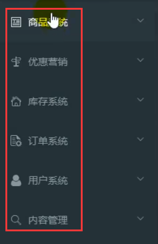


##### * 抽取三级分类组件

```
1、因为属性分组、规格参数、销售属性都是与三级分类关联，所以讲该组件抽离出来

2、在modules/common文件夹中创建category.vue组件

3、拷贝之前写的category.vue，删除掉不需要的功能就可以了
```

##### * Layout布局，菜单+表格

```
1、左边是菜单【三级分类，这一部分是抽取出来的公共组件，引入】，右边是表格【所有属性（按照分类id加载）】
  <el-row :gutter="20">
    <el-col :span="6">
    	菜单：
      <category @tree-node-click="treenodeclick"></category>
    </el-col>
    <el-col :span="18">
      <div class="mod-config">
       	表格：
        <el-table
          :data="dataList"
          border
          v-loading="dataListLoading"
          @selection-change="selectionChangeHandle"
          style="width: 100%;"
        >
    </el-col>
</el-row>

2、在renren-fast-vue的modules/product文件夹新建attrgroup.vue
导入category.vue，然后菜单就使用这个公共三级分类组件

3、打开自动生成的代码，找到attrgroup.vue
	1）把表格内容复制过来，整个div放到表格的<el-col>中
	2）除了component全复制过来【data、method等】
	3）导入attrgroup.vue原始导入的组件，然后把这个文件也复制过来【attrgroup-add-or-update.vue】

5、
```

##### * 父子组件 菜单+表格联动

```
1、点击菜单的三级分类，表格动态显示

2、父子组件
父组件：attrgroup.vue
子组件：category.vue
	1）子组件给父组件传递数据【事件机制】：
	子组件给父组件发送一个事件，携带数据
	
3、给el-tree 的Node绑定点击事件
三个属性值：data【数据库封装的信息】, node【节点】, component【整个树组件】

<el-tree @node-click="nodeclick">
事件方法：
methods:{
    nodeclick(data, node, component) {
      console.log("子组件category的节点被点击", data, node, component);
      //向父组件发送事件；
      this.$emit("tree-node-click", data, node, component);
    }
    
4、在父组件绑定事件
绑定上自己的方法
<category @tree-node-click="treenodeclick"></category>
methods:{
	// 感知树节点被点击
	treenodeclick(data,node,component){
	
	}
}

5、只有点击第三级的分类，才可以查询 属性分组
```

##### * 接口：根据三级分类分页查询属性分组

```java
1、这个就是mybatis-plus的使用模板

2、controller
    /**
     * 根据三级分类获取分页列表
     */
    @RequestMapping("/list/{catelogId}")
    public R list(@RequestParam Map<String, Object> params, @PathVariable("catelogId") Long catelogId){
        // PageUtils page = attrGroupService.queryPage(params);

        PageUtils page = attrGroupService.queryPage(params, catelogId);

        return R.ok().put("page", page);
    }

3、service
    @Override
    public PageUtils queryPage(Map<String, Object> params, Long catelogId) {
        // 如果没有传3级分类就传0，查所有
        if (catelogId == 0){
            IPage<AttrGroupEntity> page = this.page(
                    new Query<AttrGroupEntity>().getPage(params),
                    new QueryWrapper<AttrGroupEntity>()
            );
            return new PageUtils(page);
        }else {
            String key = (String) params.get("key");
            // select * from pms_attr_group where catelog_id=? and(attr_group_id=key or attr_group_name like %key%)
            QueryWrapper<AttrGroupEntity> wrapper = new QueryWrapper<AttrGroupEntity>().eq("catelog_id", catelogId);
            if (!StringUtils.isEmpty(key)) {
                wrapper.and((obj) -> {
                   obj.eq("attr_group_id", key).or().like("attr_group_name", key);
                });
            }
            IPage<AttrGroupEntity> page = this.page(
                    new Query<AttrGroupEntity>().getPage(params),
                    wrapper
            );
            return new PageUtils(page);
        }
    }
```

##### * Cascader 级联选择器【新增属性分组-分类属性】

代码解析在所有代码里面

```
1、新增属性分组，所属分类的id选择，使用级联选择器【三级】

2、找到element Cascader 级联选择器

3、给options属性指定一个数组即可渲染出一个级联选择器

4、修改BUG，出现四级级联，让children.length = 0不返回
	/**
	 * 不为空才返回
	 */
	@JsonInclude(JsonInclude.Include.NON_EMPTY)
	@TableField(exist = false)
	List<CategoryEntity> children;
```

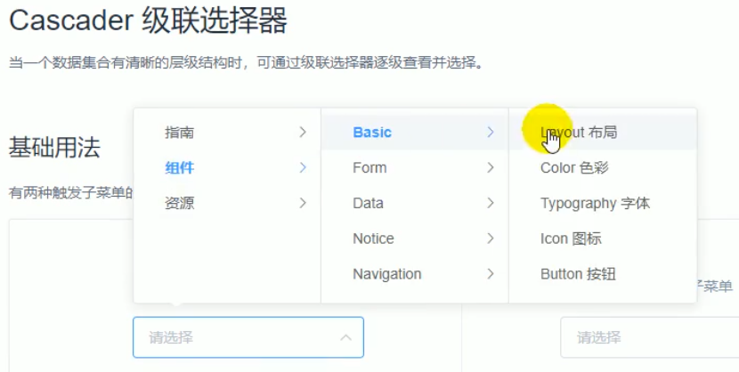

##### * Cascader 级联选择器【修改属性分组-分类属性未回显】

```java
1、bug没有回显：因为新增的时候只保存了第三级分类，所以点击修改回显的时候找不到前两级的id

2、init(id)回显数据时，因为库里面只存了第三级分类的id，前两级没存

3、设置完整路径 this.catelogPath =  data.attrGroup.catelogPath;【数组类型】
init(id) {
      this.dataForm.attrGroupId = id || 0;
      this.visible = true;
      this.$nextTick(() => {
        this.$refs["dataForm"].resetFields();
        if (this.dataForm.attrGroupId) {
          this.$http({
            url: this.$http.adornUrl(
              `/product/attrgroup/info/${this.dataForm.attrGroupId}`
            ),
            method: "get",
            params: this.$http.adornParams()
          }).then(({ data }) => {
            if (data && data.code === 0) {
              this.dataForm.attrGroupName = data.attrGroup.attrGroupName;
              this.dataForm.sort = data.attrGroup.sort;
              this.dataForm.descript = data.attrGroup.descript;
              this.dataForm.icon = data.attrGroup.icon;
              this.dataForm.catelogId = data.attrGroup.catelogId;
              //查出catelogId的完整路径
              this.catelogPath =  data.attrGroup.catelogPath;
            }
          });
        }
      });
      
4、修改接口
在接口封装三级分类catelogPath
    @RequestMapping("/info/{attrGroupId}")
    public R info(@PathVariable("attrGroupId") Long attrGroupId){
		AttrGroupEntity attrGroup = attrGroupService.getById(attrGroupId);

        Long catelogId = attrGroup.getCatelogId();
        Long[] path = categoryService.findCatelogId(catelogId);
        attrGroup.setCatelogPath(path);
        return R.ok().put("attrGroup", attrGroup);
    }


在AttrGroupEntity添加catelogPath属性
	/**
	 * 回显级联，非数据库字段
	 */
	@TableField(exist = false)
	private Long[] catelogPath;
	
service方法：
    // [2,25,225]
    @Override
    public Long[] findCatelogId(Long catelogId) {
        List<Long> paths = new ArrayList<>();
        findParentPath(catelogId, paths);// 递归查询父节点
        Collections.reverse(paths);// 逆序
        return paths.toArray(new Long[0]);
    }

    private List<Long> findParentPath(Long catelogId, List<Long> paths) {
        // 1、收集父ID
        paths.add(catelogId);
        // 查库
        CategoryEntity byId = this.getById(catelogId);
        if (byId.getParentCid() != 0) {
            findParentPath(byId.getParentCid(), paths);
        }
        return paths;
    }

test：
    @Test
    void testCategoryPath() {
        log.info("完整路径：{}", Arrays.asList(categoryService.findCatelogId(225L)));
    }
完整路径：[2, 34, 225]
```

##### * 查询全部接口没有模糊查询bug

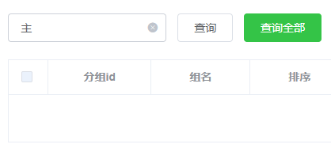

```java
1、查询全部catelog_id=0的时候没有带上模糊查询的功能
    @Override
    public PageUtils queryPage(Map<String, Object> params, Long catelogId) {
        String key = (String) params.get("key");
        QueryWrapper<AttrGroupEntity> wrapper = new QueryWrapper<AttrGroupEntity>();
        if (!StringUtils.isEmpty(key)) {
            // 这里要带一个and，否则会跟AND catelog_id在同一个层面上
            wrapper.and((obj) -> {
                obj.eq("attr_group_id", key).or().like("attr_group_name", key);
            });
        }
        // 如果没有传3级分类就传0，查所有
        if (catelogId == 0){
            IPage<AttrGroupEntity> page = this.page(
                    new Query<AttrGroupEntity>().getPage(params),
                    wrapper
            );
            return new PageUtils(page);
        }else {
            // SELECT * FROM pms_attr_group WHERE ((attr_group_id = ? OR attr_group_name LIKE ?) AND catelog_id = ?)
            wrapper.eq("catelog_id", catelogId);
            IPage<AttrGroupEntity> page = this.page(
                    new Query<AttrGroupEntity>().getPage(params),
                    wrapper
            );
            return new PageUtils(page);
        }
    }
```

##### * 关联属性分组与 基础属性

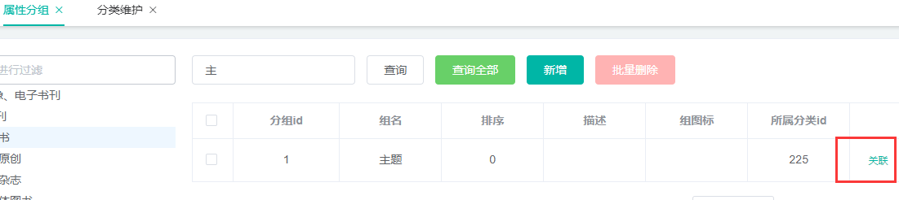


```
/product/attrgroup/attr/relation

```


##### * 获取属性分组没有关联的其他属性

```
/product/attrgroup/{attrgroupId}/noattr/relation
接口描述
获取属性分组里面还没有关联的本分类里面的其他基本属性，方便添加新的关联
请求参数
{
   page: 1,//当前页码
   limit: 10,//每页记录数
   sidx: 'id',//排序字段
   order: 'asc/desc',//排序方式
   key: '华为'//检索关键字
}
分页数据

响应数据
{
	"msg": "success",
	"code": 0,
	"page": {
		"totalCount": 3,
		"pageSize": 10,
		"totalPage": 1,
		"currPage": 1,
		"list": [{
			"attrId": 1,
			"attrName": "aaa",
			"searchType": 1,
			"valueType": 1,
			"icon": "aa",
			"valueSelect": "aa;ddd;sss;aaa2",
			"attrType": 1,
			"enable": 1,
			"catelogId": 225,
			"showDesc": 1
		}]
	}
}
```

```java
    @Override
    public PageUtils getNoRelationAttr(Map<String, Object> params, Long attrgroupId) {
        // 1、当前分组只能关联所属分类下的所有属性
        // 先查出分类ID
        AttrGroupEntity groupEntity = attrGroupDao.selectById(attrgroupId);
        Long catelogId = groupEntity.getCatelogId();
        // 2、只能显示当前分类下没有被关联的属性
        // 2.1）查出所属分类下的所有分组
        List<AttrGroupEntity> groups = attrGroupDao.selectList(new QueryWrapper<AttrGroupEntity>().eq("catelog_id", catelogId));
        List<Long> groupIds = groups.stream().map((item) -> {
            return item.getAttrGroupId();
        }).collect(Collectors.toList());
        // 2.2）查出这些分组已经关联的属性
        List<AttrAttrgroupRelationEntity> relationEntities = new ArrayList<AttrAttrgroupRelationEntity>();
        if (!CollectionUtils.isEmpty(groupIds)) {
            relationEntities = attrAttrgroupRelationDao.selectList(new QueryWrapper<AttrAttrgroupRelationEntity>().in("attr_group_id", groupIds));
        }
        List<Long> attrIds = relationEntities.stream().map((item) -> {
            return item.getAttrId();
        }).collect(Collectors.toList());

        // 2.3）从当前分类下的所有属性里 剔除已关联的属性
        QueryWrapper<AttrEntity> queryWrapper = new QueryWrapper<AttrEntity>().eq("catelog_id", catelogId).eq("attr_type", ProductConstant.AttrEnum.ATTR_TYPE_BASE.getCode());
        if (!CollectionUtils.isEmpty(attrIds)) {
            queryWrapper.notIn("attr_id", attrIds);
        }
        String key = (String) params.get("key");
        if (!StringUtils.isEmpty(key)) {
            queryWrapper.and((w)->{
                w.eq("attr_id", key).or().like("attr_name", key);
            });
        }
        IPage<AttrEntity> page = this.page(new Query<AttrEntity>().getPage(params), queryWrapper);
        PageUtils pageUtils = new PageUtils(page);
        return pageUtils;
    }
```


##### * 显示属性分组 关联的 所有属性

```java
1、根据分组去查关联表

2、根据关联表查出的数据集【attrId的集合】调用：

listByIds(attrIds)查询属性信息
    @Override
    public List<AttrEntity> getRelationAttr(Long attrgroupId) {
        List<AttrEntity> attrEntities = null;
        List<AttrAttrgroupRelationEntity> relationEntities = attrAttrgroupRelationDao.selectList(new QueryWrapper<AttrAttrgroupRelationEntity>().eq("attr_group_id", attrgroupId));
        List<Long> attrIds = relationEntities.stream().map((attr) -> {
            return attr.getAttrId();
        }).collect(Collectors.toList());
        // 集合为空会报错，要判断一下
        if (!CollectionUtils.isEmpty(attrIds)) {
            attrEntities = this.listByIds(attrIds);
        }
        return CollectionUtils.isEmpty(attrEntities) ? new ArrayList<AttrEntity>() : attrEntities;
    }
```


##### * 删除属性分组关联的所有属性

```
1、注意的点：post请求都在body中，如果前端传数据的方式是json，那么controller接口上就要加@RequestBody注解才能把请求封装成POJO类，否则异常。如果前端没有json包装直接form提交，那也可以不用@RequestBody注解

2、删除的时候不要一条一条删除，选择or的方式连接所有删除的 关联数据
自定义sql
```


##### * category.vue三级分类菜单组件代码

```vue
<template>
  <div>
    <el-input placeholder="输入关键字进行过滤" v-model="filterText"></el-input>
    <el-tree
      :data="menus"
      :props="defaultProps"
      node-key="catId"
      ref="menuTree"
      @node-click="nodeclick"
      :filter-node-method="filterNode"
      :highlight-current = "true"
    ></el-tree>
  </div>
</template>

<script>
//这里可以导入其他文件（比如：组件，工具js，第三方插件js，json文件，图片文件等等）
//例如：import 《组件名称》 from '《组件路径》';

export default {
  //import引入的组件需要注入到对象中才能使用
  components: {},
  props: {},
  data() {
    //这里存放数据
    return {
      filterText: "",
      menus: [],
      expandedKey: [],
      defaultProps: {
        children: "children",
        label: "name"
      }
    };
  },
  //计算属性 类似于data概念
  computed: {},
  //监控data中的数据变化
  watch: {
    filterText(val) {
      this.$refs.menuTree.filter(val);
    }
  },
  //方法集合
  methods: {
    //树节点过滤
    filterNode(value, data) {
      if (!value) return true;
      return data.name.indexOf(value) !== -1;
    },
    getMenus() {
      this.$http({
        url: this.$http.adornUrl("/product/category/list/tree"),
        method: "get"
      }).then(({ data }) => {
        this.menus = data.data;
      });
    },
    nodeclick(data, node, component) {
      console.log("子组件category的节点被点击", data, node, component);
      //向父组件发送事件；
      this.$emit("tree-node-click", data, node, component);
    }
  },
  //生命周期 - 创建完成（可以访问当前this实例）
  created() {
    this.getMenus();
  },
  //生命周期 - 挂载完成（可以访问DOM元素）
  mounted() {},
  beforeCreate() {}, //生命周期 - 创建之前
  beforeMount() {}, //生命周期 - 挂载之前
  beforeUpdate() {}, //生命周期 - 更新之前
  updated() {}, //生命周期 - 更新之后
  beforeDestroy() {}, //生命周期 - 销毁之前
  destroyed() {}, //生命周期 - 销毁完成
  activated() {} //如果页面有keep-alive缓存功能，这个函数会触发
};
</script>
<style scoped>

</style>
```


##### * attrgroup.vue 属性分组代码

```vue
<template>
  <el-row :gutter="20">
    <el-col :span="6">
      <category @tree-node-click="treenodeclick"></category>
    </el-col>
    <el-col :span="18">
      <div class="mod-config">
        <el-form :inline="true" :model="dataForm" @keyup.enter.native="getDataList()">
          <el-form-item>
            <el-input v-model="dataForm.key" placeholder="参数名" clearable></el-input>
          </el-form-item>
          <el-form-item>
            <el-button @click="getDataList()">查询</el-button>
            <el-button type="success" @click="getAllDataList()">查询全部</el-button>
            <el-button
              v-if="isAuth('product:attrgroup:save')"
              type="primary"
              @click="addOrUpdateHandle()"
            >新增</el-button>
            <el-button
              v-if="isAuth('product:attrgroup:delete')"
              type="danger"
              @click="deleteHandle()"
              :disabled="dataListSelections.length <= 0"
            >批量删除</el-button>
          </el-form-item>
        </el-form>
        <el-table
          :data="dataList"
          border
          v-loading="dataListLoading"
          @selection-change="selectionChangeHandle"
          style="width: 100%;"
        >
          <el-table-column type="selection" header-align="center" align="center" width="50"></el-table-column>
          <el-table-column prop="attrGroupId" header-align="center" align="center" label="分组id"></el-table-column>
          <el-table-column prop="attrGroupName" header-align="center" align="center" label="组名"></el-table-column>
          <el-table-column prop="sort" header-align="center" align="center" label="排序"></el-table-column>
          <el-table-column prop="descript" header-align="center" align="center" label="描述"></el-table-column>
          <el-table-column prop="icon" header-align="center" align="center" label="组图标"></el-table-column>
          <el-table-column prop="catelogId" header-align="center" align="center" label="所属分类id"></el-table-column>
          <el-table-column
            fixed="right"
            header-align="center"
            align="center"
            width="150"
            label="操作"
          >
            <template slot-scope="scope">// 自定义组件，在操作的el-table-column中显示
              <el-button type="text" size="small" @click="relationHandle(scope.row.attrGroupId)">关联</el-button>
              <el-button
                type="text"
                size="small"
                @click="addOrUpdateHandle(scope.row.attrGroupId)" // 点击触发事件
              >修改</el-button>
              <el-button type="text" size="small" @click="deleteHandle(scope.row.attrGroupId)">删除</el-button>
            </template>
          </el-table-column>
        </el-table>
        <el-pagination
          @size-change="sizeChangeHandle"
          @current-change="currentChangeHandle"
          :current-page="pageIndex"
          :page-sizes="[10, 20, 50, 100]"
          :page-size="pageSize"
          :total="totalPage"
          layout="total, sizes, prev, pager, next, jumper"
        ></el-pagination>
        <!-- 弹窗, 新增 / 修改 -->
        <add-or-update v-if="addOrUpdateVisible" ref="addOrUpdate" @refreshDataList="getDataList"></add-or-update>
// ref指定该组件的引用名字，可以this.$refs.addOrUpdate来引用

        <!-- 修改关联关系 -->
        <relation-update v-if="relationVisible" ref="relationUpdate" @refreshData="getDataList"></relation-update>
      </div>
    </el-col>
  </el-row>
</template>

<script>
/**
 * 父子组件传递数据
 * 1)、子组件给父组件传递数据，事件机制；
 *    子组件给父组件发送一个事件，携带上数据。
 * // this.$emit("事件名",携带的数据...)
 */
//这里可以导入其他文件（比如：组件，工具js，第三方插件js，json文件，图片文件等等）
//例如：import 《组件名称》 from '《组件路径》';
import Category from "../common/category";
import AddOrUpdate from "./attrgroup-add-or-update";
import RelationUpdate from "./attr-group-relation";
export default {
  //import引入的组件需要注入到对象中才能使用
  components: { Category, AddOrUpdate, RelationUpdate },
  props: {},
  data() {
    return {
      catId: 0,	// 默认显示所有分组
      dataForm: {
        key: ""
      },
      dataList: [],
      pageIndex: 1,
      pageSize: 10,
      totalPage: 0,
      dataListLoading: false,
      dataListSelections: [],
      addOrUpdateVisible: false,
      relationVisible: false
    };
  },
  activated() {
    this.getDataList();
  },
  methods: {
    //处理分组与属性的关联
    relationHandle(groupId) {
      this.relationVisible = true;
      this.$nextTick(() => {
        this.$refs.relationUpdate.init(groupId);
      });
    },
    //感知树节点被点击
    treenodeclick(data, node, component) {
      if (node.level == 3) {// 只有是第三级分类才查询
        this.catId = data.catId;// 设置分类ID
        this.getDataList(); //重新查询
      }
    },
    getAllDataList(){
      this.catId = 0;
      this.getDataList();
    },
    // 获取数据列表
    getDataList() {
      this.dataListLoading = true;
      this.$http({
        url: this.$http.adornUrl(`/product/attrgroup/list/${this.catId}`),// 带上分类id
        method: "get",
        params: this.$http.adornParams({
          page: this.pageIndex,		// 页码
          limit: this.pageSize,		// 每页size
          key: this.dataForm.key	// 输入的查询条件
        })
      }).then(({ data }) => {
        if (data && data.code === 0) {
          this.dataList = data.page.list;
          this.totalPage = data.page.totalCount;
        } else {
          this.dataList = [];
          this.totalPage = 0;
        }
        this.dataListLoading = false;
      });
    },
    // 每页数
    sizeChangeHandle(val) {
      this.pageSize = val;
      this.pageIndex = 1;
      this.getDataList();
    },
    // 当前页
    currentChangeHandle(val) {
      this.pageIndex = val;
      this.getDataList();
    },
    // 多选
    selectionChangeHandle(val) {
      this.dataListSelections = val;
    },
    // 新增 / 修改
    addOrUpdateHandle(id) {
      this.addOrUpdateVisible = true; // 渲染 add-or-update
      this.$nextTick(() => {	// 渲染完了之后再执行
        this.$refs.addOrUpdate.init(id); // 当前组件的$refs(表示所有组件的引用).addOrUpdate
          // .init调用该组件的init方法【根据 属性分组id 查库，然后填充到dataForm里面进行回显 】
      });
    },
    // 删除
    deleteHandle(id) {
      var ids = id
        ? [id]
        : this.dataListSelections.map(item => {
            return item.attrGroupId;
          });
      this.$confirm(
        `确定对[id=${ids.join(",")}]进行[${id ? "删除" : "批量删除"}]操作?`,
        "提示",
        {
          confirmButtonText: "确定",
          cancelButtonText: "取消",
          type: "warning"
        }
      ).then(() => {
        this.$http({
          url: this.$http.adornUrl("/product/attrgroup/delete"),
          method: "post",
          data: this.$http.adornData(ids, false)
        }).then(({ data }) => {
          if (data && data.code === 0) {
            this.$message({
              message: "操作成功",
              type: "success",
              duration: 1500,
              onClose: () => {
                this.getDataList();
              }
            });
          } else {
            this.$message.error(data.msg);
          }
        });
      });
    }
  }
};
</script>
<style scoped>
</style>
```

##### * attrgroup-add-or-update.vue所有代码

```vue
<template>
  <el-dialog
    :title="!dataForm.id ? '新增' : '修改'"
    :close-on-click-modal="false"
    :visible.sync="visible"
    @closed="dialogClose"	// 关闭对话框后，清空上次回显数组
  >
    <el-form
      :model="dataForm"
      :rules="dataRule"
      ref="dataForm"
      @keyup.enter.native="dataFormSubmit()"
      label-width="120px"
    >
      <el-form-item label="组名" prop="attrGroupName">
        <el-input v-model="dataForm.attrGroupName" placeholder="组名"></el-input>
      </el-form-item>
      <el-form-item label="排序" prop="sort">
        <el-input v-model="dataForm.sort" placeholder="排序"></el-input>
      </el-form-item>
      <el-form-item label="描述" prop="descript">
        <el-input v-model="dataForm.descript" placeholder="描述"></el-input>
      </el-form-item>
      <el-form-item label="组图标" prop="icon">
        <el-input v-model="dataForm.icon" placeholder="组图标"></el-input>
      </el-form-item>
      <el-form-item label="所属分类" prop="catelogId">
        <!-- <el-input v-model="dataForm.catelogId" placeholder="所属分类id"></el-input> @change="handleChange" -->
		<!-- <el-cascader v-model="dataForm.catelogIds" :options="categorys"  :props="props"></el-cascader> -->
          // dataForm.catelogIds绑定了一个数组【选择的三个分类ID】【后开修改成了dataForm.catelogPath】
          // options绑定categorys数组【发出getCategorys请求，props 与options数据的属性映射】
          // filterable可搜索的级联属性
        <!-- <el-cascader filterable placeholder="试试搜索：手机" v-model="catelogPath" :options="categorys"  :props="props"></el-cascader> -->
        <!-- :catelogPath="catelogPath"自定义绑定的属性，可以给子组件传值 -->
        <category-cascader :catelogPath.sync="catelogPath"></category-cascader>
      </el-form-item>
    </el-form>
    <span slot="footer" class="dialog-footer">
      <el-button @click="visible = false">取消</el-button>
      <el-button type="primary" @click="dataFormSubmit()">确定</el-button>
    </span>
  </el-dialog>
</template>

<script>
import CategoryCascader from '../common/category-cascader'
export default {
  data() {
    return {
      props:{
        value:"catId",	// 指定值【与dataForm.catelogIds绑定】
        label:"name",	// 指定显示label
        children:"children"	// 指定categorys数组中属性名
      },
      visible: false,
      categorys: [],// 该数组是getCategorys绑定的所有table数据
      catelogPath: [],// 该数组是 存库+回显的数据【分类三级级联，v-model绑定的】
      dataForm: {
        attrGroupId: 0,
        attrGroupName: "",
        sort: "",
        descript: "",
        icon: "",
        catelogId: 0
      },
      dataRule: {
        attrGroupName: [
          { required: true, message: "组名不能为空", trigger: "blur" }
        ],
        sort: [{ required: true, message: "排序不能为空", trigger: "blur" }],
        descript: [
          { required: true, message: "描述不能为空", trigger: "blur" }
        ],
        icon: [{ required: true, message: "组图标不能为空", trigger: "blur" }],
        catelogId: [
          { required: true, message: "所属分类id不能为空", trigger: "blur" }
        ]
      }
    };
  },
  components:{CategoryCascader},
  
  methods: {
    dialogClose(){
      this.catelogPath = [];
    },
    getCategorys(){
      this.$http({
        url: this.$http.adornUrl("/product/category/list/tree"),
        method: "get"
      }).then(({ data }) => {
        this.categorys = data.data;
      });
    },
    init(id) {
      this.dataForm.attrGroupId = id || 0;
      this.visible = true;
      this.$nextTick(() => {
        this.$refs["dataForm"].resetFields();
        if (this.dataForm.attrGroupId) {
          this.$http({
            url: this.$http.adornUrl(
              `/product/attrgroup/info/${this.dataForm.attrGroupId}`
            ),
            method: "get",
            params: this.$http.adornParams()
          }).then(({ data }) => {
            if (data && data.code === 0) {
              this.dataForm.attrGroupName = data.attrGroup.attrGroupName;
              this.dataForm.sort = data.attrGroup.sort;
              this.dataForm.descript = data.attrGroup.descript;
              this.dataForm.icon = data.attrGroup.icon;
              this.dataForm.catelogId = data.attrGroup.catelogId;
              //查出catelogId的完整路径
              this.catelogPath =  data.attrGroup.catelogPath;
            }
          });
        }
      });
    },
    // 表单提交
    dataFormSubmit() {
      this.$refs["dataForm"].validate(valid => {
        if (valid) {
          this.$http({
            url: this.$http.adornUrl(
              `/product/attrgroup/${
                !this.dataForm.attrGroupId ? "save" : "update"
              }`
            ),
            method: "post",
            data: this.$http.adornData({
              attrGroupId: this.dataForm.attrGroupId || undefined,
              attrGroupName: this.dataForm.attrGroupName,
              sort: this.dataForm.sort,
              descript: this.dataForm.descript,
              icon: this.dataForm.icon,
              catelogId: this.catelogPath[this.catelogPath.length-1]// 只保存第三级分类的ID
            })
          }).then(({ data }) => {
            if (data && data.code === 0) {
              this.$message({
                message: "操作成功",
                type: "success",
                duration: 1500,
                onClose: () => {
                  this.visible = false;
                  this.$emit("refreshDataList");// 触发父组件 事件，父组件会刷新表格
                }
              });
            } else {
              this.$message.error(data.msg);
            }
          });
        }
      });
    }
  },
  created(){
    this.getCategorys();
  }
};
</script>

```


#### 1.3.2、规格参数

##### * 新增规格参数【VO】

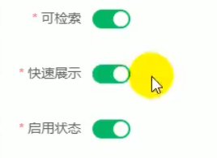

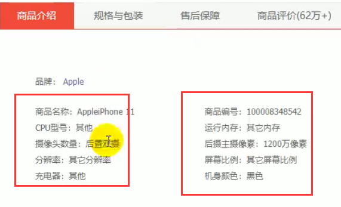

```java
1、快速展示：可以在商品介绍中显示的属性

2、传入的参数还有一个attrGroupId，但是这个字段不属于数据库字段，不规范的写法是直接在Entity加一个字段，然后加注解@TableField(exist=false)
正确做法：加一个vo类，新增vo.AttrVo类
多了一个attrGroupId字段

3、修改AttrController中接口的参数为AttrVo
    @RequestMapping("/save")
    public R save(@RequestBody AttrVo attr){
		attrService.saveAttr(attr);

        return R.ok();
    }

4、要给两个表新增【基本属性表、关联表（属性与属性分组表）】
    @Transactional
    @Override
    public void saveAttr(AttrVo attr) {
        AttrEntity attrEntity = new AttrEntity();
        BeanUtils.copyProperties(attr, attrEntity);
        // 1\保存基本属性
        this.save(attrEntity);
        // 2\保存关联关系
        AttrAttrgroupRelationEntity relationEntity = new AttrAttrgroupRelationEntity();
        relationEntity.setAttrGroupId(attr.getAttrGroupId());
        relationEntity.setAttrId(attrEntity.getAttrId());
        attrAttrgroupRelationDao.insert(relationEntity);
    }

```

##### * 查询规格参数【VO】

```java
1、查询参数：catelog_id是否等于0(查询全部) 模糊查询key
2、封装返回值VO包含catelogName，groupName
    @Override
    public PageUtils queryBaseAttrPage(Map<String, Object> params, Long catelogId) {
        QueryWrapper<AttrEntity> wrapper = new QueryWrapper<>();
        if (catelogId != 0) {
            wrapper.eq("catelog_id", catelogId);
        }
        String key = (String) params.get("key");
        if (!StringUtils.isEmpty(key)) {
            wrapper.and((obj)->{
                obj.eq("attr_id", key).or().like("attr_name", key);
            });
        }
        // 分页查询，带上了 limit参数
        IPage<AttrEntity> page = this.page(new Query<AttrEntity>().getPage(params), wrapper);
        PageUtils pageUtils = new PageUtils(page);
        List<AttrEntity> records = page.getRecords();
        List<AttrRespVo> respVos = records.stream().map((attrEntity -> {
            AttrRespVo attrRespVo = new AttrRespVo();
            BeanUtils.copyProperties(attrEntity, attrRespVo);
            // 1、查询属性分组名字
            // 分组信息id要从关联表里找
            AttrAttrgroupRelationEntity attrGroupId = attrAttrgroupRelationDao.selectOne(new QueryWrapper<AttrAttrgroupRelationEntity>().eq("attr_id", attrEntity.getAttrId()));
            if (attrGroupId != null) {
                AttrGroupEntity attrGroupEntity = attrGroupDao.selectById(attrGroupId.getAttrGroupId());
                attrRespVo.setGroupName(attrGroupEntity.getAttrGroupName());
            }
            // 2、查询分类名字
            CategoryEntity categoryEntity = categoryDao.selectById(attrEntity.getCatelogId());
            if (categoryEntity != null) {
                attrRespVo.setCatelogName(categoryEntity.getName());
            }
            return attrRespVo;
        })).collect(Collectors.toList());
        pageUtils.setList(respVos);
        return pageUtils;
    }

```

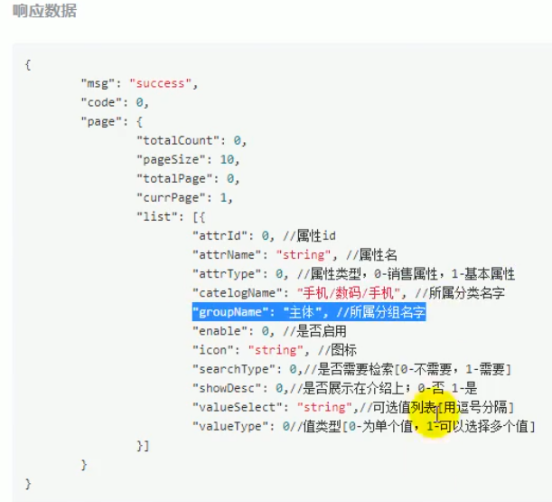

##### * 修改规格参数

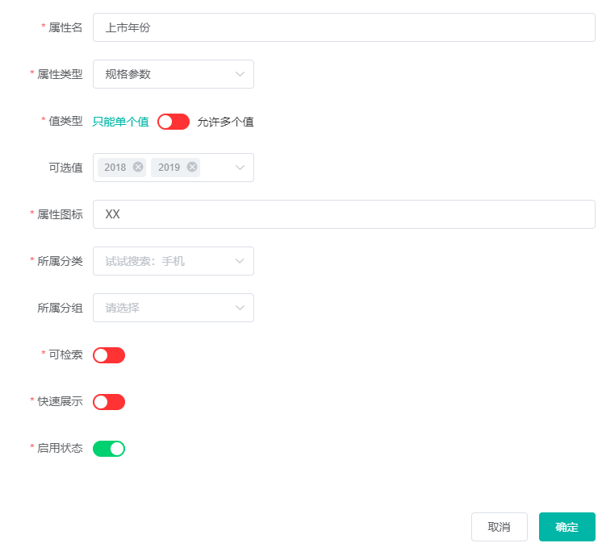

```jagva
1、有可能之前未关联分组，所以 关联表内没有数据，所以要判断是新增还是修改
    @Transactional
    @Override
    public void updateAttr(AttrVo attr) {
        AttrEntity attrEntity = new AttrEntity();
        BeanUtils.copyProperties(attr, attrEntity);
        // 1、修改Attr表
        this.updateById(attrEntity);

        AttrAttrgroupRelationEntity relationEntity = new AttrAttrgroupRelationEntity();
        relationEntity.setAttrGroupId(attr.getAttrGroupId());
        relationEntity.setAttrId(attr.getAttrId());

        Integer count = attrAttrgroupRelationDao.selectCount(new QueryWrapper<AttrAttrgroupRelationEntity>().eq("attr_id", attr.getAttrId()));
        if (count > 0) {
            // 2、修改分组关联
            attrAttrgroupRelationDao.update(relationEntity, new UpdateWrapper<AttrAttrgroupRelationEntity>().eq("attr_id", attr.getAttrId()));
        }else {
            // 3、新增分组关联
            attrAttrgroupRelationDao.insert(relationEntity);
        }
    }
```


##### * 修改回显分类级联【VO】

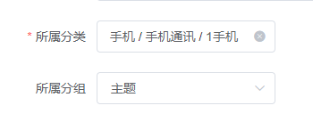

```java
1、使用接口http://localhost:88/api/product/attr/info/1?t=1597154022538
{attrId}
2、查询属性分组名称+三级分类级联数组+分类名
    @Override
    public AttrRespVo getAttrInfo(Long attrId) {
        AttrEntity attrEntity = this.getById(attrId);
        AttrRespVo respVo = new AttrRespVo();
        BeanUtils.copyProperties(attrEntity, respVo);

        // 设置分组信息
        AttrAttrgroupRelationEntity relationEntity = attrAttrgroupRelationDao.selectOne(new QueryWrapper<AttrAttrgroupRelationEntity>().eq("attr_id", attrId));
        if (relationEntity != null) {
            respVo.setAttrGroupId(relationEntity.getAttrGroupId());
            AttrGroupEntity attrGroupEntity = attrGroupDao.selectById(relationEntity.getAttrGroupId());
            if (attrGroupEntity != null) {
                respVo.setGroupName(attrGroupEntity.getAttrGroupName());
            }
        }
        // 设置分类信息
        Long[] catelogPath = categoryService.findCatelogId(attrEntity.getCatelogId());
        respVo.setCatelogPath(catelogPath);
        CategoryEntity categoryEntity = categoryDao.selectById(attrEntity.getCatelogId());
        if (categoryEntity != null) {
                respVo.setCatelogName(categoryEntity.getName());
		}
        return respVo;
    }


```


#### 1.3.3、销售属性

##### * 新增、查询、修改

```java
1、与规格参数方法共用，但是要判断当前操作是销售属性还是对规格参数的操作
新增一个枚举类
package com.atguigu.common.constant;

public class ProductConstant {
    public enum AttrEnum {
        ATTR_TYPE_BASE(1, "基本属性"),
        ATTR_TYPE_SALE(0, "销售属性");
        private int code;
        private String msg;

        AttrEnum(int code, String msg) {
            this.code = code;
            this.msg = msg;
        }

        public int getCode() {
            return code;
        }

        public void setCode(int code) {
            this.code = code;
        }

        public String getMsg() {
            return msg;
        }

        public void setMsg(String msg) {
            this.msg = msg;
        }
    }
}

2、新增、修改、查询、列表、删除，都要判断是规格还是销售属性"base"【删除还没有改成自己的，有时间自己加】
AttrServiceImpl

    @Override
    public PageUtils queryBaseAttrPage(Map<String, Object> params, Long catelogId, String type) {
        // 添加条件，基本属性是1，销售属性是0
        QueryWrapper<AttrEntity> wrapper = new QueryWrapper<AttrEntity>().eq("attr_type", "base".equalsIgnoreCase(type) ?
                ProductConstant.AttrEnum.ATTR_TYPE_BASE.getCode() : ProductConstant.AttrEnum.ATTR_TYPE_SALE.getCode());
        if (catelogId != 0) {
            wrapper.eq("catelog_id", catelogId);
        }
        String key = (String) params.get("key");
        if (!StringUtils.isEmpty(key)) {
            wrapper.and((obj) -> {
                obj.eq("attr_id", key).or().like("attr_name", key);
            });
        }
        // 分页查询，带上了 limit参数
        IPage<AttrEntity> page = this.page(new Query<AttrEntity>().getPage(params), wrapper);
        PageUtils pageUtils = new PageUtils(page);
        List<AttrEntity> records = page.getRecords();
        List<AttrRespVo> respVos = records.stream().map((attrEntity -> {
            AttrRespVo attrRespVo = new AttrRespVo();
            BeanUtils.copyProperties(attrEntity, attrRespVo);
            // 1、查询属性分组名字
            // 只有基本属性才有属性分组，销售属性不需要查询 属性分组信息
            if ("base".equalsIgnoreCase(type)) {
                // 分组信息id要从关联表里找
                AttrAttrgroupRelationEntity attrGroupId = attrAttrgroupRelationDao.selectOne(new QueryWrapper<AttrAttrgroupRelationEntity>().eq("attr_id", attrEntity.getAttrId()));
                if (attrGroupId != null) {
                    AttrGroupEntity attrGroupEntity = attrGroupDao.selectById(attrGroupId.getAttrGroupId());
                    // 如果是销售属性，attr_group_id为null，因为销售属性没有属性分组
                    attrRespVo.setGroupName(attrGroupEntity.getAttrGroupName());
                }
            }
            // 2、查询分类名字
            CategoryEntity categoryEntity = categoryDao.selectById(attrEntity.getCatelogId());
            if (categoryEntity != null) {
                attrRespVo.setCatelogName(categoryEntity.getName());
            }
            return attrRespVo;
        })).collect(Collectors.toList());
        pageUtils.setList(respVos);
        return pageUtils;
    }

    @Override
    public AttrRespVo getAttrInfo(Long attrId) {
        AttrEntity attrEntity = this.getById(attrId);
        AttrRespVo respVo = new AttrRespVo();
        BeanUtils.copyProperties(attrEntity, respVo);

        if (attrEntity.getAttrType() == ProductConstant.AttrEnum.ATTR_TYPE_BASE.getCode()) {
            // 设置分组信息
            AttrAttrgroupRelationEntity relationEntity = attrAttrgroupRelationDao.selectOne(new QueryWrapper<AttrAttrgroupRelationEntity>().eq("attr_id", attrId));
            if (relationEntity != null) {
                respVo.setAttrGroupId(relationEntity.getAttrGroupId());
                AttrGroupEntity attrGroupEntity = attrGroupDao.selectById(relationEntity.getAttrGroupId());
                if (attrGroupEntity != null) {
                    respVo.setGroupName(attrGroupEntity.getAttrGroupName());
                }
            }
        }
        // 设置分类信息
        Long[] catelogPath = categoryService.findCatelogId(attrEntity.getCatelogId());
        respVo.setCatelogPath(catelogPath);
        CategoryEntity categoryEntity = categoryDao.selectById(attrEntity.getCatelogId());
        if (categoryEntity != null) {
            respVo.setCatelogName(categoryEntity.getName());
        }
        return respVo;
    }
```

### 1.4、商品维护

#### 1.4.1、发布商品

```
SpuInfoController.save(@RequestBody SpuSaveVo vo)
```

##### * 图解

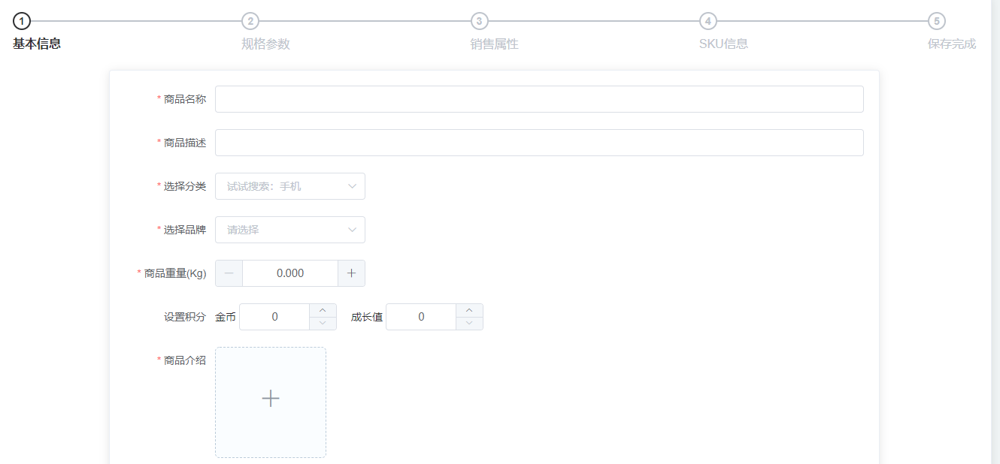

设置销售属性：

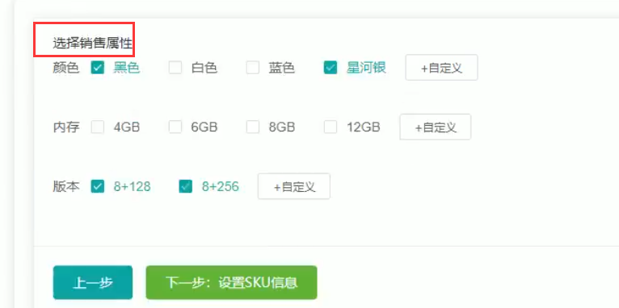

设置SKU信息：

SKU信息就是销售属性的组合

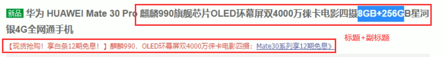

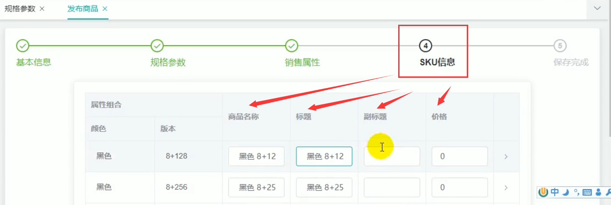

##### * 会员等级接口

```
※p84 关于pubsub、publish报错，无法发送查询品牌信息的请求：
1、npm install --save pubsub-js
2、在src下的main.js中引用：
① import PubSub from 'pubsub-js'
② Vue.prototype.PubSub = PubSub
```

```
1、发布商品点开后会现请求会员等级接口
http://localhost:88/api/member/memberlevel/list?t=1597202652921&page=1&limit=500
分页请求

2、配置路由


```


##### * 获取分类下所有品牌接口

```java
    /**
     * 获取分类关联的所有品牌
     * /product/categorybrandrelation/brands/list
     * 1、controller：处理请求，接收和校验数据【JSR303】
     * 2、service接收controller传来的数据，进行业务处理
     * 3、controller接收service处理完的数据，封装页面指定的vo
     */
    @GetMapping("/brands/list")
    public R relationBrandList(@RequestParam(value = "catId", required = true) Long catId){
        List<BrandEntity> brandEntities = categoryBrandRelationService.getBrandsByCatId(catId);
        List<BrandVo> data = brandEntities.stream().map(item -> {
            BrandVo brandVo = new BrandVo();
            brandVo.setBrandId(item.getBrandId());
            brandVo.setBrandName(item.getName());
            return brandVo;
        }).collect(Collectors.toList());

        return R.ok().put("data", data);
    }
```

##### *  获取分类下所有分组&关联属性

```
1、/product/attrgroup/{catelogId}/withattr
查出这个三级分类下关联的所有分组
然后根据分组查出关联的基本属性


```

##### * 获得发布商品的json

```
1、获得json数据，去下面网站格式化
http://www.bejson.com/

2、层级
   spuName:
   baseAttrs:[]
   skus:[{
   			attr:[],
   			skuName:
   			price:
   		}]
   
3、JSON生成Java实体类 
```

下载代码：


```json
{
	"spuName": "华为 HUAWEI Mate 30",
	"spuDescription": "华为 HUAWEI Mate 30",
	"catalogId": 225,
	"brandId": 3,
	"weight": 0.196,
	"publishStatus": 0,
	"decript": ["https://gulimall-wan.oss-cn-shanghai.aliyuncs.com/2020-08-12/bebfdd56-8672-480f-8ba3-1da068a6eb59_73366cc235d68202.jpg", "https://gulimall-wan.oss-cn-shanghai.aliyuncs.com/2020-08-12/1006bd68-bfb9-4849-8861-4d5621843cbf_528211b97272d88a.jpg"],
	"images": ["https://gulimall-wan.oss-cn-shanghai.aliyuncs.com/2020-08-12/d6923575-f61a-4ee1-8596-cef5e490882c_0d40c24b264aa511.jpg", "https://gulimall-wan.oss-cn-shanghai.aliyuncs.com/2020-08-12/70be7094-b654-4e95-8be6-ba153b87d87a_1f15cdbcf9e1273c.jpg", "https://gulimall-wan.oss-cn-shanghai.aliyuncs.com/2020-08-12/e1c08d80-a580-43b6-842b-b62c0f73806f_3c24f9cd69534030.jpg", "https://gulimall-wan.oss-cn-shanghai.aliyuncs.com/2020-08-12/21bc10f1-2668-4b1e-841a-54ad64624c10_8bf441260bffa42f.jpg", "https://gulimall-wan.oss-cn-shanghai.aliyuncs.com/2020-08-12/39b2613e-e411-4046-8a2c-e40225fb90c3_28f296629cca865e.jpg", "https://gulimall-wan.oss-cn-shanghai.aliyuncs.com/2020-08-12/76978c17-9bed-4b40-8ccd-c87b3bcaae26_335b2c690e43a8f8.jpg", "https://gulimall-wan.oss-cn-shanghai.aliyuncs.com/2020-08-12/5a500297-8984-469b-8af2-90c35835260f_d511faab82abb34b.jpg", "https://gulimall-wan.oss-cn-shanghai.aliyuncs.com/2020-08-12/ff6d6732-13b0-4d0a-81f9-f321d3cf43fd_919c850652e98031.jpg", "https://gulimall-wan.oss-cn-shanghai.aliyuncs.com/2020-08-12/52dc8b33-bb64-4026-831c-81eab8e9bdd3_73ab4d2e818d2211.jpg", "https://gulimall-wan.oss-cn-shanghai.aliyuncs.com/2020-08-12/2565d892-a915-4589-868a-54e0a02f5afc_a83bf5250e14caf2.jpg", "https://gulimall-wan.oss-cn-shanghai.aliyuncs.com/2020-08-12/15f0de72-1cbe-47bf-849c-591a4a398a1c_23d9fbb256ea5d4a.jpg", "https://gulimall-wan.oss-cn-shanghai.aliyuncs.com/2020-08-12/41cb75e5-be0c-41bf-8937-99c8c1bc45a9_b5c6b23d01dcdf81.jpg"],
	"bounds": {
		"buyBounds": 500,
		"growBounds": 500
	},
	"baseAttrs": [{
		"attrId": 1,
		"attrValues": "2019",
		"showDesc": 1
	}, {
		"attrId": 3,
		"attrValues": "TAS-AL00",
		"showDesc": 1
	}, {
		"attrId": 4,
		"attrValues": "160.8",
		"showDesc": 1
	}, {
		"attrId": 5,
		"attrValues": "其他",
		"showDesc": 0
	}, {
		"attrId": 6,
		"attrValues": "海思(Hisilicon)",
		"showDesc": 1
	}, {
		"attrId": 7,
		"attrValues": "HUAWEI Kirin 980",
		"showDesc": 1
	}],
	"skus": [{
		"attr": [{
			"attrId": 8,
			"attrName": "颜色",
			"attrValue": "星河银"
		}, {
			"attrId": 10,
			"attrName": "版本",
			"attrValue": "8GB+128GB"
		}],
		"skuName": "华为 HUAWEI Mate 30 星河银 8GB+128GB",
		"price": "5799",
		"skuTitle": "华为 HUAWEI Mate 30 星河银 麒麟990旗舰芯片4000万超感光徕卡影像屏内指纹8GB+128GB4G全网通版游戏手机",
		"skuSubtitle": "【优惠300元！】麒麟990芯片，4000万超感光徕卡影像屏内指纹；爆款至高立省500》",
		"images": [{
			"imgUrl": "https://gulimall-wan.oss-cn-shanghai.aliyuncs.com/2020-08-12/d6923575-f61a-4ee1-8596-cef5e490882c_0d40c24b264aa511.jpg",
			"defaultImg": 1
		}, {
			"imgUrl": "https://gulimall-wan.oss-cn-shanghai.aliyuncs.com/2020-08-12/70be7094-b654-4e95-8be6-ba153b87d87a_1f15cdbcf9e1273c.jpg",
			"defaultImg": 0
		}, {
			"imgUrl": "",
			"defaultImg": 0
		}, {
			"imgUrl": "",
			"defaultImg": 0
		}, {
			"imgUrl": "",
			"defaultImg": 0
		}, {
			"imgUrl": "",
			"defaultImg": 0
		}, {
			"imgUrl": "https://gulimall-wan.oss-cn-shanghai.aliyuncs.com/2020-08-12/5a500297-8984-469b-8af2-90c35835260f_d511faab82abb34b.jpg",
			"defaultImg": 0
		}, {
			"imgUrl": "https://gulimall-wan.oss-cn-shanghai.aliyuncs.com/2020-08-12/ff6d6732-13b0-4d0a-81f9-f321d3cf43fd_919c850652e98031.jpg",
			"defaultImg": 0
		}, {
			"imgUrl": "https://gulimall-wan.oss-cn-shanghai.aliyuncs.com/2020-08-12/52dc8b33-bb64-4026-831c-81eab8e9bdd3_73ab4d2e818d2211.jpg",
			"defaultImg": 0
		}, {
			"imgUrl": "",
			"defaultImg": 0
		}, {
			"imgUrl": "",
			"defaultImg": 0
		}, {
			"imgUrl": "",
			"defaultImg": 0
		}],
		"descar": ["星河银", "8GB+128GB"],
		"fullCount": 3,
		"discount": 0.98,
		"countStatus": 1,
		"fullPrice": 10000,
		"reducePrice": 50,
		"priceStatus": 1,
		"memberPrice": [{
			"id": 2,
			"name": "铜牌会员",
			"price": 5759
		}, {
			"id": 3,
			"name": "银牌会员",
			"price": 5719
		}]
	}, {
		"attr": [{
			"attrId": 8,
			"attrName": "颜色",
			"attrValue": "星河银"
		}, {
			"attrId": 10,
			"attrName": "版本",
			"attrValue": "8GB+256GB"
		}],
		"skuName": "华为 HUAWEI Mate 30 星河银 8GB+256GB",
		"price": "6299",
		"skuTitle": "华为 HUAWEI Mate 30 星河银 麒麟990旗舰芯片4000万超感光徕卡影像屏内指纹8GB+256GB4G全网通版游戏手机",
		"skuSubtitle": "【优惠300元！】麒麟990芯片，4000万超感光徕卡影像屏内指纹；爆款至高立省500》",
		"images": [{
			"imgUrl": "https://gulimall-wan.oss-cn-shanghai.aliyuncs.com/2020-08-12/d6923575-f61a-4ee1-8596-cef5e490882c_0d40c24b264aa511.jpg",
			"defaultImg": 1
		}, {
			"imgUrl": "https://gulimall-wan.oss-cn-shanghai.aliyuncs.com/2020-08-12/70be7094-b654-4e95-8be6-ba153b87d87a_1f15cdbcf9e1273c.jpg",
			"defaultImg": 0
		}, {
			"imgUrl": "",
			"defaultImg": 0
		}, {
			"imgUrl": "",
			"defaultImg": 0
		}, {
			"imgUrl": "",
			"defaultImg": 0
		}, {
			"imgUrl": "",
			"defaultImg": 0
		}, {
			"imgUrl": "https://gulimall-wan.oss-cn-shanghai.aliyuncs.com/2020-08-12/5a500297-8984-469b-8af2-90c35835260f_d511faab82abb34b.jpg",
			"defaultImg": 0
		}, {
			"imgUrl": "https://gulimall-wan.oss-cn-shanghai.aliyuncs.com/2020-08-12/ff6d6732-13b0-4d0a-81f9-f321d3cf43fd_919c850652e98031.jpg",
			"defaultImg": 0
		}, {
			"imgUrl": "https://gulimall-wan.oss-cn-shanghai.aliyuncs.com/2020-08-12/52dc8b33-bb64-4026-831c-81eab8e9bdd3_73ab4d2e818d2211.jpg",
			"defaultImg": 0
		}, {
			"imgUrl": "",
			"defaultImg": 0
		}, {
			"imgUrl": "",
			"defaultImg": 0
		}, {
			"imgUrl": "",
			"defaultImg": 0
		}],
		"descar": ["星河银", "8GB+256GB"],
		"fullCount": 3,
		"discount": 0.98,
		"countStatus": 1,
		"fullPrice": 10000,
		"reducePrice": 50,
		"priceStatus": 1,
		"memberPrice": [{
			"id": 2,
			"name": "铜牌会员",
			"price": 6259
		}, {
			"id": 3,
			"name": "银牌会员",
			"price": 6219
		}]
	}, {
		"attr": [{
			"attrId": 8,
			"attrName": "颜色",
			"attrValue": "亮黑色"
		}, {
			"attrId": 10,
			"attrName": "版本",
			"attrValue": "8GB+128GB"
		}],
		"skuName": "华为 HUAWEI Mate 30 亮黑色 8GB+128GB",
		"price": "5799",
		"skuTitle": "华为 HUAWEI Mate 30 亮黑色 麒麟990旗舰芯片4000万超感光徕卡影像屏内指纹8GB+128GB4G全网通版游戏手机",
		"skuSubtitle": "【优惠300元！】麒麟990芯片，4000万超感光徕卡影像屏内指纹；爆款至高立省500》",
		"images": [{
			"imgUrl": "",
			"defaultImg": 0
		}, {
			"imgUrl": "",
			"defaultImg": 0
		}, {
			"imgUrl": "",
			"defaultImg": 0
		}, {
			"imgUrl": "https://gulimall-wan.oss-cn-shanghai.aliyuncs.com/2020-08-12/21bc10f1-2668-4b1e-841a-54ad64624c10_8bf441260bffa42f.jpg",
			"defaultImg": 1
		}, {
			"imgUrl": "https://gulimall-wan.oss-cn-shanghai.aliyuncs.com/2020-08-12/39b2613e-e411-4046-8a2c-e40225fb90c3_28f296629cca865e.jpg",
			"defaultImg": 0
		}, {
			"imgUrl": "https://gulimall-wan.oss-cn-shanghai.aliyuncs.com/2020-08-12/76978c17-9bed-4b40-8ccd-c87b3bcaae26_335b2c690e43a8f8.jpg",
			"defaultImg": 0
		}, {
			"imgUrl": "",
			"defaultImg": 0
		}, {
			"imgUrl": "",
			"defaultImg": 0
		}, {
			"imgUrl": "",
			"defaultImg": 0
		}, {
			"imgUrl": "",
			"defaultImg": 0
		}, {
			"imgUrl": "",
			"defaultImg": 0
		}, {
			"imgUrl": "",
			"defaultImg": 0
		}],
		"descar": ["亮黑色", "8GB+128GB"],
		"fullCount": 3,
		"discount": 0.98,
		"countStatus": 1,
		"fullPrice": 10000,
		"reducePrice": 50,
		"priceStatus": 1,
		"memberPrice": [{
			"id": 2,
			"name": "铜牌会员",
			"price": 5759
		}, {
			"id": 3,
			"name": "银牌会员",
			"price": 5719
		}]
	}, {
		"attr": [{
			"attrId": 8,
			"attrName": "颜色",
			"attrValue": "亮黑色"
		}, {
			"attrId": 10,
			"attrName": "版本",
			"attrValue": "8GB+256GB"
		}],
		"skuName": "华为 HUAWEI Mate 30 亮黑色 8GB+256GB",
		"price": "6299",
		"skuTitle": "华为 HUAWEI Mate 30 亮黑色 麒麟990旗舰芯片4000万超感光徕卡影像屏内指纹8GB+256GB4G全网通版游戏手机",
		"skuSubtitle": "【优惠300元！】麒麟990芯片，4000万超感光徕卡影像屏内指纹；爆款至高立省500》",
		"images": [{
			"imgUrl": "",
			"defaultImg": 0
		}, {
			"imgUrl": "",
			"defaultImg": 0
		}, {
			"imgUrl": "",
			"defaultImg": 0
		}, {
			"imgUrl": "",
			"defaultImg": 0
		}, {
			"imgUrl": "",
			"defaultImg": 0
		}, {
			"imgUrl": "",
			"defaultImg": 0
		}, {
			"imgUrl": "",
			"defaultImg": 0
		}, {
			"imgUrl": "",
			"defaultImg": 0
		}, {
			"imgUrl": "",
			"defaultImg": 0
		}, {
			"imgUrl": "",
			"defaultImg": 0
		}, {
			"imgUrl": "",
			"defaultImg": 0
		}, {
			"imgUrl": "",
			"defaultImg": 0
		}],
		"descar": ["亮黑色", "8GB+256GB"],
		"fullCount": 3,
		"discount": 0.98,
		"countStatus": 1,
		"fullPrice": 10000,
		"reducePrice": 50,
		"priceStatus": 1,
		"memberPrice": [{
			"id": 2,
			"name": "铜牌会员",
			"price": 6259
		}, {
			"id": 3,
			"name": "银牌会员",
			"price": 6219
		}]
	}, {
		"attr": [{
			"attrId": 8,
			"attrName": "颜色",
			"attrValue": "翡冷翠"
		}, {
			"attrId": 10,
			"attrName": "版本",
			"attrValue": "8GB+128GB"
		}],
		"skuName": "华为 HUAWEI Mate 30 翡冷翠 8GB+128GB",
		"price": "5799",
		"skuTitle": "华为 HUAWEI Mate 30 翡冷翠 麒麟990旗舰芯片4000万超感光徕卡影像屏内指纹8GB+128GB4G全网通版游戏手机",
		"skuSubtitle": "【优惠300元！】麒麟990芯片，4000万超感光徕卡影像屏内指纹；爆款至高立省500》",
		"images": [{
			"imgUrl": "",
			"defaultImg": 0
		}, {
			"imgUrl": "",
			"defaultImg": 0
		}, {
			"imgUrl": "",
			"defaultImg": 0
		}, {
			"imgUrl": "",
			"defaultImg": 0
		}, {
			"imgUrl": "",
			"defaultImg": 0
		}, {
			"imgUrl": "",
			"defaultImg": 0
		}, {
			"imgUrl": "",
			"defaultImg": 0
		}, {
			"imgUrl": "",
			"defaultImg": 0
		}, {
			"imgUrl": "",
			"defaultImg": 0
		}, {
			"imgUrl": "https://gulimall-wan.oss-cn-shanghai.aliyuncs.com/2020-08-12/2565d892-a915-4589-868a-54e0a02f5afc_a83bf5250e14caf2.jpg",
			"defaultImg": 1
		}, {
			"imgUrl": "https://gulimall-wan.oss-cn-shanghai.aliyuncs.com/2020-08-12/15f0de72-1cbe-47bf-849c-591a4a398a1c_23d9fbb256ea5d4a.jpg",
			"defaultImg": 0
		}, {
			"imgUrl": "https://gulimall-wan.oss-cn-shanghai.aliyuncs.com/2020-08-12/41cb75e5-be0c-41bf-8937-99c8c1bc45a9_b5c6b23d01dcdf81.jpg",
			"defaultImg": 0
		}],
		"descar": ["翡冷翠", "8GB+128GB"],
		"fullCount": 3,
		"discount": 0.98,
		"countStatus": 1,
		"fullPrice": 10000,
		"reducePrice": 50,
		"priceStatus": 1,
		"memberPrice": [{
			"id": 2,
			"name": "铜牌会员",
			"price": 5759
		}, {
			"id": 3,
			"name": "银牌会员",
			"price": 5719
		}]
	}, {
		"attr": [{
			"attrId": 8,
			"attrName": "颜色",
			"attrValue": "翡冷翠"
		}, {
			"attrId": 10,
			"attrName": "版本",
			"attrValue": "8GB+256GB"
		}],
		"skuName": "华为 HUAWEI Mate 30 翡冷翠 8GB+256GB",
		"price": "6299",
		"skuTitle": "华为 HUAWEI Mate 30 翡冷翠 麒麟990旗舰芯片4000万超感光徕卡影像屏内指纹8GB+256GB4G全网通版游戏手机",
		"skuSubtitle": "【优惠300元！】麒麟990芯片，4000万超感光徕卡影像屏内指纹；爆款至高立省500》",
		"images": [{
			"imgUrl": "",
			"defaultImg": 0
		}, {
			"imgUrl": "",
			"defaultImg": 0
		}, {
			"imgUrl": "",
			"defaultImg": 0
		}, {
			"imgUrl": "",
			"defaultImg": 0
		}, {
			"imgUrl": "",
			"defaultImg": 0
		}, {
			"imgUrl": "",
			"defaultImg": 0
		}, {
			"imgUrl": "",
			"defaultImg": 0
		}, {
			"imgUrl": "",
			"defaultImg": 0
		}, {
			"imgUrl": "",
			"defaultImg": 0
		}, {
			"imgUrl": "https://gulimall-wan.oss-cn-shanghai.aliyuncs.com/2020-08-12/2565d892-a915-4589-868a-54e0a02f5afc_a83bf5250e14caf2.jpg",
			"defaultImg": 1
		}, {
			"imgUrl": "https://gulimall-wan.oss-cn-shanghai.aliyuncs.com/2020-08-12/15f0de72-1cbe-47bf-849c-591a4a398a1c_23d9fbb256ea5d4a.jpg",
			"defaultImg": 0
		}, {
			"imgUrl": "https://gulimall-wan.oss-cn-shanghai.aliyuncs.com/2020-08-12/41cb75e5-be0c-41bf-8937-99c8c1bc45a9_b5c6b23d01dcdf81.jpg",
			"defaultImg": 0
		}],
		"descar": ["翡冷翠", "8GB+256GB"],
		"fullCount": 3,
		"discount": 0.98,
		"countStatus": 1,
		"fullPrice": 10000,
		"reducePrice": 50,
		"priceStatus": 1,
		"memberPrice": [{
			"id": 2,
			"name": "铜牌会员",
			"price": 6259
		}, {
			"id": 3,
			"name": "银牌会员",
			"price": 6219
		}]
	}]
}
spuadd.vue ? 1 dca : 722 cancel
```

##### * 新增商品

```
/product/spuinfo/save
1、修改下上一步骤生成的VO代码属性的类型，将double改成Bigdecimal字段

2、数据库所有Id字段改成Long

3、保存步骤
//1、保存spu基本信息	pms_spu_info
//2、保存spu的描述图片	pms_spu_info_desc
//3、保存spu的图片集	pms_spu_images
//4、保存spu的规格参数; pms_product_attr_value
//5、保存当前spu对应的所有sku信息;

描述表整个作为一张表，大字段
好处？pms_spu_info_desc
```

```java
    // TODO 高级部分完善，远程调用的回滚，远程调用不稳定
    @Transactional
    @Override
    public void saveSpuInfo(SpuSaveVo vo) {
        //1、保存spu基本信息   pms_spu_info
        //2、保存spu的描述图片  pms_spu_info_desc
        //3、保存spu的图片集   pms_spu_images
        //4、保存spu的规格参数; pms_product_attr_value
        //5、保存spu的积分信息;gulimall_sms-》ms_spu_bounds【跨库】
        //6、保存当前spu对应的所有sku信息;
        //6.1)、sku的基本信.息;pms_sku_info
        //6.2)、sku的图片信息;pms_sku_images
        //6.3)、sku的销售属性信.息:pms_sku_sale_attr_value
        //6.4)、sku的优惠、满减等信息;gulimall_sms-》sms_sku_ladder\sms_sku_full_reduction\sms_member_price【跨库】

        //1、保存spu基本信息   pms_spu_info
        SpuInfoEntity spuInfoEntity = new SpuInfoEntity();
        BeanUtils.copyProperties(vo, spuInfoEntity);
        spuInfoEntity.setCreateTime(new Date());
        spuInfoEntity.setUpdateTime(new Date());
        this.saveBaseSpuInfo(spuInfoEntity);

        //2、保存spu的描述图片  pms_spu_info_desc
        List<String> decript = vo.getDecript();
        SpuInfoDescEntity descEntity = new SpuInfoDescEntity();
        descEntity.setSpuId(spuInfoEntity.getId());
        descEntity.setDecript(String.join(",", decript));
        descService.saveSpuInfoDesc(descEntity);

        //3、保存spu的图片集   pms_spu_images
        List<String> images = vo.getImages();
        imagesService.saveImages(spuInfoEntity.getId(), images);

        //4、保存spu的规格参数; pms_product_attr_value
        List<BaseAttrs> baseAttrs = vo.getBaseAttrs();
        List<ProductAttrValueEntity> collect = baseAttrs.stream().map(attr -> {
            ProductAttrValueEntity valueEntity = new ProductAttrValueEntity();
            valueEntity.setAttrId(attr.getAttrId());
            valueEntity.setAttrName(attrService.getById(attr.getAttrId()).getAttrName());
            valueEntity.setAttrValue(attr.getAttrValues());
            valueEntity.setQuickShow(attr.getShowDesc());
            valueEntity.setSpuId(spuInfoEntity.getId());
            return valueEntity;
        }).collect(Collectors.toList());
        valueService.saveProductAttr(collect);

        //5、保存spu的积分信息;gulimall_sms-》ms_spu_bounds【跨库】
        Bounds bounds = vo.getBounds();
        SpuBoundTo spuBoundTo = new SpuBoundTo();
        BeanUtils.copyProperties(bounds, spuBoundTo);
        spuBoundTo.setSpuId(spuInfoEntity.getId());
        R r = couponFeignService.saveSpuBounds(spuBoundTo);
        if (r.getCode() != 0) {
            log.error("远程保存spu积分信息失败");
        }

        //6、保存当前spu对应的所有sku信息;
        List<Skus> skus = vo.getSkus();
        if (!CollectionUtils.isEmpty(skus)) {
            skus.forEach(item -> {
                String defaultImg = "";
                for (Images image : item.getImages()) {
                    if (image.getDefaultImg() == 1) {
                        defaultImg = image.getImgUrl();
                    }
                }
                // 只有这四个字段名是一样的
                // private String skuName;
                // private BigDecimal price;
                // private String skuTitle;
                // private String skuSubtitle;
                SkuInfoEntity skuInfoEntity = new SkuInfoEntity();
                BeanUtils.copyProperties(item, skuInfoEntity);
                skuInfoEntity.setBrandId(spuInfoEntity.getBrandId());
                skuInfoEntity.setCatalogId(spuInfoEntity.getCatalogId());
                skuInfoEntity.setSaleCount(0L);
                skuInfoEntity.setSpuId(spuInfoEntity.getId());
                skuInfoEntity.setSkuDefaultImg(defaultImg);
                //6.1)、sku的基本信.息;pms_sku_info
                skuInfoService.saveSkuInfo(skuInfoEntity);

                Long skuId = skuInfoEntity.getSkuId();
                List<SkuImagesEntity> skuImagesEntities = item.getImages().stream().map(image -> {
                    SkuImagesEntity skuImagesEntity = new SkuImagesEntity();
                    skuImagesEntity.setSkuId(skuId);
                    skuImagesEntity.setImgUrl(image.getImgUrl());
                    skuImagesEntity.setDefaultImg(image.getDefaultImg());
                    return skuImagesEntity;
                }).filter(entity -> {
                    // 返回false就会剔除
                    return !StringUtils.isEmpty(entity.getImgUrl());
                }).collect(Collectors.toList());
                //6.2)、sku的图片信息;pms_sku_images
                skuImagesService.saveBatch(skuImagesEntities);
                // TODO 没有图片路径的无需保存
                List<Attr> attrs = item.getAttr();
                List<SkuSaleAttrValueEntity> skuSaleAttrValueEntities = attrs.stream().map(attr -> {
                    SkuSaleAttrValueEntity valueEntity = new SkuSaleAttrValueEntity();
                    BeanUtils.copyProperties(attr, valueEntity);
                    valueEntity.setSkuId(skuId);
                    return valueEntity;
                }).collect(Collectors.toList());
                //6.3)、sku的销售属性信.息:pms_sku_sale_attr_value
                skuSaleAttrValueService.saveBatch(skuSaleAttrValueEntities);

                //6.4)、sku的优惠、满减等信息;gulimall_sms->
                // sms_sku_ladder
                // sms_sku_full_reduction
                // sms_member_price
                SkuReductionTo skuReductionTo = new SkuReductionTo();
                // TODO 无用的优惠信息剔除[去远程服务端修改判断，这里不判断]
                // 如果 满足件数<=0 满足价格<=0 剔除
                //if (item.getFullCount() > 0 || new BigDecimal(0).compareTo(item.getFullPrice()) == -1 || !StringUtils.isEmpty(item.getMemberPrice())) {
                BeanUtils.copyProperties(item, skuReductionTo);
                skuReductionTo.setSkuId(skuId);
                R r1 = couponFeignService.saveSkuReduction(skuReductionTo);
                if (r1.getCode() != 0) {
                    log.error("远程保存sku优惠信息失败");
                }

            });
        }
    }
```

##### * 新增商品BUG汇总

```
select * from pms_spu_info;
select * from pms_spu_info_desc;
select * from pms_spu_images;
select * from pms_sku_info;
select * from pms_sku_images;
select * from pms_sku_sale_attr_value;

0、修改mysql默认隔离级别，测试接口
SET SESSION TRANSACTION ISOLATION LEVEL READ UNCOMMITTED;将当前会话隔离级别等级设置成读未提交，可以读到未提交的数据

1、插入的时候省略了id列，mybatis将其当做自增列
INSERT INTO pms_spu_info_desc ( decript ) VALUES ( ? ) 
修改：	@TableId(type = IdType.INPUT)
	  private Long spuId;

2、过滤掉sku默认未选中图片
                List<SkuImagesEntity> skuImagesEntities = item.getImages().stream().map(image -> {
                    SkuImagesEntity skuImagesEntity = new SkuImagesEntity();
                    skuImagesEntity.setSkuId(skuId);
                    skuImagesEntity.setImgUrl(image.getImgUrl());
                    skuImagesEntity.setDefaultImg(image.getDefaultImg());
                    return skuImagesEntity;
                }).filter(entity->{
                    // 返回false就会剔除
                    return !StringUtils.isEmpty(entity.getImgUrl());
                }).collect(Collectors.toList());
                
3、优惠无意义数据
	1）满0件打0折【每个sku对应一条，笛卡尔积条sku】
	2）满0元减0元【每个sku对应一条，笛卡尔积条sku】
	3）会员价格为0的数据

```


#### 1.4.2、spu管理

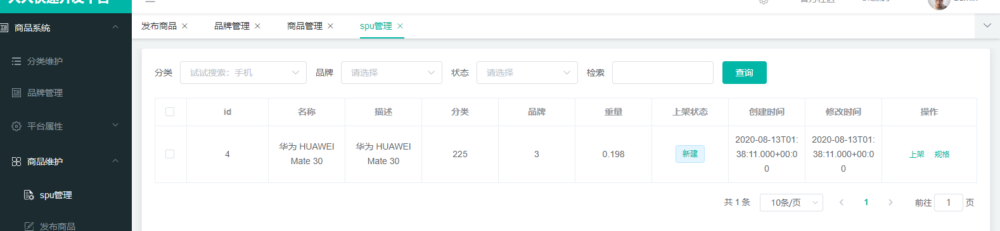

##### * SPU 检索  时间格式化

```
/product/spuinfo/list
请求参数
{
   page: 1,//当前页码
   limit: 10,//每页记录数
   sidx: 'id',//排序字段
   order: 'asc/desc',//排序方式
   key: '华为',//检索关键字
   catelogId: 6,//三级分类id
   brandId: 1,//品牌id 
   status: 0,//商品状态
}
响应数据
{
	"msg": "success",
	"code": 0,
	"page": {
		"totalCount": 0,
		"pageSize": 10,
		"totalPage": 0,
		"currPage": 1,
		"list": [{

			"brandId": 0, //品牌id
			"brandName": "品牌名字",
			"catalogId": 0, //分类id
			"catalogName": "分类名字",
			"createTime": "2019-11-13T16:07:32.877Z", //创建时间
			"id": 0, //商品id
			"publishStatus": 0, //发布状态
			"spuDescription": "string", //商品描述
			"spuName": "string", //商品名字
			"updateTime": "2019-11-13T16:07:32.877Z", //更新时间
			"weight": 0 //重量

		}]
	}
}
```

```
1、分类、品牌、状态、key关键字
    /**
     * SPU检索
     * @param params
     * @return
     */
    @Override
    public PageUtils queryPageByCondition(Map<String, Object> params) {
        QueryWrapper<SpuInfoEntity> queryWrapper = new QueryWrapper<>();
        String key = (String) params.get("key");
        if (!StringUtils.isEmpty(key)) {
            queryWrapper.and(qw->{
                qw.eq("id", key).or().like("spu_name", key);
            });
        }
        //status: 0
        //brandId: 3
        //catelogId: 225
        String status = (String) params.get("status");
        if (!StringUtils.isEmpty(status)) {
            queryWrapper.eq("publish_status", status);
        }
        String brandId = (String) params.get("brandId");
        if (!StringUtils.isEmpty(brandId) && !"0".equalsIgnoreCase(brandId)) {
            queryWrapper.eq("brand_Id", brandId);
        }
        String catelogId = (String) params.get("catelogId");
        if (!StringUtils.isEmpty(catelogId) && !"0".equalsIgnoreCase(catelogId)) {
            queryWrapper.eq("catalog_Id", catelogId);
        }

        IPage<SpuInfoEntity> page = this.page(
                new Query<SpuInfoEntity>().getPage(params),
                queryWrapper
        );
        return new PageUtils(page);
    }
2、格式化返回的时间类型
2020-08-13T01:38:11.000+00:00 ==》 
添加配置：
spring:
  jackson:
    date-format: yyyy-MM-dd HH:mm:ss
    time-zone: GMT+8   
修改市区
```


##### * 获取spu规格

```
1、功能：修改基本规格参数
2、接口一：发送商品id，获取 基本属性数组

22、获取spu规格
GET		/product/attr/base/listforspu/{spuId}
响应数据
{
	"msg": "success",
	"code": 0,
	"data": [{
		"id": 43,
		"spuId": 11,
		"attrId": 7,
		"attrName": "入网型号",
		"attrValue": "LIO-AL00",
		"attrSort": null,
		"quickShow": 1
	}]
}
```

```java
    /**
     * 22、获取spu规格
     * pms_product_attr_value
     */
    @GetMapping("/base/listforspu/{spuId}")
    public R baseAttrlistforspu(@PathVariable("spuId") Long spuId) {
        List<ProductAttrValueEntity> entities = productAttrValueService.baseAttrlistforspu(spuId);
        return R.ok().put("data", entities);
    }
```

##### * 修改商品规格

```
23、修改商品规格
POST
/product/attr/update/{spuId}
请求参数
[{
	"attrId": 7,
	"attrName": "入网型号",
	"attrValue": "LIO-AL00",
	"quickShow": 1
}, {
	"attrId": 14,
	"attrName": "机身材质工艺",
	"attrValue": "玻璃",
	"quickShow": 0
}, {
	"attrId": 16,
	"attrName": "CPU型号",
	"attrValue": "HUAWEI Kirin 980",
	"quickShow": 1
}]
响应数据
{
	"msg": "success",
	"code": 0
}
```

```

```


#### 1.4.3、商品管理

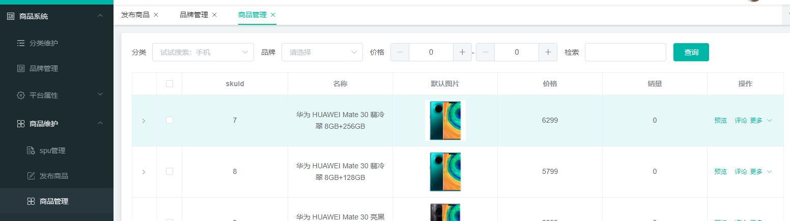

##### * SKU 检索

```
/product/skuinfo/list
请求参数
{
page: 1,//当前页码
limit: 10,//每页记录数
sidx: 'id',//排序字段
order: 'asc/desc',//排序方式
key: '华为',//检索关键字
catelogId: 0,
brandId: 0,
min: 0,
max: 0
}
响应数据
{
	"msg": "success",
	"code": 0,
	"page": {
		"totalCount": 26,
		"pageSize": 10,
		"totalPage": 3,
		"currPage": 1,
		"list": [{
			"skuId": 1,
			"spuId": 11,
			"skuName": "华为 HUAWEI Mate 30 Pro 星河银 8GB+256GB",
			"skuDesc": null,
			"catalogId": 225,
			"brandId": 9,
			"skuDefaultImg": "https://gulimall-hello.oss-cn-beijing.aliyuncs.com/2019-11-26/60e65a44-f943-4ed5-87c8-8cf90f403018_d511faab82abb34b.jpg",
			"skuTitle": "华为 HUAWEI Mate 30 Pro 星河银 8GB+256GB麒麟990旗舰芯片OLED环幕屏双4000万徕卡电影四摄4G全网通手机",
			"skuSubtitle": "【现货抢购！享白条12期免息！】麒麟990，OLED环幕屏双4000万徕卡电影四摄；Mate30系列享12期免息》",
			"price": 6299.0000,
			"saleCount": 0
		}]
	}
}
```

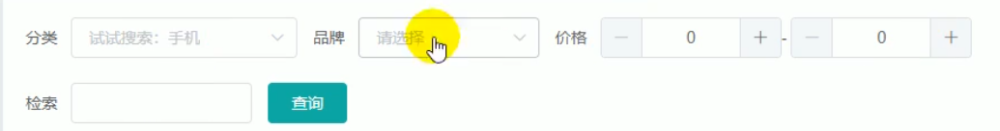

```
1、 /**
     * SKU检索
     * @param params
     * @return
     */
    @Override
    public PageUtils queryPageByCondition(Map<String, Object> params) {
        //key:
        //catelogId: 225
        //brandId: 3
        //min: 0
        //max: 0
        QueryWrapper<SkuInfoEntity> queryWrapper = new QueryWrapper<>();

        String key = (String) params.get("key");
        if (!StringUtils.isEmpty(key)) {
            queryWrapper.and(qw->{
                qw.eq("sku_id", key).or().like("sku_name", key);
            });
        }

        String catelogId = (String) params.get("catelogId");
        if (!StringUtils.isEmpty(catelogId) && !"0".equalsIgnoreCase(catelogId)) {
            queryWrapper.eq("catalog_Id", catelogId);
        }

        String brandId = (String) params.get("brandId");
        if (!StringUtils.isEmpty(brandId) && !"0".equalsIgnoreCase(brandId)) {
            queryWrapper.eq("brand_id", brandId);
        }

        String min = (String) params.get("min");
        if (!StringUtils.isEmpty(min)) {
            queryWrapper.ge("price", min);
        }

        String max = (String) params.get("max");
        if (!StringUtils.isEmpty(max)) {
            try {
                BigDecimal bigDecimal = new BigDecimal(max);
                if (bigDecimal.compareTo(new BigDecimal(0)) == 1) {
                    queryWrapper.le("price", max);
                }
            }catch (Exception e) {
            }

        }

        IPage<SkuInfoEntity> page = this.page(
                new Query<SkuInfoEntity>().getPage(params),
                queryWrapper
        );
        return new PageUtils(page);
    }
```


## 2、基础概念

先入门：Apple iPhone XS Max 红色 128G

SPU：Apple iPhone XS Max【用于检索 es】

SKU：红色 128G

规格参数：看截图，尺寸、重量等等【所有的XS Max都具有的共同属性】

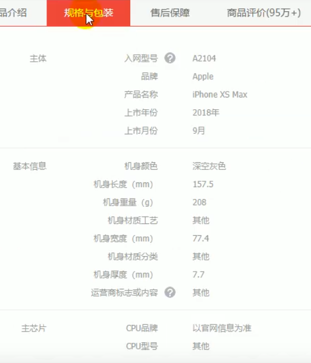


### 2.1、SPU与SKU

#### * SPU：Standard Product Unit（标准化产品单元）

​		是商品信息聚合的最小单位，是一组**可复用、易检索**的**标准化信息的集合**，**该集合描述了一**
**个产品的特性**。

【像素、尺寸、分辨率】

SPU就像是Java中的类，而我们实际要买的是SKU，一个对象

```
一句话解释：SPU就是基本属性，规格参数
```


#### * SKU：Stock Keeping Unit（库存量单元）

​		库存进出计量的基本单元，可以是以件，盒，托盘等为单位。SKU这是对于大型连锁超市
DC（配送中心）物流管理的一个必要的方法。现在已经被引申为产品统一编号的简称，每
种产品均对应有唯一的SKU号。

【内存、颜色、价格】

```
一句话解释：SKU 就是销售属性的笛卡尔积形式

```

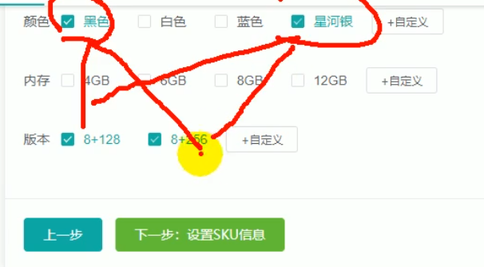

### 2.2、规格参数与销售属性

【规格参数就是**基本属性**】

总结：

​	三级分类，例如手机分类下有哪些属性分组，属性分组与属性存在关联

```
pms_brand						商品品牌表
pms_category					商品三级分类表
pms_category_brand_relation		商品三级分类 与 品牌关联表

pms_attr_group					商品分组表 关联 商品三级分类【保存了分类ID，根据分类查出所有属性分组】
pms_attr						商品属性表【检索条件】【保存了分类ID】
pms_attr_attrgroup_relation		商品属性与属性分组关联表【属性与属性分组是n:1，但是属性不能被复用】【不会出现一个属性出现在不同的分组下】

pms_spu_info					SPU表
pms_product_attr_value			商品属性值表【spu_id:attr_id=1对多】
pms_spu_info_desc				商品介绍表
pms_spu_images					SPU图片
pms_spu_comment

pms_sku_info					SKU表【spu_id:sku_id=1对多】
pms_sku_sale_attr_value			销售属性表【sku_id:attr_id=1对多】
pms_sku_images					SKU图片

pms_comment_replay				评论、回复表
```

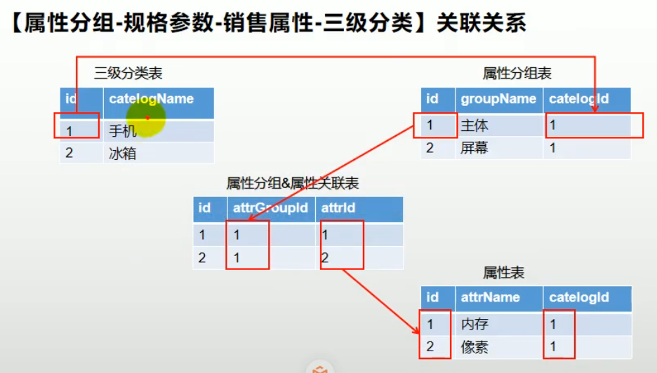

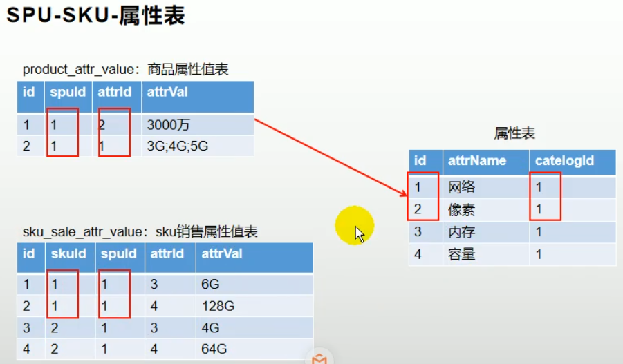


```
1、基本属性与销售属性的区别
​	基本属性：SPU决定基本属性的值【规格参数、商品介绍】
​	销售属性：SKU决定销售属性的值【有货无货，价格】【每一个SKU都有唯一的编号】

2、相同分类下的商品，例如手机分类下，华为与iphone都有相同的属性
​	例如：基本信息、主芯片、存储、屏幕属性，只是值不同

3、属性可以作为检索条件，例如麒麟980，看图

4、属性表+属性分组表+中间表【属性与分组的关联关系】
例如下图，主题就是分组，下面有很多属性与其关联【关联了几个就在页面显示几个】
pms_attr、pms_attr_attgroup_relation、pms_attr_group

5、商品基本属性值表【规格参数】：pms_product_attr_value【商品属性信息】
spu商品【iphone XS】与属性的关联关系表【商品1对n属性值】

6、pms_spu_info，商品信息

7、pms_sku_info，SKU信息表，关联了spu_id与sku_id，1对多
iphone XS是一个spu_id，对应多个sku_id【标题、副标题、价格、数量】

8、pms_sku_images，SKU对应的图片

9、pms_sku_sale_attr_value 销售属性值表
一个sku_id对应多个属性
每个sku_id都有自己对应的多个属性【颜色、内核内存(6+128、8+256)】
```

每个分类下的商品共享规格参数，与销售属性。只是有些商品不一定要用这个分类下全部的属性：

​	属性是以三级分类组织起来的
​	规格参数中有些是可以提供检索的
​	规格参数也是基本属性，他们具有自己的分组
​	属性的分组也是以三级分类组织起来的
​	属性名确定的，但是值是每一个商品不同来决定的


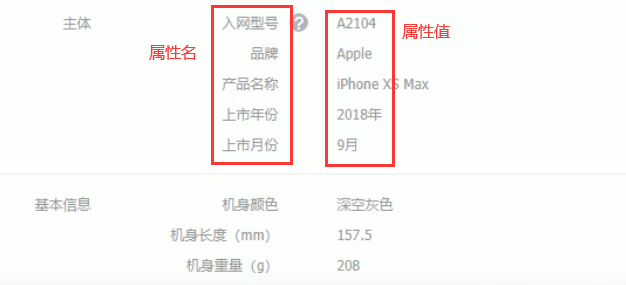

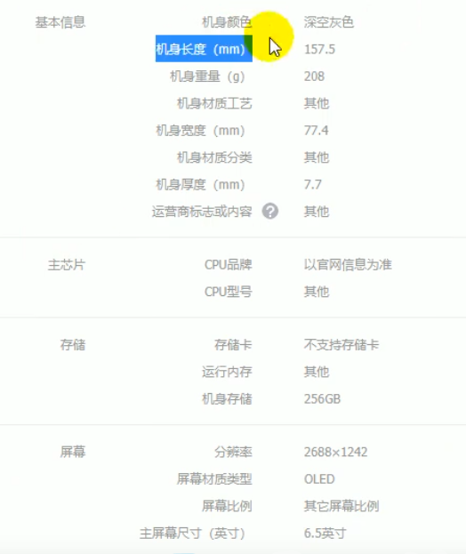

检索：

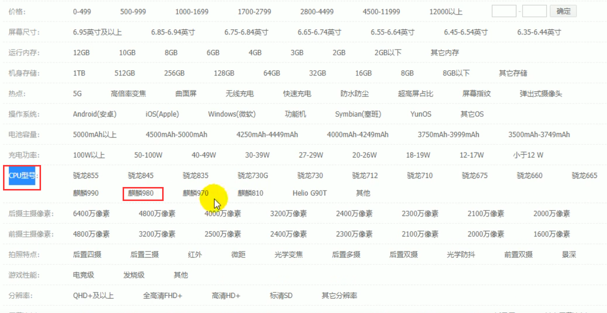

标题、副标题、价格

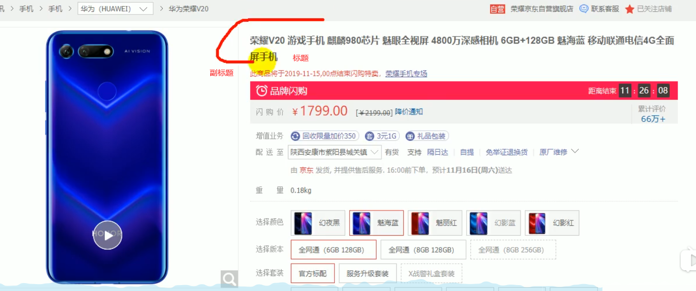

SKU信息：

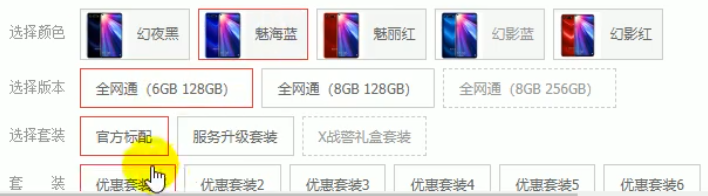


# 二、会员等级模块

## 1、后台管理


# 三、仓储服务

wms_purchase				采购单
wms_purchase_detail	采购需求
wms_ware_info				仓库
wms_ware_order_task
wms_ware_order_task_detail
wms_ware_sku				各仓库各商品件数

1、仓库指定sku商品库存

2、采购单分配采配人员【分配状态】

3、采购需求合并【合并到采购单，采购单状态->分配状态】


## 1、后台管理

### 1.1、仓库维护【wms_ware_info】

#### * 检索、新增、删除、修改

```
1、表：wms_ware_info

2、/ware/wareinfo/list
// 仓库检索
    @Override
    public PageUtils queryPage(Map<String, Object> params) {
        QueryWrapper<WareInfoEntity> queryWrapper = new QueryWrapper<>();
        String key = (String)params.get("key");
        if (!StringUtils.isEmpty(key)) {
            queryWrapper.eq("id", key).or()
                    .like("name", key).or()
                    .like("address", key).or()
                    .like("areacode", key);
        }

        IPage<WareInfoEntity> page = this.page(
                new Query<WareInfoEntity>().getPage(params),
                queryWrapper
        );

        return new PageUtils(page);
    }

```

### 1.2、库存工作单


### 1.3、商品库存

#### * 查询商品库存【wms_ware_sku】

```
1、表：wms_ware_sku【仓库中sku库存数量】

2、/ware/waresku/list
@Override
    public PageUtils queryPage(Map<String, Object> params) {
        /**
         * 商品库存：没有key
         * skuId:1
         * wareId:2
         */
        QueryWrapper<WareSkuEntity> queryWrapper = new QueryWrapper<>();
        String skuId = (String) params.get("skuId");
        if (!StringUtils.isEmpty(skuId)) {
            queryWrapper.eq("sku_id", skuId);
        }

        String wareId = (String) params.get("wareId");
        if (!StringUtils.isEmpty(wareId)) {
            queryWrapper.eq("ware_id", wareId);
        }


        IPage<WareSkuEntity> page = this.page(
                new Query<WareSkuEntity>().getPage(params),
                queryWrapper
        );

        return new PageUtils(page);
    }

```


### 1.2、采购单维护

采购人员应该按照采购单采购，采购完成后数量自动加入库存

#### 1.2.1、采购需求【wms_purchase_detail】

指定采购数量

```
两种创建逻辑：
1、后台新增采购需求【人工】
2、后台库存预警自动发出采购需求【自动化】
```

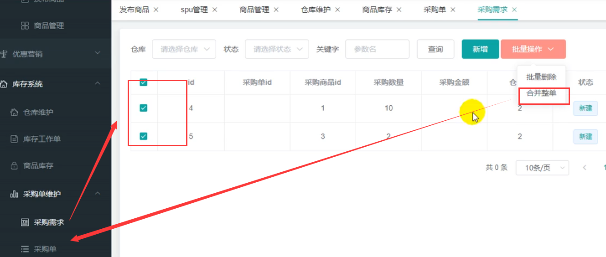

```
采购需求  整合-> 采购单
：多个采购需求可以整合成一张采购单

1、/ware/purchasedetail/list
采购需求list【整合查询条件】

2、    /**
     * 采购需求
     * @param params
     * @return
     */
    @Override
    public PageUtils queryPage(Map<String, Object> params) {
        // key
        // status:0 状态
        // wareId：1 仓库Id
        QueryWrapper<PurchaseDetailEntity> queryWrapper = new QueryWrapper<>();
        String key = (String) params.get("key");
        if (!StringUtils.isEmpty(key)) {
            queryWrapper.and(w->{
                w.eq("purchase_id", key).or().eq("sku_id", key);
            });
        }

        String status = (String) params.get("status");
        if (!StringUtils.isEmpty(status)) {
            queryWrapper.eq("status", status);
        }

        String wareId = (String) params.get("wareId");
        if (!StringUtils.isEmpty(wareId)) {
            queryWrapper.eq("ware_id", wareId);
        }

        IPage<PurchaseDetailEntity> page = this.page(
                new Query<PurchaseDetailEntity>().getPage(params),
                queryWrapper
        );

        return new PageUtils(page);
    }
```

##### * 合并采购单


```java
1、先要有一个采购单，再选中多个采购需求整合到某个采购单中
新增一个采购单

2、采购单状态：新建、已分配、已领取、已完成、有异常

3、点击整合，查询未领取的采购单【新建+已分配 状态的采购单】，这些采购单允许合并，
	已领取的单子不能再作为合并对象。
/ware/purchase/merge
{
  purchaseId: 1, //整单id
  items:[1,2,3,4] //合并项集合
}

4、  /**
     * 04、合并采购需求
     * @param mergeVo
     */
    @Transactional
    @Override
    public void mergePurchase(MergeVo mergeVo) {
        // TODO 采购需求的状态必须是 新建、已分配 才可以合并
        boolean isMerge = true;
        List<Long> items = mergeVo.getItems();
        if (!CollectionUtils.isEmpty(items)) {
            List<PurchaseDetailEntity> byIds = purchaseDetailService.listByIds(items);
            for (int i = 0; i < byIds.size(); i++) {
                if (byIds.get(i).getStatus() != WareConstant.PurchaseDetailStatusEnum.CREATED.getCode() &&
                        byIds.get(i).getStatus() != WareConstant.PurchaseDetailStatusEnum.ASSIGNED.getCode()) {
                    isMerge = false;
                    break;
                }
            }
        }else {
            isMerge = false;
        }
        if (isMerge) {
            Long purchaseId = mergeVo.getPurchaseId();
            if (purchaseId == null) {
                // 1、新建一个采购单
                PurchaseEntity purchaseEntity = new PurchaseEntity();
                purchaseEntity.setStatus(WareConstant.PurchaseStatusEnum.CREATED.getCode());
                purchaseEntity.setCreateTime(new Date());
                purchaseEntity.setUpdateTime(new Date());
                this.save(purchaseEntity);
                purchaseId = purchaseEntity.getId();
            }
            items = mergeVo.getItems();
            // 2、修改采购需求，将采购单purchaseId加进去
            Long finalPurchaseId = purchaseId;
            List<PurchaseDetailEntity> collect = items.stream().map(i -> {
                PurchaseDetailEntity detailEntity = new PurchaseDetailEntity();

                detailEntity.setId(i);
                detailEntity.setPurchaseId(finalPurchaseId);
                detailEntity.setStatus(WareConstant.PurchaseDetailStatusEnum.ASSIGNED.getCode());
                return detailEntity;
            }).collect(Collectors.toList());
            purchaseDetailService.updateBatchById(collect);

            // 修改更新时间
            PurchaseEntity purchaseEntity = new PurchaseEntity();
            purchaseEntity.setId(purchaseId);
            purchaseEntity.setUpdateTime(new Date());
            this.updateById(purchaseEntity);
        }
    }
```

##### * 查询未领取的采购单

```
1、/ware/purchase/unreceive/list

2、 /**
     * 查询未领取的采购单
     */
    @Override
    public PageUtils queryPageUnreceivePurchase(Map<String, Object> params) {
        QueryWrapper<PurchaseEntity> queryWrapper = new QueryWrapper<>();
        queryWrapper.eq("status", 0).or().eq("status", 1);

        IPage<PurchaseEntity> page = this.page(
                new Query<PurchaseEntity>().getPage(params),
                queryWrapper
        );

        return new PageUtils(page);
    }
```


#### 1.2.2、采购单

##### * 采购单分配采购人员

```
1、系统管理 =》 管理员列表 =》 新增

2、采购单 分配 采购人员
```

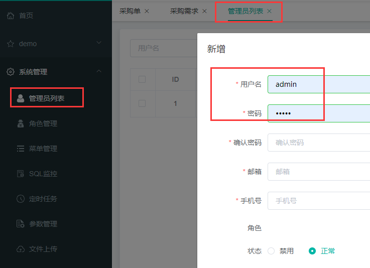

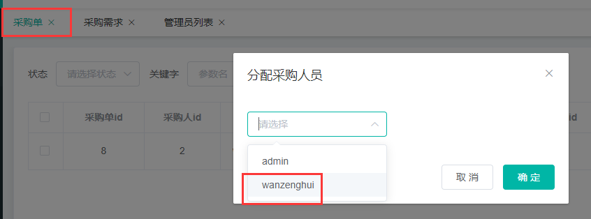

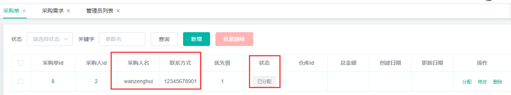


##### * 领取采购单

```
1、采购人员在手机app上看到自己的采购单，然后点击 领取【采购单状态变为已领取】

2、已领取的采购单 不能在继续分配 采配需求

3、被采购人员点击领取的采购单，关联的采购需求要同步修改为正在采购【采购单（已领取）== 采购需求（正在采购）】
```

```java
06、领取采购单

POST :/ware/purchase/received

请求参数
[1,2,3,4]//采购单id

响应数据
{
	"msg": "success",
	"code": 0
}

    /**
     * 06、领取采购单
     * 不考虑细节：只能是自己的采购单
     * @param ids 采购单ID
     */
    @Transactional
    @Override
    public void received(List<Long> ids) {
        // 1、修改所有采购单的状态为 "已领取"
        // 1.1）过滤采购单【必须是新建或者已分配的采购单】
        List<PurchaseEntity> collect = ids.stream().map(id -> {
            PurchaseEntity purchaseEntity = this.getById(id);
            return purchaseEntity;
        }).filter(item -> {
            if (item.getStatus() == WareConstant.PurchaseStatusEnum.CREATED.getCode() ||
                    item.getStatus() == WareConstant.PurchaseStatusEnum.ASSIGNED.getCode()) {
                return true;
            }
            return false;
        }).map(item -> {
            item.setStatus(WareConstant.PurchaseStatusEnum.RECEIVE.getCode());
            item.setUpdateTime(new Date());
            return item;
        }).collect(Collectors.toList());
        // 1.2、改变采购单的状态
        this.updateBatchById(collect);

        // 2、修改采购需求为 "正在购买"【采购单关联的采购需求】
        // collect是采购单集合
        collect.forEach(item->{
            // 根据采购单id列出 采购需求信息
            List <PurchaseDetailEntity> entities = purchaseDetailService.listDetailByPurchaseId(item.getId());
            List<PurchaseDetailEntity> purchaseDetailEntities = entities.stream().map(entity -> {
                // 为什么要重新new一个对象？
                // 因为只要修改指定的字段
                PurchaseDetailEntity purchaseDetailEntity = new PurchaseDetailEntity();
                purchaseDetailEntity.setId(entity.getId());
                purchaseDetailEntity.setStatus(WareConstant.PurchaseDetailStatusEnum.BUYING.getCode());
                return purchaseDetailEntity;
            }).collect(Collectors.toList());
            purchaseDetailService.updateBatchById(purchaseDetailEntities);
        });
    }
```


##### * 完成采购

```java
07、完成采购
POST /ware/purchase/done
请求参数
{
   id: 123,//采购单id
   items: [{itemId:1,status:4,reason:""}]//完成/失败的需求详情
}
响应数据
{
	"msg": "success",
	"code": 0
}

1、提交了每个采购需求的状态【status，所以完成采购单，但是采购需求可能失败】

2、
    /**
     * 完成采购
     */
    @Transactional
    @Override
    public void done(PurchaseDoneVo doneVo) {
        // 2、改变采购需求的状态
        Boolean flag = true;
        List<PurchaseItemDoneVo> items = doneVo.getItems();
        List<PurchaseDetailEntity> updates = new ArrayList<>();
        for (PurchaseItemDoneVo item : items) {
            PurchaseDetailEntity detailEntity= new PurchaseDetailEntity();
            // 设置状态：成功或失败
            detailEntity.setStatus(item.getStatus());
            // 优化，下面只需要执行一次
            if (flag && item.getStatus() == WareConstant.PurchaseDetailStatusEnum.HASERROR.getCode()) {
                flag = false;
            }else {
                // 3、将成功采购的进行入库 [三个参数：sku_id，ware_id，stock]
                // 根据采购需求id获取采购需求详情，获得sku_id
                PurchaseDetailEntity entity = purchaseDetailService.getById(item.getItemId());
                wareSkuService.addStock(entity.getSkuId(), entity.getWareId(), entity.getSkuNum());
            }
            // TODO 采购失败待完善，应采购数量10，实际采购数量8
            detailEntity.setId(item.getItemId());
            updates.add(detailEntity);
        }
        purchaseDetailService.updateBatchById(updates);

        // 1、改变采购单状态【如果存在失败的采购项，采购单状态异常】
        PurchaseEntity purchaseEntity = new PurchaseEntity();
        purchaseEntity.setId(doneVo.getId());
        purchaseEntity.setStatus(flag ? WareConstant.PurchaseStatusEnum.FINISH.getCode() : WareConstant.PurchaseStatusEnum.HASERROR.getCode());
        this.updateById(purchaseEntity);
    }


    /**
     * 成功采购=》入库
     */
    @Override
    public void addStock(Long skuId, Long wareId, Integer skuNum) {
        // 1、判断：如果没有库存记录，则新增
        List<WareSkuEntity> wareSkuEntities = wareSkuDao.selectList(new QueryWrapper<WareSkuEntity>().eq("sku_id", skuId).eq("ware_id", wareId));
        if (CollectionUtils.isEmpty(wareSkuEntities)) {
            WareSkuEntity wareSkuEntity = new WareSkuEntity();
            wareSkuEntity.setSkuId(skuId);
            wareSkuEntity.setWareId(wareId);
            wareSkuEntity.setStock(skuNum);
            wareSkuEntity.setStockLocked(0);
            // TODO 远程查询sku名字，如果失败不需要回滚
            // 方法一：自己catch异常
            // TODO 方法二：高级部分，出现异常不回滚
            try {
                R info = productFeignService.info(skuId);
                if (info.getCode() == 0) {
                    Map<String, Object> skuInfoMap = (Map<String, Object>) info.get("skuInfo");
                    // info.get("skuInfo")获得的是R对象内存的SkuInfoEntity对象
                    // 因为是传的json格式，所以可以强转为(Map<String, Object>)格式
                    wareSkuEntity.setSkuName((String) skuInfoMap.get("skuName"));
                }
            }catch (Exception e){

            }
            wareSkuDao.insert(wareSkuEntity);

        }else {
            wareSkuDao.addStock(skuId, wareId, skuNum);
        }
    }
```


# 四、分布式基础篇总结

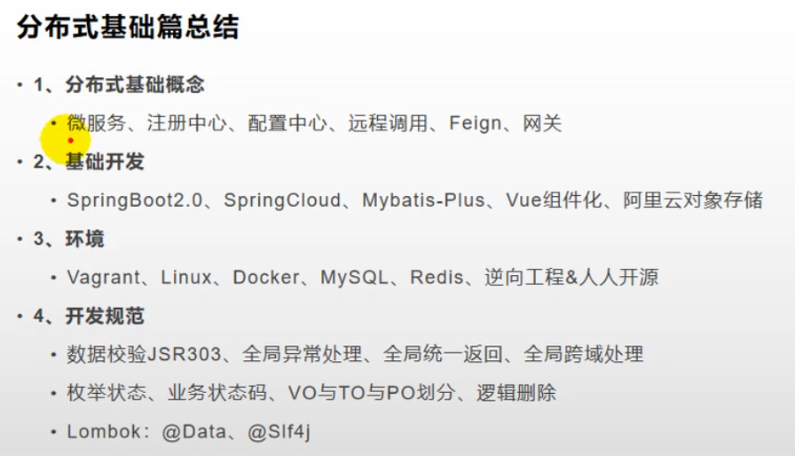

